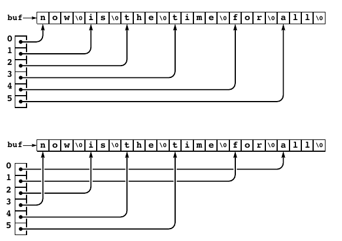

.**Arrays**, **linked lists**, and **strings** all provide simple ways to structure data sequentially. They provide a **first level** of abstraction that we can use to group in ways amenable to processing the objects efficiently. 

Having settled on these abstractions, we can use them in a hierarchical fashion to build up more complex structures. 

## 1. Two-dimensional array

In C, we can define two-dimensional array to be compound data structures (arrays of arrays). 

### 1.1 Two-dimensional array allocation (Program 3.16)

```c
// program 3.16
// Two-dimention Arrays Allocation
#include <stdio.h>
#include <stdlib.h>
#include <string.h>

int** malloc2d(int r, int c) {
    int** t = malloc(r * sizeof(int*));

    for (int i = 0; i < c; i++) {
        t[i] = malloc(c * sizeof(int));
    }

    return t;
}

int** init2dArray(int r, int c) {
    int** t = malloc2d(r,c);
    for (int i = 0; i < r; i++) {
        memset(t[i],0,c);
    }
    return t;
}

void print2dArray(int** a, int r, int c) { 
    for (int i = 0; i < r; i++) {
        printf("| ");
        for (int j = 0; j < c; j++) {
            printf("%d ",a[i][j]);
        }
        printf("|\n");
    }
}


int main(int argc, char* argv[]) {
    if (argc < 2) {
        printf("parameter list cannot be empty");
    }
    int row = atoi(argv[1]);
    int column = atoi(argv[2]);
    
    printf("Creating Row: %d, Column: %d Martices\n",row,column);
    int** a = init2dArray(row, column);
    print2dArray(a,row,column);
}
```

`malloc2d` dynamically allocates the memory for a two-dimensional array, as an array of arrays. Fist allocate an array of pointers, then  allocate memory for each row. `int** a = malloc2d(M, N);` allocates an M-by-N array of arrays.

## 2. Array of Strings (Program 3.17)

```c
// program 3.16
// Sorting array of strings
#include <stdio.h>
#include <stdlib.h>
#include <string.h>

#define Nmax 1000
#define Mmax 10000

// byte buffer
char buf[Mmax];
int M = 0;

int compare(const void *i, const void *j) {
  return strcmp(*(char **)i, *(char **)j);
}

int main() {
  int i, N;
  // array of strings
  char* a[Nmax];

  printf("Please enter the strings: ");
  for (N = 0; N < Nmax; N++) {
    a[N] = &buf[M];
    if (scanf("%s", a[N]) == EOF) {
      break;
    }
    // all input save to buffer
    M += strlen(a[N]) + 1;
  }
  qsort(a, N, sizeof(char *), compare);
  // print string
  printf("Sorted: ");
  for (i = 0; i < N; i++) {
    printf("%s ", a[i]);
  }
  return 0;
}
```

Program above illustrates an important string-processing function: ==rearranging a set of strings into sorted order==.

`qsort` takes four arguments:

- `base`: a pointer to the beginning of the array
- `nmemb`: the number of objects
- `size`: the size of each object
- `compar`: the comparison function

It blindly rearranging the blocks of data and by using a comparison function that takes pointers to `void` as argument.

This example illustrate a typical scenario for processing strings: read the characters themselves into a huge  one-dimensional array, save pointer to individual strings (delimiting them with string-termination characters), then manipulate the pointers.



## 3. Adjacency-matrix graph representation (Program 3.18)  


## 4. Adjacency-lists graph representation (Program 3.19)


## 5. A two-dimensional array of lists (Program 3.20)


## Exercises


## Reference

