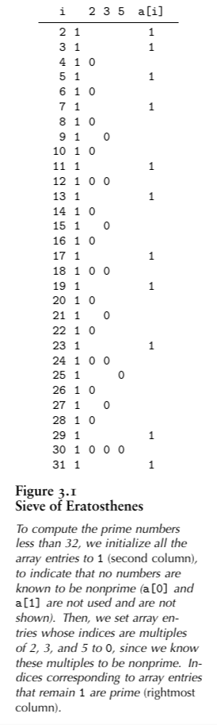
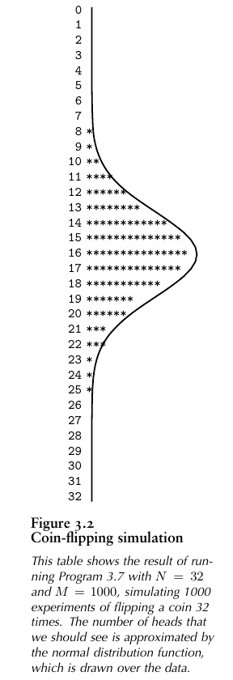

An array is a ***fixed*** collection of ***same-type*** data that are stroed ***contiguously*** and that are accessible by an ***index***.  

We refer to the `i`th element of an array `a` as `a[i]`. It is the responsibility of the programmer to strore something meaningful in an array position `a[i]` before referring to `a[i]`.

Arrays are fundamental data structures in that they have a direct correspondence with memory systems on virtually all computers. To retrieve the contents of a word from memory in machine language, we provide an **address**. Thus, we could think of the entire computer **memory**  as an **array**, with the memory addresses corresponding to array indices. Most computer-languages processors translate programs that involve arrays into efficient machine-languages programs that access memory directly.

## 3.2.1 Sieve of Eratosthenes 

The **sieve of Eratosthenes** is an ancient [algorithm](https://en.wikipedia.org/wiki/Algorithm) for finding all [prime numbers](https://en.wikipedia.org/wiki/Prime_number) up to any given limit. ([Sieve of Eratosthenes(wikipedia)](https://en.wikipedia.org/wiki/Sieve_of_Eratosthenes))

It is typical of algorithms that exploit the fact that we can access efficiently any item of an array, given that item’s index.

```c
// program 3.5
#include <stdio.h>

#define N 10000

// function declaration
void printArray(int len,int a[]);

int main()
{
    int i, j, a[N];

    for (i = 2; i < N; i++){
        a[i] = 1;
    }
    printArray(N,a);

    for (i = 2; i < N; i++){
        if (a[i])
        {
            for (j = i; i * j < N; j++)
            {
                a[i * j] = 0;
            }
        }
    }
    printArray(N,a);

    for (i = 2; i < N; i++){
        if (a[i])
        {
            printf("%4d", i);
        }
    }
    printf("\n");

    printf("Size of arr: %d bytes", sizeof(a));

    return 0;
}

// function definition
void printArray(int len,int a[]){
    printf("Array: \n\t");

    for (int i = 0; i < len; i++){   
        printf("%2d ", i);
    }

    printf("\n\t");

    for (int i = 0; i < len; i++){   
        printf("%2d ", a[i]);
    }
    printf("\n");
    return;
}
```

The goal of above program is to set `a[i]` to if `i` is prime, and to 0 if `i` is not prime. 

1. Set to 1 all array elements, to indicate that no numbers are known to be nonprime.
2. Set to 0 array elements corresponding to indices that are known to be nonprime (multiples of known primes). 
3. If `a[i]` is still 1 after all multiples of smaller primes have been set to 0, then we known it to be prime.



Because the program uses an array consisting of the simplest type of elements, 0-1 values, it would be more space **efficient** if we explicitly used an **array of bits**, rather than one of integers. Also, some programming environments might require the array to be global if *N* is huge, or we could allocate it dynamically.

#### 3.2.1.1 array of ints VS array of bits

下面使用 bit 数组来实现上述算法并与整型数组比较

```c
// bit_array.c
#include <stdio.h>
#include <string.h>

#define N 1000

const int INT_BIT_SIZE = sizeof(int) * 8;
const int ARR_LEN = (N / INT_BIT_SIZE) + 1;

void set_bit(int a[], int k);
void clear_bit(int a[], int k);
int test_bit(int a[], int k);
void print_bit(int n);
void print_bit_arr(int a[]);
void print_arr(int a[]);

int main(){
    // set all elements to 0
    int a[ARR_LEN];
    memset(a, 0, sizeof(int) * ARR_LEN);

    // assume that every one is prime
    for (int i = 2; i < N; i++){
        set_bit(a, i);
    }

    for (int i = 2; i < N; i++){
        for (int j = i; (i * j) < N; j++){
            // set ele to 0 when it is nonprime
            clear_bit(a, i * j);
        }
    }

    printf("Primes: [");
    for (int i = 2; i < N; i++)
    {
        if(test_bit(a,i)){
            printf("%d ", i);
        }
    }
    printf("]\n");

    print_bit_arr(a);

    printf("Size of arr: %d bytes",sizeof(a));

    return 0;
}

void set_bit(int a[], int k){

    int i = k / INT_BIT_SIZE;
    int pos = k % INT_BIT_SIZE;

    // 0000 ... 0001
    unsigned int flag = 1;
    // shifted pos positions
    flag = flag << pos; 
    // set the bit at the k-th position in a[i]
    a[i] = a[i] | flag;
}

void clear_bit(int a[], int k){
    int i = k / INT_BIT_SIZE;
    int pos = k % INT_BIT_SIZE;

    unsigned int flag = 1;
    flag = ~(flag << pos);
    a[i] = a[i] & flag;
}

int test_bit(int a[], int k){
    int i = k / INT_BIT_SIZE;
    int pos = k % INT_BIT_SIZE;
    
    unsigned int flag = 1;
    flag = flag << pos;

    return (a[i] & flag) != 0;
}

void print_bit(int n){
    printf("[");
    for (int i = INT_BIT_SIZE - 1; i >= 0; i--){
        printf("%u", (n >> i) & 1);
    }
    printf("]\n");
}

void print_bit_arr(int a[]){
    for (int i = 0; i < ARR_LEN; i++){
        printf("%d: ", i);
        print_bit(a[i]);
    }
}

void print_arr(int a[]){
    printf("[");
    for (int i = 0; i < ARR_LEN; i++)
    {
        printf("%d ", a[i]);
    }
    printf("]\n");
}
```

设置 N 为 10000 时分别运行程序：

```sh
$ ./bit_array
Size of arr: 1252 bytes
$ ./int_array
Size of arr: 40000 bytes
```

可见使用 bit 数组所占用的存储空间会非常的小。

## 3.2.2 Dynamic memory allocation for an array

One of the distinctive features of C is that an array name generates a pointer to the first element of the array (the one with index 0). Moreover, simple **pointer arithmetic** is allowed: if `p` is a pointer to an object of a certain type, then we can write code that assumes that objects of that type are arranged sequentially, and can use `*p` to refer to the first object, `*(p+1)` to refer to the second object and so forth. In other words, `*(a+i)` and `a[i]` are **equivalent** in C. This equivalence provides an alternate mechanism for accessing objects in arrays that is sometimes more convenient than indexing.

To change the value of the maximum prime computed in `int_array.c` above, we need to recompile the program. Instead, we can take the maximum desired number from the command line, and use it to allocate space for the array at **execution time**.

```c
// program 3.6
#include <stdlib.h>
#include <stdio.h>

// arc:  counts of the args
// argv: value of the args, argv[0] 
// is the program name
int main(int arc, char *argv[]){
    long int i, j, N = atoi(argv[1]);
    // allocate memory
    int *a = malloc(N * sizeof(int));
    // failed to allocate memory
    if(a == NULL) {
        printf("failed to allocate memory");
        return 1;
    }
    printf("allocate memory success");
    return 0;
}
```

## 3.2.3 Coin-flipping simulation

Not only do arrays closely reflect the low-level mechanisms for accessing data in memory on most computers, but also they find widespread use because they correspond directly to natural methods of organizing data for applications.

In the theory of [probability](https://en.wikipedia.org/wiki/Probability) and [statistics](https://en.wikipedia.org/wiki/Statistics), a **Bernoulli trial** (or **binomial trial**) is a random [experiment](https://en.wikipedia.org/wiki/Experiment_(probability_theory)) with exactly two possible [outcomes](https://en.wikipedia.org/wiki/Outcome_(probability)), "success" and "failure", in which the probability of success is the same every time the experiment is conducted.

The following program is an example of a simulation program that uses an array, it simulates a sequence of *Bernoulli trials*, a familiar abstract concept from probability theory. If we flip a coin *N* times, the probability that we see *k* heads is


```c
// program 3.7
#include <stdlib.h>
#include <stdio.h>

int heads(){
    return rand() < RAND_MAX / 2;
}

void print_arr(int a[], int len){
    printf("\n[");
    for (int i = 0; i < len; i++){
        printf("%d ", a[i]);
    }
    printf("]\n");
}

int main(int argc, char *argv[]){
    int i, j, cnt;
    int N = atoi(argv[1]);
    int M = atoi(argv[2]);

    int *f = malloc((N + 1) * sizeof(int));

    // init array with 0
    for(j = 0; j <= N; j++){
        f[j] = 0;
    }

    print_arr(f, N + 1);

    
    for (i = 0; i < M; i++, f[cnt]++){
        for (cnt = 0, j = 0; j <= N; j++){
            if(heads()){
                cnt++;
            }
        }
    }

    print_arr(f, N + 1);

    for (j = 0; j <= N; j++){
        printf("%2d", j);
        for (i = 0; i < f[j]; i+=10){
            printf("*");
        }
        printf("\n");
    }

    return 0;
}
```

If we flip a coin N times, we expect to get *N/2* heads, but could get anywhere from 0 to *N* heads. The program runs the experiment *M* times, taking both *N* and *M* from the command line. It uses an array *f* to keep track of the frequency of occurrence of the outcome “*i* heads” for 0 $\leq$ i $\leq$ *N* , then prints out a histogram of the result of the experiments, with one asterisk for each 10 occurrences.



## 3.2.4 Closest-point computation

This program illustrates the use of an array of structures, and is representative of the typical situation where we save items in an array to process them later, during some computation. 

It counts the number of pairs of *N* randomly generated points in the unit square that can be connected by a straight line of length less than *d*. The running time is *O(N^2^)*  , so this program cannot be used for huge *N*.

```c
// program 3.7 
#include <stdio.h>
#include <stdlib.h>
#include <math.h>

#include "point.h"

float rand_float(){
    return 0.1 * rand() / RAND_MAX;
}

int main(int argc, char *argv){
    float d = atof(argv[2]);
    int cnt = 0;
    int N = atoi(argv[1]);
    Point *a = malloc(N * sizeof(*a));

    for (int i = 0; i < N; i++){
        a[i].x = rand_float();
        a[i].y = rand_float();
    }

    for (int i = 0; i < N; i++){
        for (int j = i + 1; j < N;j++){
            if(distance(a[i],a[j]) < d){
                cnt++;
            }
        }
    }

    printf("%d edges shorter than %f\n", cnt, d);
    return 0;
}
```

This program also illustrates a common use of arrays: to save data away so that they can be quickly accessed in an organized manner in some computation. 

## Exercises

- 3.11 Suppose that `a` is declared as int `a[99]`. Give the contents of the array after the following two statements are executed:
  `for(i = 0; i < 99; i++) a[i] = 98 - i;`
  `for(i = 0; i < 99; i++) a[i] = a[a[i]];`
  **Solution:**

  ```
  ```

  

## Reference

1. [Algorithms in C](https://www.amazon.com/Algorithms-Parts-1-4-Fundamentals-Structures-dp-0201314525/dp/0201314525/ref=mt_other?_encoding=UTF8&me=&qid=) 
2. [Sieve of Eratosthenes](https://en.wikipedia.org/wiki/Sieve_of_Eratosthenes) wikipedia
3. [How to define and work with an array of bits in C?](https://stackoverflow.com/questions/2525310/how-to-define-and-work-with-an-array-of-bits-in-c) stackoverflow
4. [Bernoulli trial](https://en.wikipedia.org/wiki/Bernoulli_trial) wikipedia
5. [How to initialize array to 0 in C?](https://stackoverflow.com/questions/2589749/how-to-initialize-array-to-0-in-c) stackoverflow


