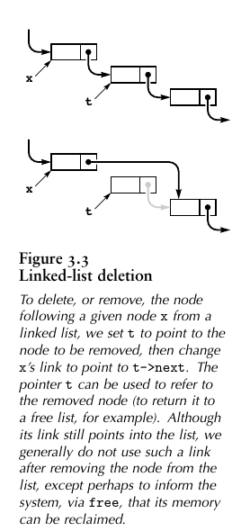
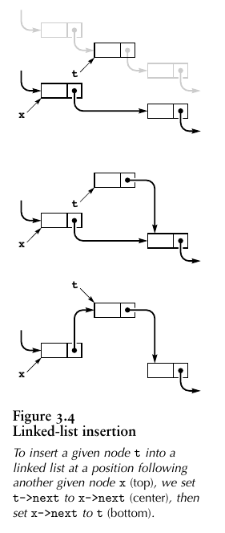
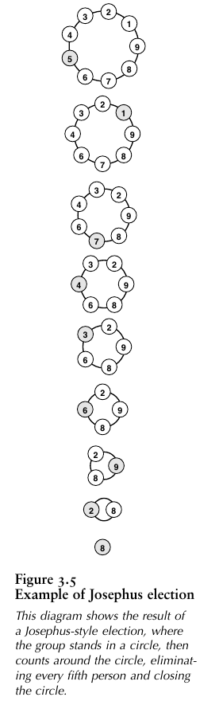
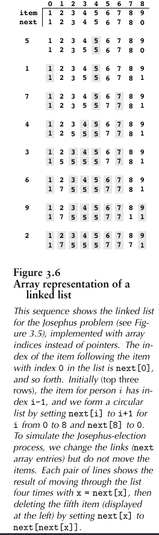

When our primary interest is to go through a collection of items sequentially, one by one, we can organize the items as a *linked list*: a basic data structure where each item contains the information that we need to get to the next item. The primary advantage of linked lists over arrays is that the ==links provide us with the capability to  rearrange the items efficiently==. This flexibility is gained at the expense of quick access to any arbitrary item in the list, because the only way to get to an item in the list is to follow links, one node to the next. There are a number of ways to organize linked lists, all starting with the following basic definition.

## 3.3.1 Definition

**Definition 3.2**   *A*  **linked list** *is a set of items where each item is part of a* **node** *that also contains a* **link** *to a node*.

  We define nodes in terms of references to nodes, so linked lists are sometimes referred to as *self-referent* structures. Moreover, although a node’s link usually refers to a different node, it could refer to the node itself, so linked lists can  also be *cyclic* structures.

Normally, we think of linked lists as implementing a sequential arrangement of a set of items: Starting at a given node, we consider its item to be first in the sequence. Then, we follow its link to another node, which gives us an item that we consider to be second in the sequence, and so forth. In principle, the list could be cyclic and the sequence could seem infinite, but we most often work with lists that correspond to a simple sequential arrangement of a finite set of items, adopting one of the following conventions for the link in the final node:

- It is a *null link* that points to no node.
- It refers to a *dummy node* that contains no item.
- It refers back to the first node, making the list a *circular* list.

In each case, following links from the first node to the final one defines a sequential arrangement of items. Arrays define a sequential ordering of items as well; in an array, however, the sequential organization is provided implicitly, by the position in the array. (Array also support arbitrary access by index, which lists do not.)

In C, we use points for links and structures for nodes. The `typedef` declaration gives us a way to refer to links and nodes. Links are pointers to nodes, and nodes consist of items and links. :

```c
typedef struct node *link;
struct node {
  Item item;
  link next;
};
```

==Memory allocation is a central consideration in the effective use of linked lists.== Although we have defined a single structure, it is important to remember that we will have many instances of this. Generally, we do not know the number of nodes that we will need until our program is executing, and various parts of our programs might have similar calls on the available memory, so we make use of system programs to keep track of our memory usage. 

To begin, whenever we want to use a new node, we need to create an instance of a node structure and to reserve memory for it :

```c
link x = malloc(sizeof *x);
```

The correspondence between links and C pointers is essential, but we must bear in mind  that the former is an abstraction and the latter a concrete representation.

## 3.3.2 Deletion and Insertion

Figures 3.3 and 3.4 show the two fundamental operations that perform on linked lists. We can *delete* any item from a linked list and *insert* an item into a linked list at any point. 



To delete the node following node x, we use the statement :

```c
t = x->next;
x->next = t->next;
// or simply 
x->next = x->next->next;
```



To insert node t into a list at a position following node x:

```c
t->next = x->next;
x->next = t;
```

The simplicity of insertion and deletion is the *raison d’etre* (reason to be, 这里为啥用法语。。。) of linked lists.

 The corresponding operations are unnatural and inconvenient in arrays, because they require moving all of the array’s contents following the affected item.

By contrast, linked lists are *not* well suited for the *find the kth item* (find an item given its index) operation that simply by accessing a[k]; in a list,we have to traverse *k* links. Another operation that is unnatural on singly linked lists is *find the item before a given item*.

When we remove a node from a linked list using `x->next = x->next->next`, we may never be able to access it again. For small programs, this is no special concern, but we generally regard it as good programming practice to use the function `free`, which is the counterpart to `malloc`, for any node that we no longer wish to use.

```c
t = x->next;
x->next = t->next;
free(t)
```

Specifically, the sequence of instructions not only removes t from our list but also informs the system that the memory it occupies may be used for some other purpose. We pay particular attention to `free` when we have large list objects, or large numbers of them. 

## 3.3.3 Josephus problem

> People are standing in a [circle](https://en.wikipedia.org/wiki/Circle) waiting to be executed. Counting begins at a specified point in the circle and proceeds around the circle in a specified direction. After a specified number of people are skipped, the next person is executed. The procedure is repeated with the remaining people, starting with the next person, going in the same direction and skipping the same number of people, until only one person remains, and is freed.
>
> The problem—given the number of people, starting point, direction, and number to be skipped—is to choose the position in the initial circle to avoid execution.

```c
// program 3.9
#include <stdio.h>
#include <stdlib.h>

typedef struct node* Link;
struct node {
    int item;
    Link next;
};

int main(int argc, char* argv[]) {
    int N = atoi(argv[1]);
    int M = atoi(argv[2]);

    Link t = malloc(sizeof(*t));
    Link x = t;
    t->item = 1;
    t->next = t;

    // create a circular list
    for (int i = 2; i <= N; i++) {
        x->next = malloc(sizeof(*x));
        x = x->next;
        x->item = i;
        x->next = t;
    }
    
    // remove Mth item
    while(x != x->next) {
        for (int i = 1; i < M; i++) {
            x = x->next;
        }
        // delete node x
        Link d = x->next;
        x->next = d->next;
        // release mem
        free(d);
        N--;
    }
    printf("%d\n", x->item);
}
```

To represent people arranged in a circle, we build a circular linked list. The `i` represents the `i`th person in the circle. After building a one-node circular list for 1, we insert 2 through *N* after that node, resulting in a circle with 1  through *N*, leaving x pointing to N. Then we skip `M - 1` nodes, beginning with 1, and set the link of the `M - 1` st to skip the `M`th, continuing until only one node is left.



The Sieve of Eratosthenes and the Josephus problem clearly illustrate the distinction between using arrays and using linked lists to represent a sequentially organized collection of objects. 

- **Sieve of Eratosthenes**: Using a linked list would be **costly** because the algorithm’s efficiency depends on being able to access any array position quickly.
- **Josephus problem** : Using an array would be **costly** because the algorithm’s efficiency depends on the ability to delete items quickly.

When we choose a data structure, we *must* be aware of the effects of that choice upon the efficiency of the algorithms that will process the data. This interplay between  data structures and algorithms is at the heart of the design process.

### 3.3.3.1 Using array for Josephus Problem

In C, pointers provide a direct and convenient concrete realization of the abstract concept of a linked list, but the essential value of the abstraction does not depend on any particular implementation. Figure 3.6 shous how we could use arrays of int to implement the linked list. 

Linked lists are thus useful even in the simplest of programming environments. Linked lists were useful well before pointer constructs were available in high-level languages such as C. Eevn in modern systems, simple array-based implementations are sometimes convenient.

```c
#include <stdio.h>
#include <stdlib.h>
#include <string.h>
#include <time.h>

void print_arr(int a[], int len) {
    printf("[");
    for (int i = 0; i < len; i++) {
        printf("%d ", a[i]);
    }
    printf("]\n");
}

void print_indices(int len) {
     printf("[");
    for (int i = 0; i < len; i++) {
        printf("%d ", i);
    }
    printf("]\n");
}

void print_all(int item[], int next[], int N, char* msg) {
    printf("%s:\n\t",msg);
    print_indices(N);
    printf("\t");
    print_arr(item, N);
    printf("\t");
    print_arr(next, N);
}

int main(int argc, char* argv[]) {
    int N = atoi(argv[1]);
    int M = atoi(argv[2]);

    int* item = malloc(sizeof(int) * N);
    int* next = malloc(sizeof(int) * N);

    memset(item, 0, N);
    memset(next, 0, N);

    // start time
    clock_t begin = clock();

    for (int i = 1; i <= N; i++) {
        item[i - 1] = i;
        next[i - 1] = i;
        if(i == N) {
            next[i - 1] = 0;
        }
    }

    // print_all(item, next, N, "Before");

    int x = N - 1;
    for (; item[x] != item[next[x]];) {
        for (int j = 1; j < M; j++){
            x = next[x];
        }
        // remove Mth item
        next[x] = next[next[x]];
    }

    // end time
    clock_t end = clock();

    printf("Result: %d\n", item[x]);
    // print_all(item, next, N, "After");

    printf("Mem usage: %d bytes\n", (sizeof(item) + sizeof(next)) * N);
    printf("Time spent: %f s", (double)(end - begin)/CLOCKS_PER_SEC);
}
```



对比两种实现：

```sh
$ cmake --build . && ./LinkedListInArray 100000 100000
Result: 66029
Mem usage: 1600000 bytes
Time spent: 18.794240 s
$ cmake --build . && ./LinkedListInPointer 100000 100000
Result: 66029
Max mem usage: 1600000 bytes
Time spent: 27.371862 s
```

时间上采用数组实现的链表运行时间要短一些（指针实现即使是注释掉了`free` 函数，但是运行时间还是比较长，可能是数组的随机访问要快些？）

内存使用上，数组实现占用的内存是固定不变的，而指针实现在删除节点元素时会释放掉不用的内存。

## Exercises

- 3.24 Write
- // TODO: complete it later 2022-01-28

## Reference

1. [Algorithms in C](https://www.amazon.com/Algorithms-Parts-1-4-Fundamentals-Structures-dp-0201314525/dp/0201314525/ref=mt_other?_encoding=UTF8&me=&qid=) 
2. [Josephus problem](https://en.wikipedia.org/wiki/Josephus_problem) wikipedia