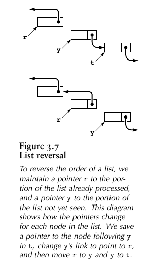

With arrays and structures, we save an item in memory and later refer to it by name (or by index); with linked lists, the manner in which we save information makes it more difficult to access but easier to rearrange. 

Working with data that are organized in linked lists is called *list processing*.

## 1 Definition

**Definition 3.3 ** *A linked list is either a null link or a link to a node that contains an item and a link to a linked list*.

This definition is more restrictive than [**definition 3.2**](03.3.md/#Definition), but it corresponds more closely to the mental model that we have when we write list-processing code.

## 2 List Processing

### 2.1 Traverse

One of the common operations that we perform on lists is to *traverse* them: We scan through the items on the list sequentially, performing some operation on each.

For example, if `x` is a pointer to the first node of a list, the final node has a null pointer, and `visit` is a function that takes an item as an argument: 

```c
for (t = x; t != NULL; t = t->next) {
    visit(t->item);
}
```

 This loop is as ubiquitous in list-processing programs as is the corresponding `for (int i = 0; i < N; i++)` in array-processing program.

### 2.2 List Reversal

Implementation in C :

```c
#include <stdio.h>
#include <stdlib.h>

typedef struct node* Link;
struct node {
    int item;
    Link next;
};

Link reverse(Link head) {
    Link r = NULL;

    for (Link y = head; y != NULL;) {
        // save y to tmp node
        // The variable is allocated once, when the function is called 
        // (https://stackoverflow.com/questions/7959573/declaring-variables-inside-loops-good-practice-or-bad-practice)
        Link tmp = y->next;
        // y point to r(head of reverse list)
        y->next = r;
        // move r to y
        r = y;
        // move y to next
        y = tmp;
    }
    // return the new head of reverse list 
    return r;
}

void print_list(Link head) {
    printf("[");
    for (Link x = head; x != NULL; x = x->next) {
        printf("%d ", x->item);
    }
    printf("]");
}

void print_node(Link node) {
    printf("{item: %d, next: %p", node->item, node->next);
}

void print_list_verbose(Link head) {
    printf("[");
    for (Link x = head; x != NULL; x = x->next) {
        print_node(x);
        printf(", ");
    }
    printf("]");
}

Link new_list(int len) {
    Link head = malloc(sizeof(*head));
    head->item = 0;
    head->next = NULL;

    Link x = head;
    // create a list that item is from 0 to len-1
    for (int i = 1; i < len; i++) {
        Link node = malloc(sizeof(*node));
        node->item = i;

        // add to tail of the lists
        node->next = x->next;
        x->next = node;
        // move x to next
        x = node;
    }
    return head;
}

int main() {
    Link list = new_list(10);
    printf("Before: \n");
    print_list(list);
    printf("\n");
    Link reverseLink = reverse(list);
    printf("\nAfter: \n");    
    print_list(reverseLink);
    printf("\n");
    return 0;
}
```

Implementation in go:

```go
package main

import (
	"fmt"
	"os"
	"strconv"
	"strings"
)

type Node struct {
	item int
	next *Node
}

func (n *Node) String() string {
	var builder strings.Builder

	builder.WriteString("[")
	for x := n; x != nil; x = x.next {
		builder.WriteString(fmt.Sprintf("%d ", x.item))
	}
	builder.WriteString("]")
	return builder.String()
}

func (n *Node) Reverse() *Node {
	var r *Node
	for x := n; x != nil; {
		t := x.next
		x.next = r
		r = x
		x = t
	}
	return r
}

func NewLinkedList(len int) *Node {
	head := &Node{}

	x := head
	for i := 1; i < len; i++ {
		node := &Node{item: i}

		node.next = x.next
		x.next = node
		x = x.next
	}
	return head
}

func main() {
	if len(os.Args) < 2 {
		fmt.Printf("Usage: ListReversal list_length")
	}
	len, _ := strconv.Atoi(os.Args[1])

	list := NewLinkedList(len)
	fmt.Println(list)
	reverseList := list.Reverse()
	fmt.Println(reverseList)
}
```

 This function reverses the links in a list, returning a pointer to the final node. To accomplish this task, we need to maintain links to three consecutive nodes in the list.



### 2.3 List Insertion Sort

In C : 

```c
```

