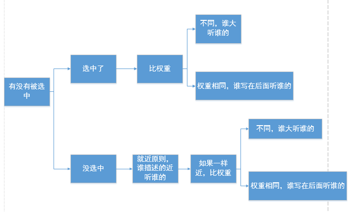

# CSS

## 简介

CSS(Cascading Style Sheets): 层叠样式表，作用是给 HTML 页面标签添加各种样式，**定义网页的显示效果**,将网页**内容和显示样式进行分离**，提高了显示功能

## 语法

CSS 由两个部分组成

- 选择器 ： 需要改变的 HTML 元素 
- 声明 ： 由属性和值组成，属性(property)为样式属性(style attribute)

```
选择器{ 属性名: 属性值; 属性名: 属性值; }
```


注意： 

- 声明使用分号`;`结束,以大括号包裹`{}`
- 属性有多个值的话，那么多个值用**空格**隔开

CSS 使用 `/* comment */`的形式注释

```css
/* comment */
p {
    width: 20px;
}
```

## 插入样式表

插入样式表的方法有三种:

- 外部样式表(External style sheet)
- 内部样式表(Internal style sheet)
- 内联样式(Inline style)

###  内联样式

将样式和内容混杂在一起，内联样式会损失样式表的优势；所以要慎用这种方式，如样式仅需在此内容上显示一次

在标签使用 style 属性即可使用内联样式:

```html
<p style="color:red;margin-left:20px">This is a paragraph</p>
```

### 内部样式

当单个页面需要特殊样式时，可以使用内部样式表

在`<head>`中使用`<style>`标签来定义内部样式：

```html
 <style>
        h1 {
            color: blue;
        }
 </style>
```

### 外部样式

当样式需要应用到很多页面的时候，可以使用外部样式

在`<head>`中使用`<link>`链接外部样式:

```html
<link rel="stylesheet" type="text/css" href="test.css">
```

```css
h2 {
   color: green;
}
```

### 多重样式

若样式在不同的 CSS 中被同样的选择器所定义

覆盖的优先级为：

`**（内联样式）Inline style > （内部样式）Internal style sheet >（外部样式）External style sheet > 浏览器默认样式**`

例如：

内联样式：

```html
<h3 style="color: red; font-size: 20px;">Title</h3> 
```

内部样式：

```css
h3 {
    color: pink;
    font-size: 5px;
    margin-top: 50px;
}
```

外部样式：

```css
h3 {
    margin-left: 10px;
}
```

最后 h3 的样式将为：

```
color: red;
font-size: 20px;
margin-top: 50px;
margin-left: 10px;
```

## 基本选择器

**CSS 选择器**规定了 CSS 规则会被应用到哪些元素上

基本选择器有四种：

- 元素选择器： 按照给定的节点名称，选择所有匹配的元素。
  **语法：**`elementname`
  **例子：**`input` 匹配任何 [``](https://developer.mozilla.org/zh-CN/docs/Web/HTML/Element/Input) 元素。
- ID 选择器 ： 按照 `id` 属性选择一个与之匹配的元素。需要注意的是，一个文档中，每个 ID 属性都应当是唯一的。
  **语法：**`#idname`
  **例子：**`#toc` 匹配 ID 为 "toc" 的元素
- 类选择器 ： 按照给定的 `class` 属性的值，选择所有匹配的元素。
  **语法**：`.classname`
  **例子**：`.index` 匹配任何 `class` 属性中含有 "index" 类的元素
- 通用选择器 ：选择所有元素。（可选）可以将其限制为特定的名称空间或所有名称空间。
  **语法：**`*` `ns|*` `*|*`
  **例子：**`*` 将匹配文档的所有元素
- 属性选择器 ： 按照给定的属性，选择所有匹配的元素。
  **语法：**`[attr]` `[attr=value]` `[attr~=value]` `[attr|=value]` `[attr^=value]` `[attr$=value]` `[attr*=value]`
  **例子：**`[autoplay]` 选择所有具有 `autoplay` 属性的元素（不论这个属性的值是什么）

### 元素选择器

```css
p {
    color: red;
}
```

表示所有的`<p>`标签字体颜色将为 red

### ID 选择器

使用`#id`的形式定义

```css
#my-title {
    color: palegreen;
}
```

将应用在 ID 为`my-title`的元素上

### 类选择器

使用`.class`的形式

```css
.my-span {
    color: plum;
}
```

将应用在所有 class 为`my-span`的标签上

### 通用选择器

使用`*`选择任何标签

```css
* {
    color: red;
}
```

将应用在所有的标签上

### 属性选择器

```css
[font-size] {
    color: red;
}
```

选择所有具有 `font-size` 属性的元素（不论这个属性的值是什么）

## 高级选择器

常见的高级选择器：

- 选择器列表（[Selector list](https://developer.mozilla.org/zh-CN/docs/Web/CSS/Selector_list)）

  `,` 是将不同的选择器组合在一起的方法，它选择所有能被列表中的任意一个选择器选中的节点。
  **语法**：`A, B`
  **示例**：`div, span` 会同时匹配`<span>`元素和`<div>`元素

- 后代组合器([Descendant combinator](https://developer.mozilla.org/zh-CN/docs/Web/CSS/Descendant_combinator)) ： （空格）组合器选择前一个元素的后代节点
  **语法：**`A B`
  **例子：**`div span` 匹配所有位于任意`<div>`内部的`<span>`元素
  
- 直接子代组合器（[Child combinator](https://developer.mozilla.org/zh-CN/docs/Web/CSS/Child_combinator)）： 组合器选择前一个元素的直接子代的节点

- 一般兄弟组合器**（**[General sibling combinator](https://developer.mozilla.org/zh-CN/docs/Web/CSS/General_sibling_combinator)**）**：`~` 组合器选择兄弟元素，也就是说，后一个节点在前一个节点后面的任意位置，并且共享同一个父节点 
  **语法**：`A ~ B`
  **例子**：`p ~ span` 匹配同一父元素下，`<p>`元素后的所有`<span>`元素
  
- 紧邻兄弟组合器**（**[Adjacent sibling combinator](https://developer.mozilla.org/zh-CN/docs/Web/CSS/Adjacent_sibling_combinator)**）**`+` 组合器选择相邻元素，即后一个元素紧跟在前一个之后，并且共享同一个父节点。
  **语法：**`A + B`
  **例子：**`h2 + p` 会匹配所有紧邻在`<h2>`元素后的`<p>`元素

- 列组合器**（**[Column combinator](https://developer.mozilla.org/en-US/docs/Web/CSS/Column_combinator)**）**`||` 组合器选择属于某个表格行的节点。
  **语法：** `A || B`
  **例子：** `col || td` 会匹配所有`<col>`作用域内的`<td>`元素

- 伪类
  `:` 伪选择器支持按照未被包含在文档树中的状态信息来选择元素。
  **例子：**`a:visited` 匹配所有曾被访问过的`<a>`元素

- 伪元素`::` 伪选择器用于表示无法用 HTML 语义表达的实体。
  **例子：**`p::first-line` 匹配所有`<p>`元素的第一行

 ## 继承

- 关于文字样式的属性，都具有继承性。这些属性包括：color、 text-开头的、line-开头的、font-开头的。
- 关于盒子、定位、布局的属性，都不能继承

## 层叠

Stylesheets **cascade（样式表层叠）** — 简单的说，css规则的顺序很重要

当多个选择器，选择上了某个元素的时候，要按照如下顺序统计权重：

- id 选择器
- 类选择器、属性选择器、伪类选择器
- 标签选择器、伪元素选择器

对于相同方式的样式表，其选择器排序的优先级为：ID选择器 > 类选择器 > 标签选择器

权重相同时,书写顺序靠后优先

权重总结：



- 选择上了，数权重，(id的数量，类的数量，标签的数量)。如果权重一样，谁写在后面听谁的。
- 没有选择上，通过继承影响的，就近原则，谁描述的近听谁的。如果描述的一样近，比如选择器权重，如果权重再一样重，谁写在后面听谁的

冲突总结

- 1、对于相同的选择器（比如同样都是类选择器），其样式表排序：行级样式 > 内嵌样式表 > 外部样式表（就近原则）
- 2、对于相同类型的样式表（比如同样都是内部样式表），其选择器排序：ID选择器 > 类选择器 > 标签选择器
- 3、外部样式表的ID选择器 > 内嵌样式表的标签选择器

### `!important`

当在一个样式声明中使用一个 `!important` 规则时，此声明将覆盖任何其他声明。虽然，从技术上讲，`!important` 与优先级无关，但它与最终的结果直接相关。使用 `!important` 是一个**坏习惯**，应该尽量避免，因为这破坏了样式表中的固有的级联规则 使得调试找bug变得更加困难了。当两条相互冲突的带有 `!important` 规则的声明被应用到相同的元素上时，拥有更大优先级的声明将会被采用

- **一定**要优先考虑使用样式规则的优先级来解决问题而不是 `!important`
- **只有**在需要覆盖全站或外部 CSS 的特定页面中使用 `!important`
- **永远不要**在你的插件中使用 `!important`
- **永远不要**在全站范围的 CSS 代码中使用 `!important`

#### 可以使用 `!important`的情况

覆盖内联样式

你的网站上有一个设定了全站样式的 CSS 文件，同时你（或是你同事）写了一些很差的内联样式。

全局的CSS文件会在全局范围内设置网站的外观，而直接在各个元素上定义的内联样式可能会覆盖您的全局CSS文件。 内联样式和!important都被认为是非常不好的做法，但是有时你可以在CSS文件里用!important去覆盖内联样式。

在这种情况下，你就可以在你全局的 CSS 文件中写一些 `!important` 的样式来覆盖掉那些直接写在元素上的行内样式。

覆盖优先级高的选择器

```css
#someElement p {
  color: blue;
}

p.awesome {
  color: red;
}
```

在外层有 `#someElement` 的情况下，你怎样能使 `awesome `的段落变成红色呢？这种情况下，如果不使用 `!important` ，第一条规则永远比第二条的优先级更高

#### 覆盖 `!important`

A)很简单，只需再添加一条 带 `!important` 的CSS规则，再给这个给选择器更高的优先级（添加一个标签，ID或类）；或是添加一样选择器，把它的位置放在原有声明的后面（总之，最后定义一条规则比胜）。

## 伪类

伪类是选择器的一种，它用于选择处于特定状态的元素，比如当它们是这一类型的第一个元素时，或者是当鼠标指针悬浮在元素上面的时候。它们表现得会像是你向你的文档的某个部分应用了一个类一样，帮你在你的标记文本中减少多余的类，让你的代码更灵活、更易于维护

伪类就是开头为冒号的关键字：

```
:pseudo-class-name
```

示例：

使用[`:first-child`](https://developer.mozilla.org/zh-CN/docs/Web/CSS/:first-child)伪类选择器——这将*一直*选中文章中的第一个子元素，我们将不再需要编辑HTML

```css
article p:first-child {
    font-size: 120%;
    font-weight: bold;
}   
```

```html
<article>
    <p>Veggies es bonus vobis, proinde vos postulo essum magis kohlrabi welsh onion daikon amaranth tatsoi tomatillo
            melon azuki bean garlic.</p>

    <p>Gumbo beet greens corn soko endive gumbo gourd. Parsley shallot courgette tatsoi pea sprouts fava bean collard
            greens dandelion okra wakame tomato. Dandelion cucumber earthnut pea peanut soko zucchini.</p>
</article>
    
```

### 用户行为伪类

一些伪类只会在用户以某种方式和文档交互的时候应用。这些**用户行为伪类**，有时叫做**动态伪类**，表现得就像是一个类在用户和元素交互的时候加到了元素上一样。案例包括：

- `:hover`——上面提到过，只会在用户将指针挪到元素上的时候才会激活，一般就是链接元素。
- `:focus`——只会在用户使用键盘控制，选定元素的时候激活。

```css
a:link,
a:visited {
    color: rebeccapurple;
    font-weight: bold;
}

a:hover {
    color:hotpink;
}   
```

```html
<p><a href="">Hover over me</a></p>
```

## 伪元素

伪元素以类似方式表现，不过表现得是像你往标记文本中加入全新的HTML元素一样，而不是向现有的元素上应用类。伪元素开头为双冒号`::`

```
::pseudo-element-name
```

例如，如果你想选中一段的第一行，你可以把它用一个`<span>`元素包起来，然后使用元素选择器；不过，如果包起来的单词/字符数目长于或者短于父元素的宽度，这样做会失败。由于我们一般不会知道一行能放下多少单词/字符——因为屏幕宽度或者字体大小改变的时候这也会变——通过改变HTML的方式来可预测地这么做是不可能的。

`::first-line`伪元素选择器会值得信赖地做到这件事——即使单词/字符的数目改变，它也只会选中第一行。

```css
article p::first-line {
    font-size: 120%;
    font-weight: bold;
}   
```

```html
<article>
    <p>Veggies es bonus vobis, proinde vos postulo essum magis kohlrabi welsh onion daikon amaranth tatsoi tomatillo
            melon azuki bean garlic.</p>

    <p>Gumbo beet greens corn soko endive gumbo gourd. Parsley shallot courgette tatsoi pea sprouts fava bean collard
            greens dandelion okra wakame tomato. Dandelion cucumber earthnut pea peanut soko zucchini.</p>
</article>
```

## 伪类和伪元素组合

如果你想让第一段的第一行加粗，你需要把`:first-child`和`::first-line`选择器放到一起。试着编辑前面的实时示例，让它使用下面的CSS。这里的意思是，我们想选择一个`<article>`元素里面的第一个`<p>`元素的第一行。

```
article p:first-child::first-line {
  font-size: 120%;
  font-weight: bold;
}
```

## 生成带有::before和::after的内容

有一组特别的伪元素，它们和`content`属性一同使用，使用CSS将内容插入到你的文档中中。

你能用这些插入一个文本字符串，和在下面的实时示例里那样。试着改变[`content`](https://developer.mozilla.org/zh-CN/docs/Web/CSS/content)属性的文本值，看看输出是怎么改变的。你也能改变`::before`伪元素为`::after`，看到这段文本插入到了元素的末尾而不是开头。

```css
.box::before {
    content: "This should show before the other content."
}   
```

```html
<p class="box">Content in the box in my HTML page.</p>
    
```

从CSS插入文本字符串，我们并不会在Web浏览器上经常这么做，因为对于一些屏幕阅读器来说，文本是不可见的，而且对于未来别人的查找和编辑也不是很方便。

这些伪元素的更推荐的用法是插入一个图标，例如下面的示例加入的一个小箭头，作为一个视觉性的提示，而且我们并不希望屏幕阅读器读出它。

```css
box::after {
    content: " ➥"
}   
```

```html
<p class="box">Content in the box in my HTML page.</p>
```

这些伪元素经常用于插入空字符串，其后可以像页面上的其他元素被样式化。

下个示例，我们已经用 `::before`伪元素加入了个空字符串。我们把它设为了`display: block`，以让它可以用width和height进行样式化。然后我们可以用CSS像任何元素那样样式化。你可以摆弄CSS，改变它的外观和行为。

```css
.box::before {
    content: "";
    display: block;
    width: 100px;
    height: 100px;
    background-color: rebeccapurple;
    border: 1px solid black;
}   
```

```html
<p class="box">Content in the box in my HTML page.</p>
```

`::before`和`::after`伪元素与`content`属性的共同使用，在CSS中被叫做“生成内容”，而且你会见到这种技术被用于完成各种任务。[CSS Arrow Please](http://www.cssarrowplease.com/)网站就是一个著名的示例，它帮你用CSS生成一个箭头。在你创建你的箭头的时候看下CSS，你将会看到实际使用的[`::before`](https://developer.mozilla.org/zh-CN/docs/Web/CSS/::before)和[`::after`](https://developer.mozilla.org/zh-CN/docs/Web/CSS/::after)伪元素。无论什么时候你看到了这些选择器，都要看下[`content`](https://developer.mozilla.org/zh-CN/docs/Web/CSS/content)属性，以了解文档中添加了什么

## 参考

1. [MDN Web Docs](https://developer.mozilla.org/zh-CN/) 
2. [qianguyihao-CSS](https://web.qianguyihao.com/01-HTML/08-HTML5%E8%AF%A6%E8%A7%A3.html#%E8%A1%A8%E5%8D%95%E5%85%83%E7%B4%A0%EF%BC%88%E6%A0%87%E7%AD%BE%EF%BC%89) qianguyihao
3. [cssarrowplease](https://cssarrowplease.com/)
