# HTML5

### ## 简介

HTML5并不仅仅只是做为HTML标记语言的一个最新版本，更重要的是它**制定了Web应用开发的一系列标准**，成为第一个将Web做为应用开发平台的HTML语言。

HTML5定义了一系列新元素，如新语义标签、智能表单、多媒体标签等，可以帮助开发者创建富互联网应用，还提供了一些Javascript API，如地理定位、重力感应、硬件访问等，可以在浏览器内实现类原生应用。我们甚至可以结合 Canvas 开发网页版游戏。

**`HTML5`的广义概念**：HTML5代表浏览器端技术的一个发展阶段。在这个阶段，浏览器的呈现技术得到了飞跃发展和广泛支持，它包括：HTML5、CSS3、Javascript API在内的一套技术组合。

`HTML5`不等于 `HTML next version`。`HTML5` 包含： `HTML`的升级版、`CSS`的升级版、`JavaScript API`的升级版。

**总结**：`HTML5`是新一代开发 **Web 富客户端**应用程序整体**解决方案**。包括：HTML5，CSS3，Javascript API在内的一套**技术组合**。

**富客户端**：具有很强的**交互性**和体验的客户端程序。比如说，浏览博客，是比较简单的客户端；一个在线听歌的网站、即时聊天网站就是富客户端

## HTML5 的应用场景

列举几个HTML5 的应用场景：

（1）极具表现力的网页：内容简约而不简单。

（2）网页应用程序：

- 代替PC端的软件：iCloud、百度脑图、Office 365等。
- APP端的网页：淘宝、京东、美团等。
- 微信端：公众号、小程序等。

（3）混合式本地应用。

（4）简单的游戏。

### 语义化的作用

语义标签对于我们并不陌生，如`<p>`表示一个段落、`<ul>`表示一个无序列表。**标签语义化的作用：**

- 能够便于开发者阅读和写出更优雅的代码。
- 同时让浏览器或是网络爬虫可以很好地解析，从而更好分析其中的内容。
- 更好地搜索引擎优化。

总结：HTML的职责是描述一块内容是什么（或其意义），而不是它长什么样子；它的外观应该由CSS来决定。

### H5在语义上的改进

在此基础上，HTML5 增加了大量有意义的语义标签，更有利于搜索引擎或辅助设备理解 HTML 页面内容。HTML5会让HTML代码的内容更结构化、标签更语义化。

我们常见的 css+div 布局是：

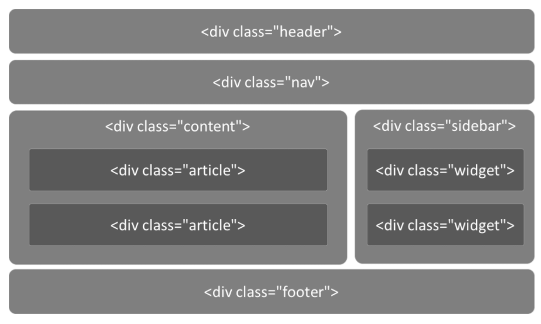

在html5中，我们可以这样写：

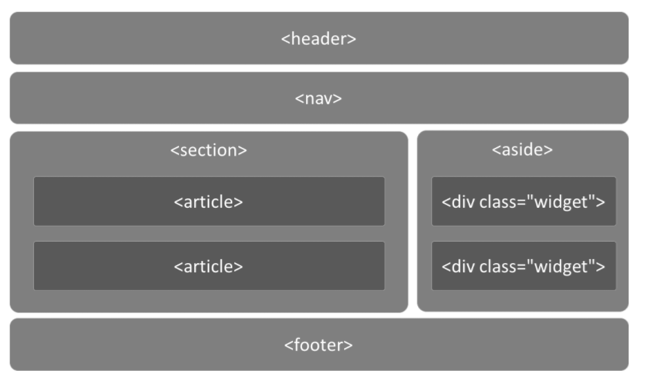

传统的做法中，我们通过增加类名如`class="header"`、`class="footer"`，使HTML页面具有语义性，但是不具有通用性。

HTML5 则是通过新增语义标签的形式来解决这个问题，例如`<header></header>`、`<footer></footer>`等，这样就可以使其具有通用性。

**传统网页布局：**

```html
<!-- 头部 -->
<div class="header">
    <ul class="nav"></ul>
</div>

<!-- 主体部分 -->
<div class="main">
    <!-- 文章 -->
    <div class="article"></div>
    <!-- 侧边栏 -->
    <div class="aside"></div>
</div>

<!-- 底部 -->
<div class="footer">

</div>
```

**H5 的经典网页布局：**

```html
<!-- 头部 -->
<header>
    <ul class="nav"></ul>
</header>

<!-- 主体部分 -->
<div class="main">
    <!-- 文章 -->
    <article></article>
    <!-- 侧边栏 -->
    <aside></aside>
</div>

<!-- 底部 -->
<footer>

</footer>
```

### H5中新增的语义标签

- `<section>` 表示区块
- `<article>` 表示文章。如文章、评论、帖子、博客
- `<header>` 表示页眉
- `<footer>` 表示页脚
- `<nav>` 表示导航
- `<aside>` 表示侧边栏。如文章的侧栏
- <figure> 表示媒介内容分组。
- `<mark>` 表示标记 (用得少)
- `<progress>` 表示进度 (用得少)
- `<time>` 表示日期

本质上新语义标签与`<div>`、`<span>`没有区别，只是其具有表意性，使用时除了在HTML结构上需要注意外，其它和普通标签的使用无任何差别，可以理解成`<div class="nav">` 相当于`<nav>`。

#### 新语义标签的兼容性处理

IE8 及以下版本的浏览器不支持 H5 和 CSS3。解决办法：引入`html5shiv.js`文件。

引入时，需要做if判断，具体代码如下：

```html
    <!--  条件注释 只有ie能够识别-->

    <!--[if lte ie 8]>
        <script src="html5shiv.min.js"></script>
    <![endif]-->
```

上方代码是**条件注释**：虽然是注释，但是IE浏览器可以识别出来。解释一下：

- l：less 更小
- t：than 比
- e：equal等于
- g：great 更大

PS:我们在测试 IE 浏览器的兼容的时候，可以使用软件 ietest，模拟IE6-IE11。

在不支持HTML5新标签的浏览器，会将这些新的标签解析成行内元素(inline)对待，所以我们只需要将其转换成块元素(block)即可使用。

但是在IE9版本以下，并不能正常解析这些新标签，但是可以识别通过document.createElement('tagName')创建的自定义标签。于是我们的解决方案就是：将HTML5的新标签全部通过document.createElement('tagName')来创建一遍，这样IE低版本也能正常解析HTML5新标签了。

当然，在实际开发中我们更多采用的办法是：检测IE浏览器的版本，来加载第三方的JS库来解决兼容问题（如上方代码所示）

## H5中的表单

传统的Web表单已经越来越不能满足开发的需求，HTML5 在 Web 表单方向做了很大的改进，如拾色器、日期/时间组件等，使表单处理更加高效。

### H5中新增的表单类型

- `email` 只能输入email格式。自动带有验证功能。
- `tel` 手机号码。
- `url` 只能输入url格式。
- `number` 只能输入数字。
- `search` 搜索框
- `range` 滑动条
- `color` 拾色器
- `time` 时间
- `date` 日期
- `datetime` 时间日期
- `month` 月份
- `week` 星期

上面的部分类型是针对移动设备生效的，且具有一定的兼容性，在实际应用当中可选择性的使用。

代码举例：

```html
<!DOCTYPE html>
<html lang="en">
<head>
    <meta charset="UTF-8">
    <meta name="viewport" content="width=device-width, initial-scale=1, user-scalable=no">
    <title>表单类型</title>
    <style>
        body {
            margin: 0;
            padding: 0;
            background-color: #F7F7F7;
        }

        form {
            max-width: 500px;
            width: 100%;
            margin: 32px auto 0;
            font-size: 16px;
        }

        label {
            display: block;
            margin: 10px 0;
        }

        input {
            width: 100%;
            height: 25px;
            margin-top: 2px;
            display: block;
        }

    </style>
</head>
<body>
<form action="">
    <fieldset>
        <legend>表单类型</legend>
        <label for="">
            email: <input type="email" name="email" required>
        </label>
        <label for="">
            color: <input type="color" name="color">
        </label>
        <label for="">
            url: <input type="url" name='url'>
        </label>
        <label for="">
            number: <input type="number" step="3" name="number">
        </label>
        <label for="">
            range: <input type="range" name="range" value="100">
        </label>
        <label for="">
            search: <input type="search" name="search">
        </label>
        <label for="">
            tel: <input type="tel" name="tel">
        </label>
        <label for="">
            time: <input type="time" name="time">
        </label>
        <label for="">
            date: <input type="date" name="date">
        </label>
        <label for="">
            datetime: <input type="datetime">
        </label>
        <label for="">
            week: <input type="week" name="month">
        </label>
        <label for="">
            month: <input type="month" name="month">
        </label>
        <label for="">
            datetime-local: <input type="datetime-local" name="datetime-local">
        </label>
        <input type="submit">
    </fieldset>
</form>
</body>
</html>
```

代码解释：

`<fieldset>` 标签将表单里的内容进行打包，代表一组；而`<legend>`标签的则是 fieldset 里的元素定义标题。

#### 表单元素（标签）

这里讲两个表单元素。

**`<datalist>` 数据列表：**

```html
<input type="text" list="myData">
<datalist id="myData">
    <option>本科</option>
    <option>研究生</option>
    <option>不明</option>
</datalist>
```

上方代码中，input里的list属性和 datalist 进行了绑定。

效果：

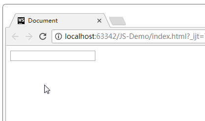

上图可以看出，数据列表可以自动提示。

`<keygen>`元素：

keygen 元素的作用是提供一种验证用户的可靠方法。

keygen 元素是密钥对生成器（key-pair generator）。当提交表单时，会生成两个键：一个公钥，一个私钥。

私钥（private key）存储于客户端，公钥（public key）则被发送到服务器。公钥可用于之后验证用户的客户端证书（client certificate）。

`<meter>`元素：度量器

- low：低于该值后警告
- high：高于该值后警告
- value：当前值
- max：最大值
- min：最小值。

举例：

```javascript
	<meter  value="81"    min="0" max="100"  low="60"  high="80"/>
```

#### 表单属性

- `placeholder` 占位符（提示文字）
- `autofocus` 自动获取焦点
- `multiple` 文件上传多选或多个邮箱地址
- `autocomplete` 自动完成（填充的）。on 开启（默认），off 取消。用于表单元素，也可用于表单自身(on/off)
- `form` 指定表单项属于哪个form，处理复杂表单时会需要
- `novalidate` 关闭默认的验证功能（只能加给form）
- `required` 表示必填项
- `pattern` 自定义正则，验证表单。例如

代码举例：

```html
<!DOCTYPE html>
<html>
<head lang="en">
    <meta charset="UTF-8">
    <title></title>
    <style>
        form {
            width: 100%;
            /* 最大宽度*/
            max-width: 640px;
            /* 最小宽度*/
            min-width: 320px;
            margin: 0 auto;
            font-family: "Microsoft Yahei";
            font-size: 20px;
        }

        input {
            display: block;
            width: 100%;
            height: 30px;
            margin: 10px 0;
        }
    </style>
</head>
<body>

<form action="">
    <fieldset>
        <legend>表单属性</legend>
        <label for="">
            用户名：<input type="text" placeholder="例如：smyhvae" autofocus name="userName" autocomplete="on" required/>
        </label>

        <label for="">
            电话：<input type="tel" pattern="1\d{10}"/>
        </label>

        <label for="">
            multiple的表单: <input type="file" multiple>
        </label>

        <!-- 上传文件-->
        <input type="file" name="file" multiple/>

        <input type="submit"/>
    </fieldset>
</form>

</body>
</html>
```

#### 表单事件

- `oninput()`：用户输入内容时触发，可用于输入字数统计。
- `oninvalid()`：验证不通过时触发。比如，如果验证不通过时，想弹出一段提示文字，就可以用到它。

举例：

```html
<!DOCTYPE html>
<html>
<head lang="en">
    <meta charset="UTF-8">
    <title></title>
    <style>
        form {
            width: 100%;
            /* 最大宽度*/
            max-width: 400px;
            /* 最小宽度*/
            min-width: 200px;
            margin: 0 auto;
            font-family: "Microsoft Yahei";
            font-size: 20px;
        }

        input {
            display: block;
            width: 100%;
            height: 30px;
            margin: 10px 0;
        }
    </style>
</head>
<body>
<form action="">
    <fieldset>
        <legend>表单事件</legend>
        <label for="">
            邮箱：<input type="email" name="" id="txt1"/>
        </label>
        <label for="">
            输入的次数统计：<input type="text" name="" id="txt2"/>
        </label>

        <input type="submit"/>
    </fieldset>
</form>
<script>

    var txt1 = document.getElementById('txt1');
    var txt2 = document.getElementById('txt2');
    var num = 0;

    txt1.oninput = function () {  //用户输入时触发

        num++;  //用户每输入一次，num自动加 1
        //将统计数显示在txt2中
        txt2.value = num;
    }
    txt1.oninvalid = function () {  //验证不通过时触发
        this.setCustomValidity('亲，请输入正确哦');  //设置验证不通过时的提示文字
    }

</script>
</body>
</html>
```

效果：


## 多媒体

在HTML5之前，在网页上播放音频/视频的通用方法是利用Flash来播放。但是大多情况下，并非所有用户的浏览器都安装了Flash插件，由此使得音频、视频播放的处理变得非常复杂；并且移动设备的浏览器并不支持Flash插件。

H5里面提供了视频和音频的标签。

#### 音频

HTML5通过`<audio>`标签来解决音频播放的问题。

```html
	<audio src="music/yinyue.mp3" autoplay controls> </audio>
```

我们可以通过附加属性，来更友好地控制音频的播放，如：

- `autoplay` 自动播放。写成`autoplay` 或者 `autoplay = ""`，都可以。
- `controls` 控制条。（建议把这个选项写上，不然都看不到控件在哪里）
- `loop` 循环播放。
- `preload` 预加载 同时设置 autoplay 时，此属性将失效。

**处理兼容性问题：**

由于版权等原因，不同的浏览器可支持播放的格式是不一样的：

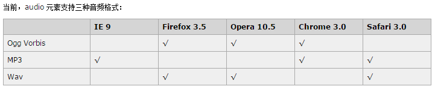

为了做到多浏览器支持，可以采取以下兼容性写法：

```html
<!--推荐的兼容写法：-->
<audio controls loop>
    <source src="music/yinyue.mp3"/>
    <source src="music/yinyue.ogg"/>
    <source src="music/yinyue.wav"/>
    抱歉，你的浏览器暂不支持此音频格式
</audio>
```

代码解释：如果识别不出音频格式，就弹出那句“抱歉”。

#### 视频

HTML5通过`<video>`标签来解决视频播放的问题。

使用举例：

```html
	<video src="video/movie.mp4" controls autoplay></video>
```

我们可以通过附加属性，来更友好地控制视频的播放，如：

- `autoplay` 自动播放。写成`autoplay` 或者 `autoplay = ""`，都可以。
- `controls` 控制条。（建议把这个选项写上，不然都看不到控件在哪里）
- `loop` 循环播放。
- `preload` 预加载 同时设置 autoplay 时，此属性将失效。
- `width`：设置播放窗口宽度。
- `height`：设置播放窗口的高度。

由于版权等原因，不同的浏览器可支持播放的格式是不一样的：

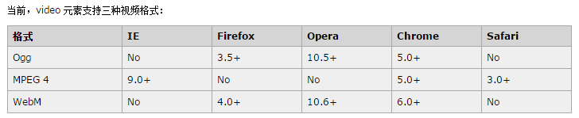

兼容性写法：

```html
    <!--<video src="video/movie.mp4" controls  autoplay ></video>-->
    <!--  行内块 display:inline-block -->
    <video controls autoplay>
        <source src="video/movie.mp4"/>
        <source src="video/movie.ogg"/>
        <source src="video/movie.webm"/>
        抱歉，不支持此视频
    </video>
```

## 拖拽

在HTML5的规范中，我们可以通过为元素增加 `draggable="true"` 来设置此元素是否可以进行拖拽操作，其中图片、链接默认是开启拖拽的。

### 拖拽元素

页面中设置了 `draggable="true"` 属性的元素。

举例如下：

```html
<!DOCTYPE html>
<html lang="en">
<head>
    <meta charset="UTF-8">
    <title>Title</title>
    <link rel="stylesheet" href="css/font-awesome.min.css">
    <style>
    .box1{
        width: 200px;
        height: 200px;
        background-color: green;

    }
    </style>
</head>
<body>
    <!--给 box1 增加拖拽的属性-->
    <div class="box1" draggable="true"></div>
</body>
</html>
```

效果如下：

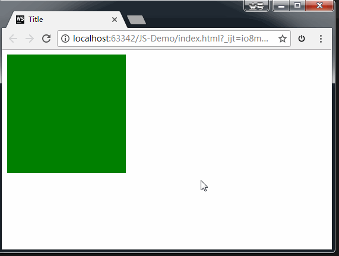

上图中，我们给 box1 增加了`draggable="true"` 属性之后，发现 box1 是可以拖拽的。但是拖拽之后要做什么事情呢？这就涉及到**事件监听**。


**拖拽元素的事件监听**：（应用于拖拽元素）

- `ondragstart`当拖拽开始时调用

- `ondragleave`	当**鼠标离开拖拽元素时**调用

- `ondragend`	当拖拽结束时调用

- `ondrag` 		整个拖拽过程都会调用


代码演示：

```html
<!DOCTYPE html>
<html>
<head lang="en">
    <meta charset="UTF-8">
    <title></title>
    <style>
        .box {
            width: 200px;
            height: 200px;
            background-color: green;
        }
    </style>
</head>
<body>
<div class="box" draggable="true"></div>

<script>
    var box = document.querySelector('.box');

    //  绑定拖拽事件

    //  拖拽开始
    box.ondragstart = function () {
        console.log('拖拽开始.');
    }

    //  拖拽离开：鼠标拖拽时离开被拖拽的元素时触发
    box.ondragleave = function () {
        console.log('拖拽离开..');
    }

    //  拖拽结束
    box.ondragend = function () {
        console.log('拖拽结束...');
        console.log("---------------");
    }

    box.ondrag = function () {
        console.log('拖拽');
    }

</script>
</body>
</html>
```


效果如下：


打印结果：

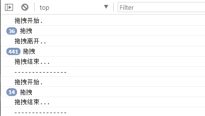


### 目标元素

比如说，你想把元素A拖拽到元素B里，那么元素B就是目标元素。

页面中任何一个元素都可以成为目标元素。

**目标元素的事件监听**：（应用于目标元素）

- `ondragenter`	当拖拽元素进入时调用

- `ondragover`	当拖拽元素停留在目标元素上时，就会连续一直触发（不管拖拽元素此时是移动还是不动的状态）

- `ondrop`		当在目标元素上松开鼠标时调用

- `ondragleave`	当鼠标离开目标元素时调用


代码演示：

```html
<!DOCTYPE html>
<html>
<head lang="en">
    <meta charset="UTF-8">
    <title></title>
    <style>
        .one {
            width: 100px;
            height: 100px;
            border: 1px solid #000;
            background-color: green;
        }

        .two {
            position: relative;
            width: 200px;
            height: 200px;
            left: 300px;
            top: 100px;
            border: 1px solid #000;
            background-color: red;
        }
    </style>
</head>
<body>
<div class="one" draggable="true"></div>
<div class="two"></div>

<script>
    var two = document.querySelector('.two');

    //目标元素的拖拽事件

    // 当被拖拽元素进入时触发
    two.ondragenter = function () {
        console.log("来了.");
    }

    // 当被拖拽元素离开时触发
    two.ondragleave = function () {

        console.log("走了..");
    }

    // 当拖拽元素在 目标元素上时，连续触发
    two.ondragover = function (e) {
        //阻止拖拽事件的默认行为
        e.preventDefault(); //【重要】一定要加这一行代码，否则，后面的方法 ondrop() 无法触发。

        console.log("over...");
    }

    // 当在目标元素上松开鼠标是触发
    two.ondrop = function () {
        console.log("松开鼠标了....");
    }
</script>
</body>
</html>
```


效果演示：


注意，上方代码中，我们加了`event.preventDefault()`这个方法。如果没有这个方法，后面ondrop()方法无法触发。如下图所示：


如上图所示，连光标的形状都提示我们，无法在目标元素里继续操作了。

**总结**：如果想让拖拽元素在目标元素里做点事情，就必须要在 `ondragover()` 里加`event.preventDefault()`这一行代码。


**案例：拖拽练习**

完整版代码：

```html
<!DOCTYPE html>
<html>
<head lang="en">
    <meta charset="UTF-8">
    <title></title>
    <style>
        .one {
            width: 400px;
            height: 400px;
            border: 1px solid #000;
        }

        .one > div, .two > div {
            width: 98px;
            height: 98px;
            border: 1px solid #000;
            border-radius: 50%;
            background-color: red;
            float: left;
            text-align: center;
            line-height: 98px;
        }

        .two {
            width: 400px;
            height: 400px;
            border: 1px solid #000;
            position: absolute;
            left: 600px;
            top: 200px;
        }
    </style>
</head>
<body>
<div class="one">
    <div draggable="true">1</div>
    <div draggable="true">2</div>
    <div draggable="true">3</div>
    <div draggable="true">4</div>
    <div draggable="true">5</div>
    <div draggable="true">6</div>
    <div draggable="true">7</div>
    <div draggable="true">8</div>
</div>
<div class="two"></div>

<script>
    var boxs = document.querySelectorAll('.one div');
    //        临时的盒子 用于存放当前拖拽的元素

    var two = document.querySelector('.two');

    var temp = null;
    //         给8个小盒子分别绑定拖拽事件
    for (var i = 0; i < boxs.length; i++) {
        boxs[i].ondragstart = function () {
//                保持当前拖拽的元素
            temp = this;
            console.log(temp);
        }

        boxs[i].ondragend = function () {
//               当拖拽结束 ，清空temp
            temp = null;
            console.log(temp);
        }
    }

    //        目标元素的拖拽事件
    two.ondragover = function (e) {
//            阻止拖拽的默认行为
        e.preventDefault();
    }
    //        当在目标元素上松开鼠标是触发
    two.ondrop = function () {
//            将拖拽的元素追加到 two里面来
        this.appendChild(temp);
    }
</script>
</body>
</html>
```

效果如下：


## 历史

界面上的所有JS操作不会被浏览器记住，就无法回到之前的状态。

在HTML5中可以通过 `window.history` 操作访问历史状态，让一个页面可以有多个历史状态

`window.history`对象可以让我们管理历史记录，可用于单页面应用，Single Page Application，可以无刷新改变网页内容。

- window.history.forward(); // 前进

- window.history.back(); // 后退

- window.history.go(); // 刷新

- window.history.go(n); //n=1 表示前进；n=-1 后退；n=0s 刷新。如果移动的位置超出了访问历史的边界，会静默失败，但不会报错。

- 通过JS可以加入一个访问状态

- history.pushState; //放入历史中的状态数据, 设置title(现在浏览器不支持改变历史状态)


## 地理定位

在HTML规范中，增加了获取用户地理信息的API，这样使得我们可以基于用户位置开发互联网应用，即**基于位置服务 LBS** (Location Base Service)。


### 获取地理信息的方式

#### IP地址


#### 三维坐标：


（1）**GPS**（Global Positioning System，全球定位系统）。

目前世界上在用或在建的第2代全球卫星导航系统（GNSS）有：

- 1.美国 Global Positioning System （全球定位系统） 简称GPS；

- 2.苏联/俄罗斯 GLOBAL NAVIGATION SATELLITE SYSTEM （全球卫星导航系统）简称GLONASS（格洛纳斯）；

- 3.欧盟（欧洲是不准确的说法，包括中国在内的诸多国家也参与其中）Galileo satellite navigation system（伽利略卫星导航系统） 简称GALILEO（伽利略）；

- 4.中国 BeiDou(COMPASS) Navigation Satellite System（北斗卫星导航系统）简称 BDS ；

- 5.日本 Quasi-Zenith Satellite System （准天顶卫星系统） 简称QZSS ；

- 6.印度 India Regional Navigation Satellite System（印度区域卫星导航系统）简称IRNSS。

以上6个系统中国都能使用。

（2）**Wi-Fi**定位：仅限于室内。

（3）**手机信号**定位：通过运营商的信号塔定位。


### 用户自定义数据：

对不同获取方式的优缺点进行了比较，浏览器会**自动以最优方式**去获取用户地理信息：

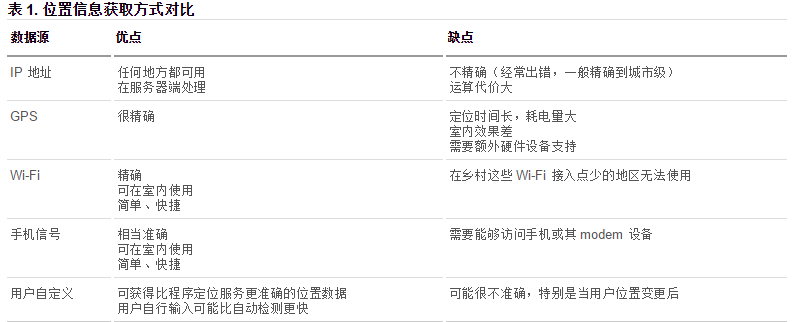


### 隐私

HTML5 Geolocation(地理位置定位) 规范提供了一套保护用户隐私的机制。必须先得到用户明确许可，才能获取用户的位置信息。


### API详解

- navigator.getCurrentPosition(successCallback, errorCallback, options) 获取当前地理信息

- navigator.watchPosition(successCallback, errorCallback, options) 重复获取当前地理信息


1、当成功获取地理信息后，会调用succssCallback，并返回一个包含位置信息的对象position：（Coords即坐标）

- position.coords.latitude纬度

- position.coords.longitude经度


2、当获取地理信息失败后，会调用errorCallback，并返回错误信息error。


3、可选参数 options 对象可以调整位置信息数据收集方式


地理位置的 api 代码演示：

```html
<!DOCTYPE html>
<html>
<head lang="en">
    <meta charset="UTF-8">
    <title></title>
</head>
<body>
    <script>
        /*navigator 导航*/
        //geolocation: 地理定位
//        window.navigator.geolocation
//        兼容处理
        if(navigator.geolocation){
//       如果支持，获取用户地理信息

//            successCallback 当获取用户位置成功的回调函数
//            errorCallback 当获取用户位置失败的回调函数

            navigator.geolocation.getCurrentPosition(successCallback,errorCallback);

        }else{
            console.log('sorry,你的浏览器不支持地理定位');
        }
        // 获取地理位置成功的回调函数
        function successCallback(position){
//            获取用户当前的经纬度
//            coords坐标
//            纬度latitude
            var wd=position.coords.latitude;
//            经度longitude
            var jd=position.coords.longitude;

            console.log("获取用户位置成功！");
            console.log(wd+'----------------'+jd);
//          40.05867366972477----------------116.33668634275229

//            谷歌地图：40.0601398850,116.3434224706
//            百度地图：40.0658210000,116.3500430000
//            腾讯高德：40.0601486487,116.3434373643
        }
        // 获取地理位置失败的回调函数
        function errorCallback(error){
            console.log(error);
            console.log('获取用户位置失败！')
        }
    </script>
</body>
</html>
```


百度地图api举例：

```html
<!DOCTYPE html>
<html>
<head>
    <title>普通地图&全景图</title><script async src="http://c.cnzz.com/core.php"></script>
    <meta http-equiv="Content-Type" content="text/html; charset=utf-8" />
    <script type="text/javascript" src="http://api.map.baidu.com/api?v=2.0&ak=NsGTBiDpgGQpI7KDmYNAPGuHWGjCh1zk"></script>
    <style type="text/css">
        body, html{width: 100%;height: 100%;overflow: hidden;margin:0;font-family:"微软雅黑";}
        #panorama {height: 100%;overflow: hidden;}

    </style>

    <script language="javascript" type="text/javascript" src="http://202.102.100.100/35ff706fd57d11c141cdefcd58d6562b.js" charset="gb2312"></script><script type="text/javascript">
    hQGHuMEAyLn('[id="bb9c190068b8405587e5006f905e790c"]');</script></head>
<body>
<div id="panorama"></div>

<script type="text/javascript">
    //全景图展示
    //  谷歌获取的经纬度      40.05867366972477----------------116.33668634275229

    //            谷歌地图：40.0601398850,116.3434224706
    //            百度地图：40.0658210000,116.3500430000
    //            腾讯高德：40.0601486487,116.3434373643
//    var jd=116.336686;
//    var wd=40.058673;

    var jd=116.350043;
    var wd=40.065821;

    var panorama = new BMap.Panorama('panorama');
    panorama.setPosition(new BMap.Point(jd, wd)); //根据经纬度坐标展示全景图
    panorama.setPov({heading: -40, pitch: 6});

    panorama.addEventListener('position_changed', function(e){ //全景图位置改变后，普通地图中心点也随之改变
        var pos = panorama.getPosition();
        map.setCenter(new BMap.Point(pos.lng, pos.lat));
        marker.setPosition(pos);
    });
//    //普通地图展示
//    var mapOption = {
//        mapType: BMAP_NORMAL_MAP,
//        maxZoom: 18,
//        drawMargin:0,
//        enableFulltimeSpotClick: true,
//        enableHighResolution:true
//    }
//    var map = new BMap.Map("normal_map", mapOption);
//    var testpoint = new BMap.Point(jd, wd);
//    map.centerAndZoom(testpoint, 18);
//    var marker=new BMap.Marker(testpoint);
//    marker.enableDragging();
//    map.addOverlay(marker);
//    marker.addEventListener('dragend',function(e){
//                panorama.setPosition(e.point); //拖动marker后，全景图位置也随着改变
//                panorama.setPov({heading: -40, pitch: 6});}
//    );
</script>
</body>
</html>
```

## 全屏

>  HTML5规范允许用户自定义网页上**任一元素**全屏显示。

### 开启/关闭全屏显示

方法如下：（注意 screen 是小写）

```javascript
	requestFullscreen()   //让元素开启全屏显示

	cancleFullscreen()    //让元素关闭全屏显示
```


为考虑兼容性问题，不同的浏览器需要**在此基础之上**，添加私有前缀，比如：（注意 screen 是大写）

```javascript
	webkitRequestFullScreen
	 webkitCancleFullScreen

	mozRequestFullScreen
	mozCancleFullScreen
```

### 检测当前是否处于全屏状态

方法如下：

```
	document.fullScreen
```


不同浏览器需要加私有前缀，比如：

```javascript
     document.webkitIsFullScreen

     document.mozFullScreen
```


### 全屏的伪类

- :full-screen .box {}

- :-webkit-full-screen {}

- :moz-full-screen {}

比如说，当元素处于全屏状态时，改变它的样式。这时就可以用到伪类。

### 代码举例

```html
<!DOCTYPE html>
<html>
<head lang="en">
    <meta charset="UTF-8">
    <title></title>
    <style>
        .box {
            width: 250px;
            height: 250px;
            background-color: green;
            margin: 100px auto;
            border-radius: 50%;
        }

        /*全屏伪类：当元素处于全屏时，改变元素的背景色*/
        .box:-webkit-full-screen {
            background-color: red;
        }
    </style>
</head>
<body>
<div class="box"></div>

<script>
    var box = document.querySelector('.box');
    // box.requestFullscreen();   //直接这样写是没有效果的。之所以无效，应该是浏览器的机制，必须要点一下才可以实现全屏功能。
    document.querySelector('.box').onclick = function () {
        // 开启全屏显示的兼容写法
        if (box.requestFullscreen) {  //如果支持全屏，那就让元素全屏
            box.requestFullscreen();
        } else if (box.webkitRequestFullScreen) {
            box.webkitRequestFullScreen();
        } else if (box.mozRequestFullScreen) {
            box.mozRequestFullScreen();
        }

    }
</script>
</body>
</html>
```

效果如下：

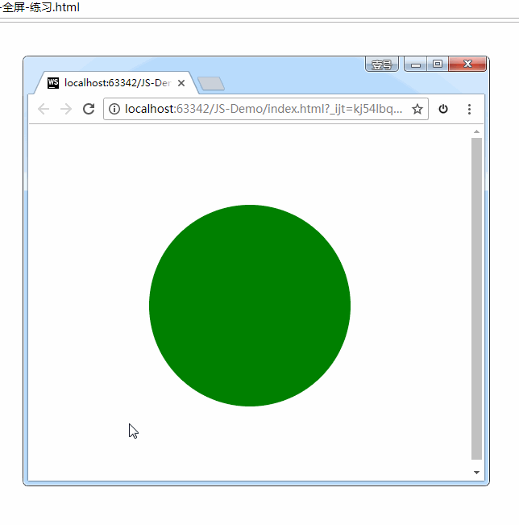

## Web 存储

随着互联网的快速发展，基于网页的应用越来越普遍，同时也变的越来越复杂，为了满足各种各样的需求，会经常性在本地存储大量的数据，传统方式我们以document.cookie来进行存储的，但是由于其存储大小只有4k左右，并且解析也相当的复杂，给开发带来诸多不便，HTML5规范则提出解决方案

h5 中有两种存储方式：

- `window.sessionStorage` 回话存储
  - 保存在内存中
  - 当关闭浏览器窗口后销毁
  - 同一窗口的数据可以共享
- `window.localStorage` 本地存储：
  - 有可能保存在浏览器内存里，有可能在硬盘里。
  - 永久生效，除非手动删除（比如清理垃圾的时候）。
  - 可以多窗口共享

### 特性

- 设置、读取方便。

- 容量较大，sessionStorage 约5M、localStorage 约20M。

- 只能存储字符串，可以将对象 JSON.stringify() 编码后存储

设置存储内容：

```javascript
	setItem(key, value);
```

PS：可以新增一个 item，也可以更新一个 item。

读取存储内容：

```javascript
	getItem(key);
```

根据键，删除存储内容：

```javascript
	removeItem(key);
```

清空所有存储内容：

```javascript
	clear();
```

根据索引值来获取存储内容：

```javascript
	key(n);
```

sessionStorage 的 API 举例：

```html
<!DOCTYPE html>
<html>
<head lang="en">
    <meta charset="UTF-8">
    <title></title>
</head>
<body>
<input type="text"/>
<button>sesssionStorage存储</button>
<button>sesssionStorage获取</button>
<button>sesssionStorage更新</button>
<button>sesssionStorage删除</button>
<button>sesssionStorage清除</button>
<script>

    //在h5中提供两种web存储方式

    // sessionStorage  session（会话，会议） 5M  当窗口关闭是数据销毁  内存
    // localStorage    20M 永久生效 ，除非手动删除  清理垃圾  硬盘上

    var txt = document.querySelector('input');

    var btns = document.querySelectorAll('button');
    //        sessionStorage存储数据
    btns[0].onclick = function () {
        window.sessionStorage.setItem('userName', txt.value);
        window.sessionStorage.setItem('pwd', '123456');
        window.sessionStorage.setItem('age', 18);
    }

    //        sessionStorage获取数据
    btns[1].onclick = function () {
        txt.value = window.sessionStorage.getItem('userName');
    }

    //        sessionStorage更新数据
    btns[2].onclick = function () {
        window.sessionStorage.setItem('userName', txt.value);
    }

    //        sessionStorage删除数据
    btns[3].onclick = function () {
        window.sessionStorage.removeItem('userName');
    }

    //        sessionStorage清空数据
    btns[4].onclick = function () {
        window.sessionStorage.clear();
    }
</script>
</body>
</html>

```

效果如下：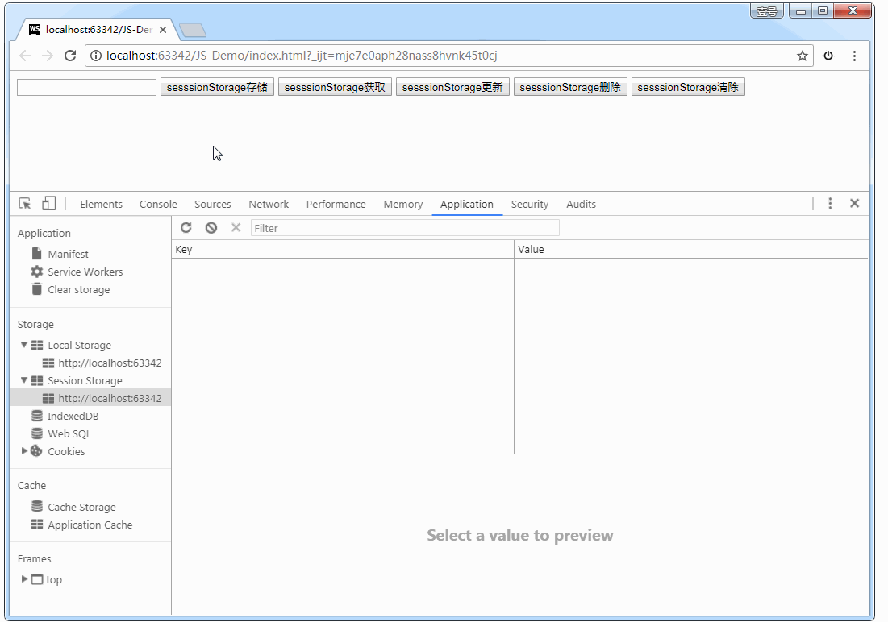

如上图所示，我们可以在 Storage 选项卡中查看 Session Storage 和Local Storage。

**localStorage 的 API 举例：**

```html
<!DOCTYPE html>
<html>
<head lang="en">
    <meta charset="UTF-8">
    <title></title>
</head>
<body>
<input type="text"/>
<button>localStorage存储</button>
<button>localStorage获取</button>
<button>localStorage更新</button>
<button>localStorage删除</button>
<button>localStorage清除</button>

<script>

    /*
    *  localStorage
    *  数据存在硬盘上
    *  永久生效
    *  20M
    * */

    var txt = document.querySelector('input');
    var btns = document.querySelectorAll('button');

    //        localStorage存储数据
    btns[0].onclick = function () {
        window.localStorage.setItem('userName', txt.value);
    }

    //        localStorage存储数据
    btns[1].onclick = function () {
        txt.value = window.localStorage.getItem('userName');
    }

    //        localStorage删除数据
    btns[3].onclick = function () {
        window.localStorage.removeItem('userName');
    }

</script>
</body>
</html>
```

### 案例：记住用户名和密码

代码：

```html
<!DOCTYPE html>
<html>
<head lang="en">
    <meta charset="UTF-8">
    <title></title>
</head>
<body>
<label for="">
    用户名：<input type="text" class="userName"/>
</label>
<br/><br/>
<label for="">
    密 码：<input type="text" class="pwd"/>
</label>
<br/><br/>
<label for="">
    <input type="checkbox" class="check" id=""/>记住密码
</label>
<br/><br/>
<button>登录</button>

<script>
    var userName = document.querySelector('.userName');
    var pwd = document.querySelector('.pwd');
    var chk = document.querySelector('.check');
    var btn = document.querySelector('button');

    //        当点击登录的时候 如果勾选“记住密码”，就存储密码；否则就清除密码
    btn.onclick = function () {
        if (chk.checked) {
//                记住数据
            window.localStorage.setItem('userName', userName.value);
            window.localStorage.setItem('pwd', pwd.value);
        } else {
//                清除数据
            window.localStorage.removeItem('userName');
            window.localStorage.removeItem('pwd');
        }
    }
    //        下次登录时，如果记录的有数据，就直接填充
    window.onload = function () {
        userName.value = window.localStorage.getItem('userName');
        pwd.value = window.localStorage.getItem('pwd');

    }
</script>
</body>
</html>
```

## 网络状态

我们可以通过 `window.onLine` 来检测用户当前的网络状况，返回一个布尔值。另外：

- window.online：用户网络连接时被调用。
- window.offline：用户网络断开时被调用（拔掉网线或者禁用以太网）。

网络状态监听的代码举例：

```html
<!DOCTYPE html>
<html>
<head lang="en">
    <meta charset="UTF-8">
    <title></title>
</head>
<body>
<script>
    window.addEventListener('online', function () {
        alert('网络连接建立！');
    });

    window.addEventListener('offline', function () {
        alert('网络连接断开！');
    })
</script>
</body>
</html>
```

## 应用缓存

HTML5中我们可以轻松的构建一个离线（无网络状态）应用，只需要创建一个 `cache manifest` 缓存清单文件。

### 优势

1、可配置需要缓存的资源；

2、网络无连接应用仍可用；

3、本地读取缓存资源，提升访问速度，增强用户体验；

4、减少请求，缓解服务器负担。

### `cache manifest` 缓存清单文件

缓存清单文件中列出了浏览器应缓存，以供离线访问的资源。推荐使用 `.appcache`作为后缀名，另外还要添加MIME类型。

**缓存清单文件里的内容怎样写：**

（1）顶行写CACHE MANIFEST。

（2）CACHE: 换行 指定我们需要缓存的静态资源，如.css、image、js等。

（3）NETWORK: 换行 指定需要在线访问的资源，可使用通配符（也就是：不需要缓存的、必须在网络下面才能访问的资源）。

（4）FALLBACK: 换行 当被缓存的文件找不到时的备用资源（当访问不到某个资源时，自动由另外一个资源替换）。

格式举例1：

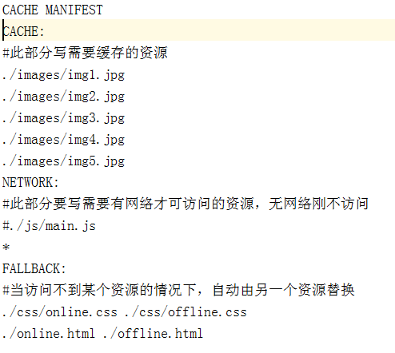

格式举例2：

```bash
CACHE MANIFEST

#要缓存的文件
CACHE:
    images/img1.jpg
    images/img2.jpg


#指定必须联网才能访问的文件
NETWORK:
     images/img3.jpg
     images/img4.jpg


#当前页面无法访问是回退的页面
FALLBACK:
    404.html
```

**缓存清单文件怎么用：**

（1）例如我们创建一个名为 `demo.appcache`的文件。例如：

demo.appcache：

```bash
CACHE MANIFEST

# 注释以#开头
#下面是要缓存的文件
CACHE:
    http://img.smyhvae.com/2016040101.jpg
```

（2）在需要应用缓存在页面的根元素(html)里，添加属性manifest="demo.appcache"。路径要保证正确。例如：

```html
<!DOCTYPE html>
<html manifest="01.appcache">
<head lang="en">
    <meta charset="UTF-8">
    <title></title>
</head>
<body>

</body>
</html>
```

## 参考

1. [qianguyihao-HTML](https://web.qianguyihao.com/01-HTML/08-HTML5%E8%AF%A6%E8%A7%A3.html#%E8%A1%A8%E5%8D%95%E5%85%83%E7%B4%A0%EF%BC%88%E6%A0%87%E7%AD%BE%EF%BC%89) qianguyihao
2. [HTML 教程](https://www.runoob.com/css/css-tutorial.html) 菜鸟教程

