## 1. Golang 调度器的由来

### 1.1 单进程时代无需调度器

在早期的操作系统中一个程序就是一个进程，只有一个进程运行完毕之后才能运行下一个进程，所有的进程只能串行发生。

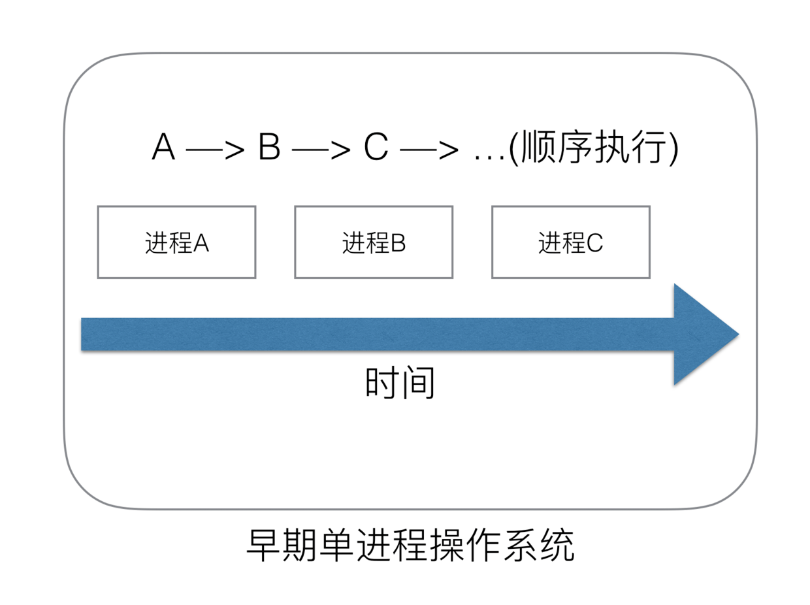

早期的单进程操作系统，面临着两个问题：

1. 单一的执行流程，计算机只能串行处理任务。
2. 进程阻塞会带来 CPU 时间的浪费。

后来操作系统有了最早的并发能力：多进程并发。当一个进程阻塞的时候，切换到另外等待执行的进程，这样避免了 CPU 时间的浪费。

### 1.2 多进程 / 线程时代的调度器

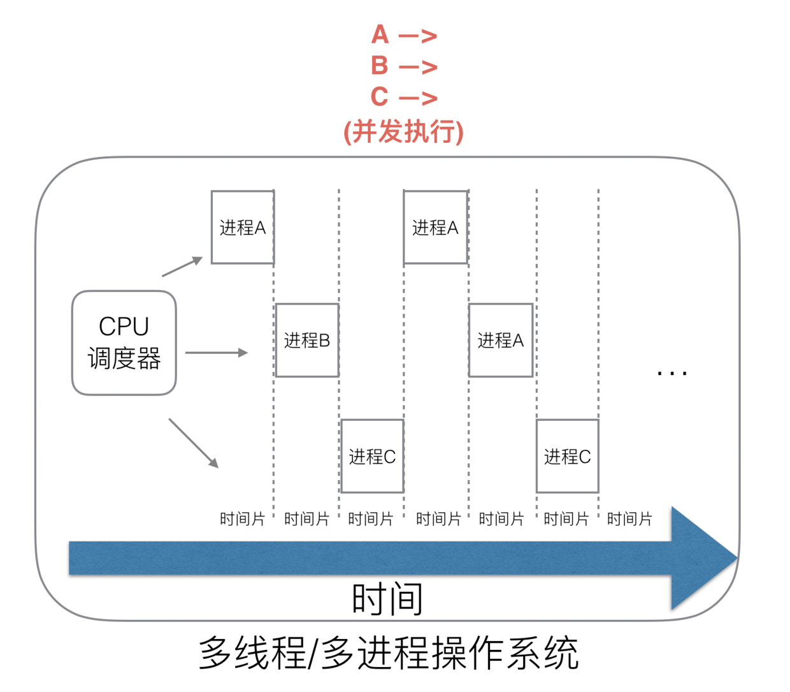

在多进程 / 多线程的操作系统中，解决了阻塞问题，因为一个进程阻塞后 CPU 可以切换至其他进程中执行，调度 CPU 的算法可以保证在运行的进程都可以被分配到 CPU 时间片，宏观上多个进程是在同时运行。

但是这样会出现新的问题，进程拥有太多的资源，进程的创建、切换及销毁均会产生时间成本，CPU 虽然利用起来了，但是当进程数量过多时，CPU 耗费很大一部分时间用于进程调度。


虽然进程看起来很美好，但实际上多线程开发设计会变得更加复杂，需要考虑很多同步竞争的问题。

### 1.3 使用协程来提高 CPU 利用率

多进程、多线程已经提高了系统的并发能力，但是在当今互联网高并发的场景下，为每个任务均创建一个线程是不现实的，会消耗大量的内存（进程虚拟内存会占用 4GiB (32 位)，而线程也要大约 4MiB）。

此时也出现了新的问题：

- 高内存占用
- 进程 / 线程调度高消耗 CPU

之后工程师发现，一个线程可分为“内核态”和“用户态”两种。一个“用户态线程”必须绑定一个“内核态线程”，对于 CPU 来说其并不知道“用户态线程”的存在，只知道运行的是“内核态线程”。


此时，我们将“内核态线程”称作 线程（Thread），“用户态线程”称作 协程（co-routine）.

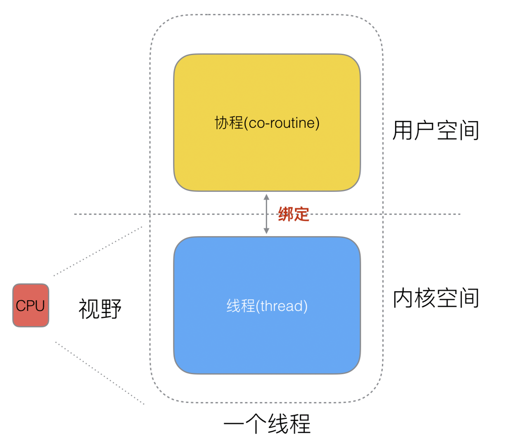

既然协程可以和线程进行绑定，那么就有三种对应关系：

- 1:1 (一对一)
- N:1 (多对一)
- N:M (多对多)

#### 1.3.1 多对一

N 个协程绑定一个线程，优点在于**协程在用户态线程完成切换，不会陷入到内核态，这种切换非常的轻量快速**，但是也会有很大的缺点，多个协程绑定在一个线程上：

- 某个程序无法使用硬件的多核加速能力
- 一旦某个协程阻塞导致线程阻塞，当前进程文档其他协程均无法执行，此时失去了并发的能力。

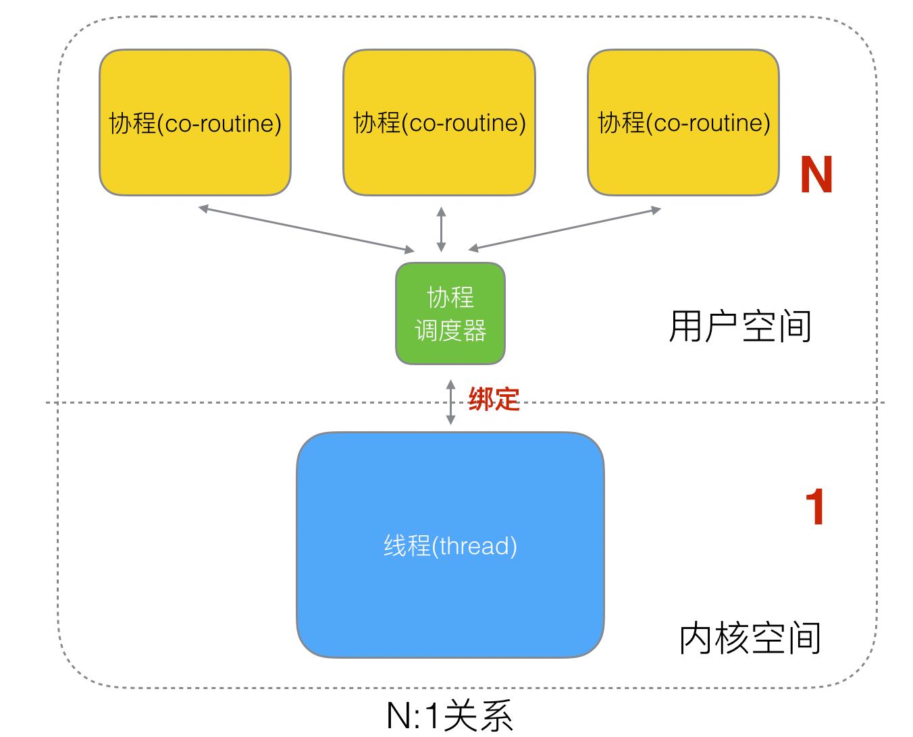

#### 1.3.2 一对一

一个协程绑定一个线程，此时协程的调度都交由 CPU 完成，但是其创建、销毁和切换的成本较高。


#### 1.3.3 多对多

多个协程绑定多个线程，克服了上述关系的缺点，但是实现起来较为复杂。

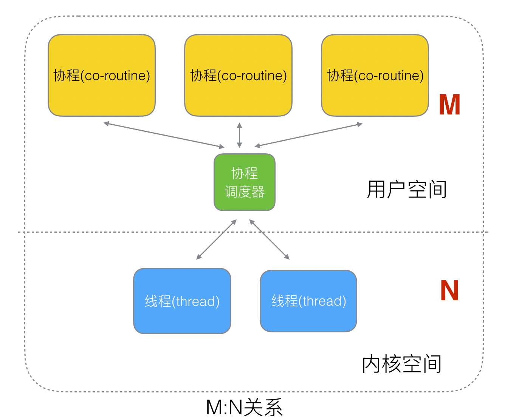

协程和线程的区别：

- 线程由 CPU 进行调度，是抢占式的
- 协程由用户态调度，是协作式的（当一个协程让出 CPU 后才可执行下一协程）

### 1.4 Go 协程 goroutine

Go 为了提供更容易的并发方法，使用了 goroutine 和 channel，goroutine 概念来自协程，让一组可复用的函数运行于一组线程之上，即使由协程阻塞了，该线程的其他协程可以被 `runtime` 调度，转移至其他可以运行的线程上。这些对与开发人员来说是透明的，为开发提供了便利。

一个 goroutine 非常的轻量，仅占用几 KiB，这样就能在有限的内存空间创建大量的 goroutine，支持更多的并发。虽然一个 goroutine 的栈仅占几KiB，但实际是可伸缩的，`runtime` 会自动为 goroutine 分配。

### 1.5 已废弃的 groutine 调度器

Golang 目前使用的调度器为 2012 年重新设计，之前的调度器存在性能问题，使用了 4 年已被废弃，下面来看看其如何运作的

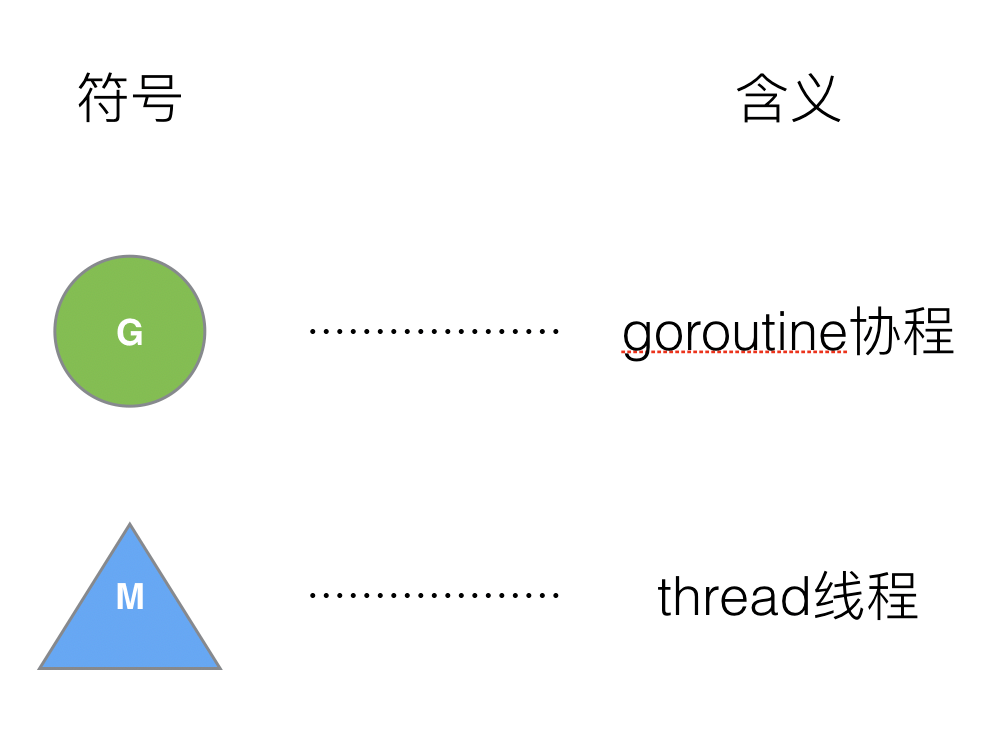

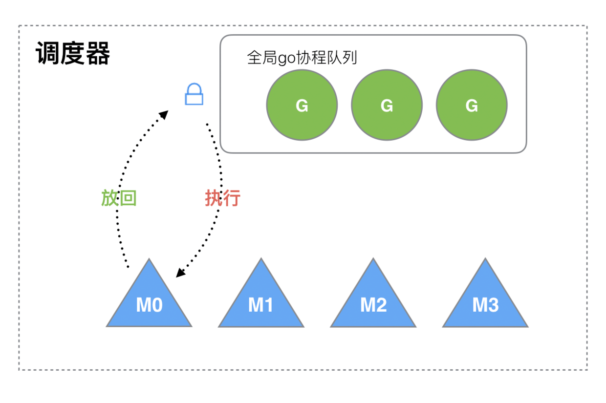

M (Thread) 想要执行、放回 G (goroutine) 必须访问全局 G 队列，并且 M 由多个，即多线程访问同一资源需要加锁以保证互斥 / 同步，所以全局 G 队列是有互斥锁进行保护的。

老的调度器存在以下缺点：

- 创建、销毁、调度 G 都需要每个 M 获取锁，这样会形成激烈的 **锁竞争**。
- M 转移 G 会造成 **延迟和额外的系统负载**。比如当 G 中包含创建新协程的时候，M 创建了 G’，为了继续执行 G’，需要将 G’ 交给 M’ 来执行，也会造成了 **很差的局部性**，因为 G’ 和 G 是相关的，最好的是在 M 上执行而不是其他的 M’。
- 系统调用 (CPU 在 M 之间的切换) 导致频繁的线程阻塞和取消阻塞操作增加了系统开销。

## 2. GMP 模型设计思想 

为了解决之前的问题，Go 设计了新的调度器，除了 M (Machine, 实际上为 Thread) 和 G (goroutine) 外，引进了 P (Processor)。

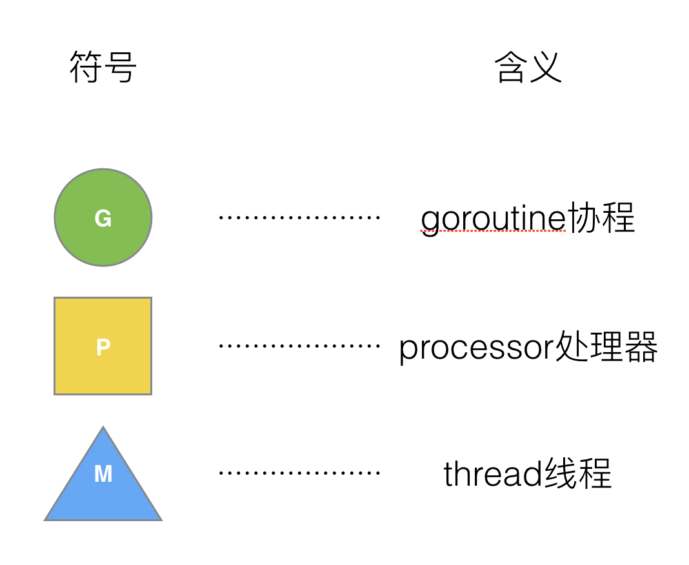

**Processor 包含了运行 goroutine 的资源**，若线程想要运行 goroutine 必须获取 P，P 中还包含了可运行的 G 队列。

### 2.1 GMP 模型

在 Go 中，**线程为运行 goroutine 的实体，调度器的功能是把可运行的 goroutine 分配到工作线程上**。


- **全局队列 (Global Queue)**: 存放等待运行的 G。
- **P 的本地队列**： 同全局队列类似，存放的也是等待运行的 G, 存储数量不超过 256 个。新建 G’ 时，G’ 优先加入 P 的本地队列，若队列已满，则会把本地队列中的一半的 G 移动到全局队列。
- **P 列表**：所有的 P 都在程序启动时创建，并保存在数组中，最多为 `GOMAXPROCS` 个。
- **M**： 线程想要运行任务就需要获取 P，从 P 的本地队列获取 G，P 队列为空时，M 会尝试从全局队列中获取一些 G 放入 P 的本地队列，或者从其他的 P 的本地队列中**偷取**一半放入自己的 P 本地队列，M 会按照队列先进先出的顺序执行 G。

**Goroutine 调度器和 OS 调度器通过 M 结合起来，每个 M 代表一个内核线程， OS 调度器负责把内核线程分配至 CPU 核心运行**。

#### 2.1.1  P 和 M 的数量

**P** 的数量由启动时环境变量 `GOMAXPROCS` 或 `runtime.GOMAXPROCS(int)` 决定，这意味着程序执行的任意时刻只会有 `GOMAXPROCS`个 goroutine 在 **同时** 运行。

**M** 的数量：

- go 语言本身的限制：go 程序启动时，会设置 M 的最大数量， 默认为 10000
- `runtime/debug` 包中的 `SetMaxThreads` 函数手动设置最大数量
- 当一个 M 阻塞了会创建新的 M

P 和 M 的数量之前没有绝对关系，一个 M 阻塞了，P 就会创建或者切换另一个 M，所以即使 P 的数量为 1，也可能会有多个 M。

#### 2.1.2 P 和 M 何时创建

**P **：在确定了 P 的最大数量 n 之后，运行时系统会根据配置创建 n 个 P。

**M**： 没有足够的 M 来关联 P 并运行其中的可运行的 G，当 M 被阻塞了，P 就会寻找空闲的 M，若没有则创建新的 M。

### 2.2 调度器的设计

- **复用线程**： 避免了频繁创建、销毁线程，而是对线程的复用
  - Work Stealing
    当本线程无可运行的 G, 尝试从其他线程绑定的 P 中偷取 G, 而不是销毁线程
  - Hand Off
    当线程因 G 进行系统调用而阻塞时，线程释放绑定的 P,将 P 转移至其他空闲的线程执行
- **利用并行**： `GOMAXPROCS` 设置 P 的数量，最多有 `GOMAXPROCS` 个线程分布在多个 CPU 上同时运行。`GOMAXPROCS` 也限制了并行的程度，比如当 `GOMAXPROCS = CPU 核心数 / 2` 时最多利用一半的 CPU 核心进行并行。
- **抢占**：对于协程 (coroutine) 来说需要协程主动让出 CPU 才能执行下一个，而 go 协程 (goroutine) 最多占用 CPU 10ms，防止其他的 goroutine 饿死。
- **全局 G 队列**：在新的调度器中依然有全局 G 队列，但功能已被弱化，仅当 M 执行 Work Stealing 无法从其他的 P 本地队列中获取 G 是才会从全局队列中获取。

### 2.3 `go func()` 调度流程


由上图可以看到：

1. `go func()` 创建一个 goroutine
2. 由两个存储 G 的队列，一个是局部调度器 P 的本地队列，一个是全局 G 队列。新创建的 G 会先保存在 P 的本地队列中，若 P 的本地队列已经满了就会保存在全局的队列中
3. G 只能运行在 M 中，一个 M 必须持有一个 P, M 与 P 是 1:1 的关系。M 与 P 是 1:1 的关系。M 会从 P 的本地队列弹出一个可执行状态的 G 来执行，如果 P 的本地队列为空，就会从其他的 MP 组合中偷取可执行的 G。
4. 一个 M 调度 G 执行对的过程是一个循环机制
5. 当 M 执行某一个 G 时若发生了 `syscall` 或则其余阻塞操作，M 会阻塞，若当前有一些 G 在执行，`runtime` 会将此线程 M 从 P 中摘除(detach), 然后再创建一个新的操作系统线程（若有空闲线程则服用）来服务这个 P。
6. 当 M 系统调用结束时，这个 G 会尝试获取一个空闲的 P 执行，并放入到这个 P 的本地队列。若获取不到 P，那么这个线程 M 编程休眠状态，加入到空闲线程中，然后这个 G 会被放入全局队列中。

### 2.4 调度器的生命周期


上图中出现的特殊的 M 和 G:

- **M0**: 启动程序后的编号为 0 的主线程，这个 M 对应的实例会在全局变量 `runtime.m0` 中，不需要在 heap 上分配，M0 负责执行初始化操作和启动第一个 G，在之后 M0 就和其他的 M 一样了。
- **G0**: 每次启动一个 M 都会第一个创建的 goroutine， G0 仅用于负责调度的 G，G0 不指向任何可执行的函数，每个 M 都会有一个自己的 G0。在调度或系统调用时会使用 G0 的栈空间，全局变量的 G0 是 M0 的 G0。

下面追踪一段代码：

```go
package main

import "fmt"

func main() {
    fmt.Println("Hello world")
}
```

- `runtime` 创建最初的线程 `M0` 和 goroutine `g0` , 并关联二者
- 调度器初始化，初始化 M0, 栈，GC 以及有 GOMAXPROCS 个 P 构成的列表
- 示例代码中的 main 函数 `main.main`, `runtime` 中也有一个 main 函数 `runtime.main`，代码经过编译后，`runtime.main` 会调用 `main.main` ，程序启动时会为 `runtime.main` 创建 goroutine，称其为主协程，然后将主协程加入 P 的本地队列。
- 启动 M0，M0 已经绑定了 P, 会从 P 的本地队列获取 G，此例中获取到主协程
- G 拥有栈内存，M 根据 G 中的栈信息和调度信息设置运行环境
- M 执行 G 
- G 退出，再次回到 M，M 会再次尝试获取 G ，如此重复下去直到 `main.main` 退出，`runtime.main`  会执行 Defer 和 Panic 处理，或者调用 `runtime.exit` 退出

调度器的生命周期几乎占满了 Go 程序的一生， `runtime.main` 的 goroutine 执行之前都是为调度器做准备工作，`runtime.main`  的 goroutine 的运行才是调度器真正的开始，直到 `runtime.main`  的结束。

### 2.5 可视化 GMP

#### 2.5.1 go tool trace

trace 工具可以记录运行时信息，能提供可视化的 Web 页面

以下是简单的测试代码，创建 trace （会运行在独立的 goroutine 中），然后 main 打印 “Hello World” 退出：

```go
package main

import (
	"fmt"
	"log"
	"os"
	"runtime/trace"
)

func main() {
	// create trace file
	f, err := os.OpenFile("trace.out", os.O_CREATE|os.O_WRONLY, 0666)
	if err != nil {
		log.Fatalf("failed to create trace file: %v", err)
	}
	// remember to close
	defer f.Close()

	// start trace goroutine
	err = trace.Start(f)
	if err != nil {
		log.Fatalf("failed to start trace: %v", err)
	}
	// remember to stop
	defer trace.Stop()

	// main
	fmt.Println("Hello World")
}
```

执行程序会生成 `trace.out`，使用 trace 工具分析文件就可以在浏览器访问了

```sh
$ go tool trace trace.out
2022/01/12 21:57:41 Parsing trace...
2022/01/12 21:57:41 Splitting trace...
2022/01/12 21:57:41 Opening browser. Trace viewer is listening on http://127.0.0.1:37259
```

在首页点击 `view trace  ` 即可看到可视化的调度流程


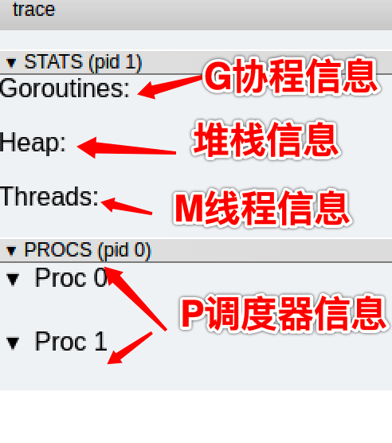

**G 信息**

点击 Gotoutine 的一段条形图，可以看到


其中 G0 为每个 M 一定会有的初始化的 G，而 G1 就是执行中的主协程了，在所选的这段时间中处于可运行和运行态。

**M 信息**

点击 Threads 的一段可以看到：


其中 M0 是初始化的 M0，而 M1 是用于执行主协程 G1 的线程

**P 信息**


G1 中调用了  `main.main` ， 创建了 `trace goroutine` G6。 G1 运行于 P0 上，G6 运行在 P1 上， 由于 M 和 P 是一一绑定的，这是看下 M 的信息会发现新的线程 M2 执行G6。


#### 2.5.2 debug trace

 下面利用 debug 的形式来进行跟踪

````go
package main

import (
	"fmt"
	"time"
)

func main() {
	for i := 0; i < 5; i++ {
		time.Sleep(1 * time.Second)
		fmt.Println("Hello World")
	}
}
````

```sh
$ go build -o trace ./trace.go
$ GODEBUG=schedtrace=1000 ./trace
GODEBUG=schedtrace=1000 ./trace
SCHED 0ms: gomaxprocs=16 idleprocs=13 threads=5 spinningthreads=1 idlethreads=0 runqueue=0 [1 0 0 0 0 0 0 0 0 0 0 0 0 0 0 0]
Hello World
SCHED 1005ms: gomaxprocs=16 idleprocs=16 threads=5 spinningthreads=0 idlethreads=3 runqueue=0 [0 0 0 0 0 0 0 0 0 0 0 0 0 0 0 0]
Hello World
SCHED 2006ms: gomaxprocs=16 idleprocs=16 threads=5 spinningthreads=0 idlethreads=3 runqueue=0 [0 0 0 0 0 0 0 0 0 0 0 0 0 0 0 0]
Hello World
SCHED 3007ms: gomaxprocs=16 idleprocs=16 threads=5 spinningthreads=0 idlethreads=3 runqueue=0 [0 0 0 0 0 0 0 0 0 0 0 0 0 0 0 0]
Hello World
SCHED 4009ms: gomaxprocs=16 idleprocs=16 threads=5 spinningthreads=0 idlethreads=3 runqueue=0 [0 0 0 0 0 0 0 0 0 0 0 0 0 0 0 0]
Hello World
```

- `SCHED`: 调试信息输出标志字符串，代表本行为 goroutine 调度器的输出
- `1005ms`: 为程序启动到输出日志的时间
- `gomaxprocs`: P 的数量，本例中为 16， 因为 gomaxprocs 默认与 CPU 的核心数量一致
- `idleprocs`: 处于空闲状态的 P 的数量
- `thread`: 线程数
- `spiningthreads`: 自旋线程数，当 M 在本地队列，全局运行队列中找不到 G 则可以认为 M 正在自旋，也就是说 M 进入了循环寻找可运行 G 的状态
- `runqueue`: Scheduler 全局队列中的 G 数量
- `[[0 0 0 0 0 0 0 0 0 0 0 0 0 0 0 0]]`:  各个 P 中本地队列的 G 数量

## 3. 调度器场景解析

### 3.1 G1 创建 G2

P 拥有 G1，M1 获取 P 后开始运行 G1，G1 使用 `go func()` 创建 G2，为了保证局部性 G2 优先加入到 P1 的本地队列。


### 3.2 本地队列执行

G1 运行完成后 （`goexit` 函数），M 上运行的 goroutine 切换为 G0， G0 负责调度时协程的切换（`schedule` 函数）。从 P 的本地队列获取 G2，从 G0 切换到 G2，并开始运行 G2（`execute` 函数）。实现了线程 M1 的复用。

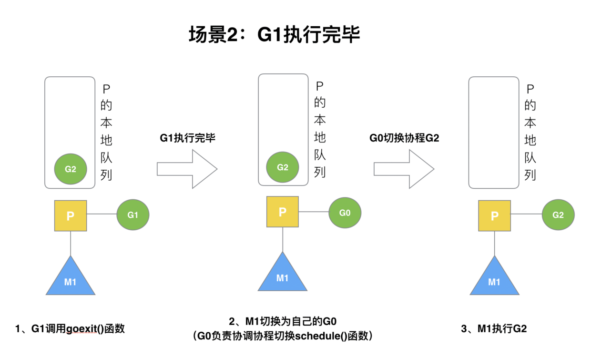

### 3.3 本地队列容量已满

假设每个 P 的队列长度为 3，G2 在运行时创建了 6 个 G，前 3 G（G3，G4，G5）已经加入 P1 的队列，此时 P1 的容量已满。


### 3.4 负载均衡

紧接着上面的场景，G2 创建 G7 时，P1 的本地队列已满，需要执行 **负载均衡**（将 P1 中本地队列中前一半的 G 以及新创建的 G **转移** 至全局队列。实际上 不一定是新的 G，如果 G 在 G2 之后就会执行，就会被保存在本地队列，而已存在的 G 会被移动到全局队列）


移动至全局队列时，G 的顺序会被打乱，此时加入队列的顺序为 G3 G7 G4。

### 3.5 本地队列容量未满

G2 创建 G8 时，P1 的本地队列未满，所以 G8 会被 **优先** 加入到 P1 的本地队列。


### 3.6 唤醒正在休眠的 M

**在创建 G 时，运行的 G 会尝试唤醒休眠的 P M 组合**

假设 G2 唤醒了 M2（和 P2 绑定），此时 M2 会运行 G0，但 P2 队列没有 G，此时 M2 就处于 **自旋** 状态（没有可运行 G 但处于运行状态，不断寻找 G）。

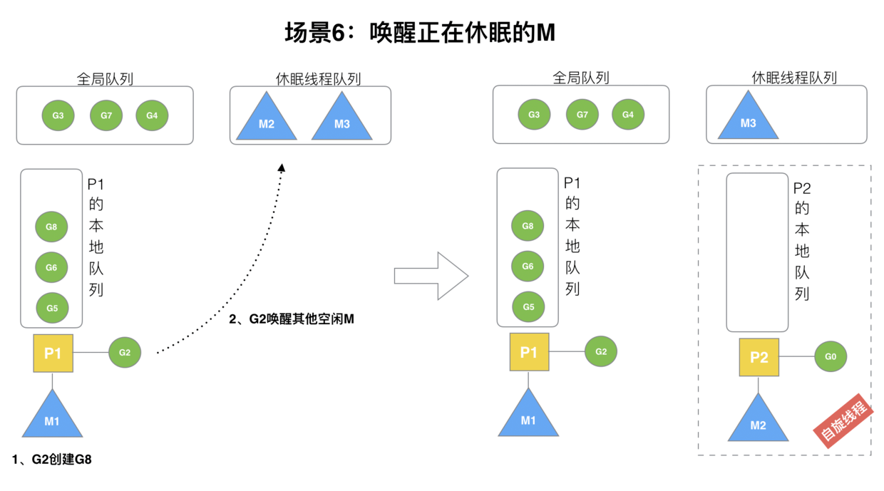

### 3.7 从全局队列中获取 G

M2 尝试从全局队列（GQ）取一批 G 放入 P2 的本地队列（函数：`findrunnable()`）,M2 从全局队列取的 G 数量满足下列公式：

```
n = min( len(GQ)/GOMAXPROCS + 1, len(GQ/2) ) 
```

至少从 GQ 中获取一个 G，但不会一次获取过多的 G 到 P 的本地队列，这时 **全局队列到 P 本地队列的负载均衡**。


假设场景中一共有 4 个 P （ `GOMAXPROCS ` 为 4 ），所以 M2 只能从全局队列取 1 个 G （G3）移动到 P2 本地队列，然后完成 G0 到 G3 的切换，运行 G3。

### 3.8 从 P 的本地队列中偷取 G (work stealing)

假设 G2 一直在 M1 上运行，经过 2 轮之后， M2 已经把 G7, G4 从全局队列中获取并完成运行，全局队列和 P2 的本地队列均已无可运行 G，如下图左半部分所示：

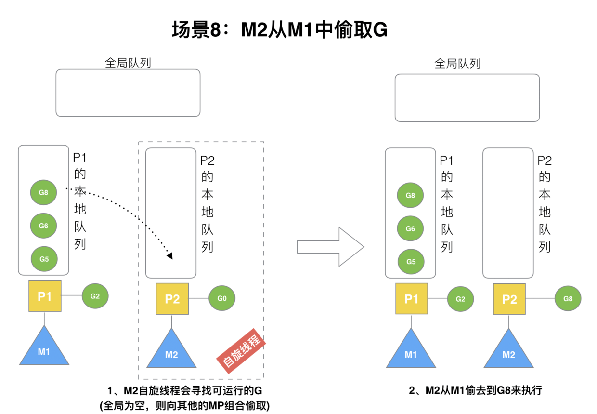

全局队列已经没有 G, 那么 M 就会执行 work stealing, 从其他持有 G 的 P 中偷取一半 G 放入自己的 P 本地队列。上图右半部分， M2 从 M1 的 P1 本地队列获取 G8 来运行。

### 3.9 自旋线程


## Reference

1. [Golang 调度器 GMP 原理与调度全分析](https://learnku.com/articles/41728)   [Aceld](https://learnku.com/blog/Aceld)
2. [进程控制块](https://zh.wikipedia.org/wiki/%E8%A1%8C%E7%A8%8B%E6%8E%A7%E5%88%B6%E8%A1%A8) wikipedia
