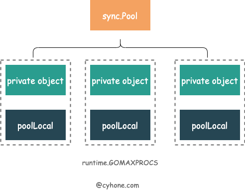

 `sync.Pool` 是 Golang 内置的对象池技术，可用于缓存临时对象，避免因频繁建立临时对象所带来的消耗及对 GC 造成的压力。

在许多知名的开源库中，都可以看到 `sync.Pool` 的大量使用。例如，`Gin` 使用其来复用每个请求都会创建的 `gin.Context` 对象。在 `grpc-go`, `kubernates` 等也都可以看到其声影。

值得注意的是，`sync.Pool` 缓存的对象随时会被无通知清除，因此不能将其用于存储持久对象的场景。

`sync.Pool` 作为 goroutine 内置的官方库，其设计非常巧妙。sync.Pool 不仅是并发安全的，而且实现了 lock free，非常值得学习。

 下面基于 `go-1.6` 分析用法及原理

## 1. 基本用法

 ```go
 type MyStruct struct {
 	A int
 }
 
 func main(){
 	fmt.Println("Start ...")
 
 	pool := sync.Pool {
 		New: func() interface{}{
 			return &MyStruct{
 				A: 1,
 			}
 		},
 	}
 
 	testObject := pool.Get().(*MyStruct)
 	fmt.Printf("\tTest_Object.A: %d\n",testObject.A)
 
 	pool.Put(testObject)
 
 	fmt.Println("End ...")
 }
 ```

sync.Pool 在初始化时，需要用户提供对象的构造函数 `New`, 用户使用 `Get` 方法来从对象池中获取对象，使用 `Put` 方法将对象归还给对象池。

## 2. 实现原理

### 2.1 GMP 模型

在 Golang 的 GMP 模型中， M(Machine) 代表系统线程，在同一时间一个 M 上只能运行一个 P。那么从线程的维度上看，在 P 上的逻辑都是单线程执行的（串行）。

 `sync.Pool` 充分利用了 GMP 这一特点。对于同一个 `sync.Pool`, 每个 P 都有自己的本地对象池 `poolLocal`，如下图所示：



`sync.Pool` 的代码定义如下：

```go
type Pool struct {
	noCopy noCopy

	local     unsafe.Pointer // local fixed-size per-P pool, actual type is [P]poolLocal
	localSize uintptr        // size of the local array

	victim     unsafe.Pointer // local from previous cycle
	victimSize uintptr        // size of victims array

	// New optionally specifies a function to generate
	// a value when Get would otherwise return nil.
	// It may not be changed concurrently with calls to Get.
	New func() interface{}
}
```

其中需要关注三个字段：

- `local` ： 长度为 P 的个数的数组，元素类型为 `poolLocal`。存储各个 P 对应的本地对象池，可以看做 `[P]poolLocal`
- `localSize`: 代表 local 数组的长度。

## Reference

1. [深度分析 Golang sync.Pool 底层原理](https://www.cyhone.com/articles/think-in-sync-pool/) cyhone