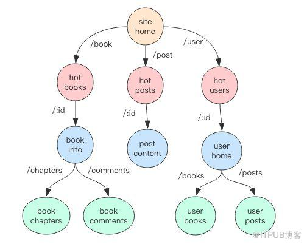

# Gin Web Framework

参考 Gin 官方文档，记录学习 Gin 的笔记

## 1. Introduction

Gin is a web framework written in GO. It features a martini-like API with performance that is up to 40 times faster thanks to [httprouter](https://github.com/julienschmidt/httprouter). 

## 2. Installation 

You can use the below Go command to install Gin.

```sh
$ go get -u github.com/gin-gonic/gin
```

## 3. Quick Start 

```go
// gin-note/quick-start/main.go
package main

import (
	"net/http"

	"github.com/gin-gonic/gin"
)

func main() {
	router := gin.Default()
	router.GET("/ping", func(c *gin.Context) {
		c.JSON(http.StatusOK, gin.H{
			"message": "pong",
		})
	})
	router.Run(":9090")
}
```

Run `main.go`:

```sh
$ go run ./main.go 
```

Visit `http://127.0.0.1:9090/ping`:

```sh
$ curl -X GET http://127.0.0.1:9090/ping
{"message":"pong"}
```

## 4. API Examples

You can find a number of ready-to-run examples at [Gin examples repository](https://github.com/gin-gonic/examples)(之后会单独学习这些示例)

### 4.1 Using GET,POST,PUT,PATCH,DELETE and OPTIONS

```go
// gin-note/http-methods/main.go
package main

import (
	"net/http"

	"github.com/gin-gonic/gin"
)

func main() {
	router := gin.Default()

	router.GET("/get", getting)
	router.POST("/post", posting)
	router.PUT("/put", putting)
	router.DELETE("/delete", deleting)
	router.PATCH("/patch", patching)
	router.HEAD("/head", head)
	router.OPTIONS("/option", options)

	router.Run(":9090")
}

func getting(c *gin.Context) {
	c.JSON(http.StatusOK, gin.H{
		"message": "GET",
	})
}

func posting(c *gin.Context) {
	c.JSON(http.StatusOK, gin.H{
		"message": "POST",
	})
}

func putting(c *gin.Context) {
	c.JSON(http.StatusOK, gin.H{
		"message": "PUT",
	})
}

func deleting(c *gin.Context) {
	c.JSON(http.StatusOK, gin.H{
		"message": "DELETE",
	})
}

func patching(c *gin.Context) {
	c.JSON(http.StatusOK, gin.H{
		"message": "PATCH",
	})
}

func head(c *gin.Context) {
	c.Header("key", "val")
}

func options(c *gin.Context) {
	c.JSON(http.StatusOK, gin.H{
		"message": "OPTION",
	})
}
```

- `gin.Default`: Creates a gin router with default middleware, logger and recovery (crash-free) middleware
- `router.Run`: By default it serves on :8080 unless a PORT environment variable was defined. You can use `router.Run(":9090")` for a hard coded port

tips:

**HTTP `HEAD` 方法** 请求资源的头部信息, 并且这些头部与 HTTP [`GET`](https://developer.mozilla.org/zh-CN/docs/Web/HTTP/Methods/GET) 方法请求时返回的一致. 该请求方法的一个使用场景是在下载一个大文件前先获取其大小再决定是否要下载, 以此可以节约带宽资源

### 4.2 Parameters in path

```go
// gin-note/params-in-path/main.go
package main

import (
	"net/http"

	"github.com/gin-gonic/gin"
)

func main() {
	router := gin.Default()

	router.GET("/user/:name", hello)
	router.GET("/user/:name/*action", action)
	router.POST("/user/:name/*action", fullPath)
	router.GET("/user/groups", groups)

	router.Run(":9090")
}

func hello(c *gin.Context) {
	name := c.Param("name")
	c.String(http.StatusOK, "Hello %s", name)
}

func action(c *gin.Context) {
	name := c.Param("name")
	action := c.Param("action")
	message := name + " is " + action
	c.String(http.StatusOK, message)
}

func fullPath(c *gin.Context) {
	path := c.FullPath()
	b := path == "/user/:name/*action"
	c.String(http.StatusOK, "path: %s,%t", path, b)
}

func groups(c *gin.Context) {
	c.String(http.StatusOK, "The available groups are [...]")
}
```

- `/user/:name`: this handler will match `/user/john` but will not match `/user/` or `/user`
- `user/:name/*action`: will match `user/john/` and `/user/john/send` 
- `c.FullPath`: for each matched request `Context` will hold the route definition 
- `/user/groups`: this handler will add a new router for `/user/groups`.
  Exact routes are resolved before param routes, regardless of the order they were defined. Routes starting with `/user/groups` are never interpreted as `/user/:name/...` routes

Run `main.go` and test:

```sh
$ curl http://127.0.0.1:9090/user/kesa
Hello kesa
$ curl http://127.0.0.1:9090/user/kesa/
kesa is /
$ curl http://127.0.0.1:9090/user/kesa/send
kesa is /send
$ curl -X POST http://127.0.0.1:9090/user/kesa/
path: /user/:name/*action,true
$ curl http://127.0.0.1:9090/user/groups
The available groups are [...]
```

- `user/kesa/`将会匹配`user/:name/*action`,而不是`user/:name`
- `user/groups`优先进行精准匹配

tips:

**路由树**

在 Gin 框架中，路由规则被分成了最多 9 棵前缀树，每一个 HTTP Method对应一棵 前缀树 ，树的节点按照 URL 中的 / 符号进行层级划分，URL 支持 `:name` 形式的名称匹配，还支持 `*subpath` 形式的路径通配符

```
// 匹配单节点 named
pattern = /book/:id
match /book/123
nomatch /book/123/10
nomatch /book/

// 匹配子节点 catchAll mode
/book/*subpath
match /book/
match /book/123
match /book/123/10
```



### 4.3 QueryString parameters

```go
// gin-note/query-string-params/main.go
package main

import (
	"net/http"

	"github.com/gin-gonic/gin"
)

func main() {
	router := gin.Default()
	router.GET("/welcome", welcome)
	router.Run(":9090")
}

func welcome(c *gin.Context) {
	firstname := c.Query("firstname")
	lastname := c.Query("lastname")
	c.String(http.StatusOK, "Hello %s %s", firstname, lastname)
}

```

Run and test:

```sh
$ curl http://127.0.0.1:9090/welcome?firstname=kesa&lastname=jin
Hello kesa jin
```

### 4.4 Multipart/Urlencoded Form

```go
//
package main

import (
	"net/http"

	"github.com/gin-gonic/gin"
)

func main() {
	router := gin.Default()
	router.POST("/form_post", formPost)
	router.Run(":9090")
}

func formPost(c *gin.Context) {
	message := c.PostForm("message")
	nick := c.DefaultPostForm("nick", "anonymous")
	c.JSON(http.StatusOK, gin.H{
		"status":  "posted",
		"message": message,
		"nick":    nick,
	})
}

```

Run and test:

```sh
$ curl -X POST -d "message=hello" http://127.0.0.1:9090/form_post  
{"message":"hello","nick":"anonymous","status":"posted"}
```

tips:

**Difference between form-data and x-www-form-urlencoded**

These are different Form content types defined by W3C. If you want to send simple text/ ASCII data, then **x-www-form-urlencoded** will work. This is the default.

But if you have to send non-ASCII text or large binary data, the **form-data** is for that.

### 4.5 Query + post form

```go
// gin-note/query-and-form/main.go
package main

import (
	"net/http"

	"github.com/gin-gonic/gin"
)

func main() {
	router := gin.Default()
	router.POST("/post", details)
	router.Run(":9090")
}

func details(c *gin.Context) {
	id := c.Query("id")
	page := c.DefaultQuery("page", "0")
	message := c.PostForm("message")
	name := c.PostForm("name")
	c.JSON(http.StatusOK, gin.H{
		"id":      id,
		"page":    page,
		"name":    name,
		"message": message,
	})
}

```

Run and test:

```sh
$ curl -X POST -d "message=hello&name=kesa" http://127.0.0.1:9090/post\?id\=1\&page\=1
{"id":"1","message":"hello","name":"kesa","page":"1"}
```

### 4.6 Map as querystring or postform parameters

```go
// gin-note/map-as-param/main.go
package main

import (
	"net/http"

	"github.com/gin-gonic/gin"
)

func main() {
	router := gin.Default()
	router.POST("/post", post)
	router.Run(":9090")
}

func post(c *gin.Context) {
	ids := c.QueryMap("ids")
	names := c.PostFormMap("names")
	c.JSON(http.StatusOK, gin.H{
		"ids":   ids,
		"names": names,
	})
}
```

Run and test :

```sh
$ curl -X POST -d "names[first]=kesa&names[second]=jin" -g "http://127.0.0.1:9090/post?ids[a]=1&ids[b]=2"
{"ids":{"a":"1","b":"2"},"names":{"first":"kesa","second":"jin"}}
```

tips:

curl 发送请求时要使用`-g` 以禁用网址序列和范围使用{}和[]，否则参数中带有`{},[]`将会报错

### 4.7 Upload files

#### Single file

`file.Filename` **SHOULD NOT** be trusted. See [`Content-Disposition` on MDN](https://developer.mozilla.org/en-US/docs/Web/HTTP/Headers/Content-Disposition#Directives) and [#1693](https://github.com/gin-gonic/gin/issues/1693)

>The filename is always optional and must not be used blindly by the application: path information should be stripped, and conversion to the server file system rules should be done.

```go
// gin-note/upload-single-file/main.go
package main

import (
	"fmt"
	"log"
	"net/http"
	"path/filepath"

	"github.com/gin-gonic/gin"
)

func main() {
	router := gin.Default()
	router.MaxMultipartMemory = 8 << 20 // 8 MiB
	router.POST("/upload", upload)
	router.Run(":9090")
}

func upload(c *gin.Context) {
	file, _ := c.FormFile("file")
	log.Println(file.Filename)
	dst := filepath.Base(file.Filename)
	log.Println("dst:", dst)
	c.SaveUploadedFile(file, dst)
	c.String(http.StatusOK, fmt.Sprintf("%s uploaded", file.Filename))
}

```

- `router.MaxMultipartMemory = 8 << 20`: Set a lower memory limit for multipart forms (default is 32 MiB)

Run and test:

```sh
$ curl -X POST http://127.0.0.1:9090/upload -F "file=@test.txt" \    
-H "Content-Type: multipart/form-data"
test.txt uploaded
```

**注意**

这里特别强调不要信任任何用户定义的文件名，非常危险[#1693](https://github.com/gin-gonic/gin/issues/1693)

比如用户设定用户名为`../test.txt`,可以改变存储的位置，或者文件名为 html 标签，这样都是非常危险的

简单的处理方案是使用`filepath.Base`过滤文件名（`../text.txt`->`text.txt`）,但这样仍有安全隐患，应该自定义文件名,比如

```go
now := time.Now().Format("20060102150405")
dst := fmt.Sprintf("%s_%s", username, now)
```

#### Multiple files

```go
// gin-note/upload-multiple-files/main.go
package main

import (
	"fmt"
	"log"
	"net/http"
	"path/filepath"
	"strings"
	"time"

	"github.com/gin-gonic/gin"
)

func main() {
	router := gin.Default()
	router.MaxMultipartMemory = 8 << 20
	router.POST("/upload", upload)
	router.Run(":9090")
}

func upload(c *gin.Context) {
	form, _ := c.MultipartForm()
	files := form.File["upload[]"]
	username := c.Query("username")
	for _, file := range files {
		log.Println(file.Filename)
		extension := filepath.Ext(file.Filename)
		filename := strings.TrimSuffix(file.Filename, extension)
		now := time.Now().Format("20060102150405")
		dst := fmt.Sprintf("%s_%s_%s%s", now, username, filename, extension)
		c.SaveUploadedFile(file, dst)
	}
	c.String(http.StatusOK, fmt.Sprintf("%d files uploaded", len(files)))
}
```

Run and test:

```sh
$ curl -X POST "http://127.0.0.1:9090/upload?username=kesa" \   
-F "upload[]=@test.txt" \
-F "upload[]=@test1.txt" \
-F "upload[]=@test2.txt" \
-H "Content-Type: multipart/form-data"
3 files uploaded
```

### 4.8 Grouping routes

```go
// gin-note/grouping-routes/main.go
package main

import (
	"net/http"

	"github.com/gin-gonic/gin"
)

func main() {
	router := gin.Default()
	v1 := router.Group("/v1")
	{
		v1.GET("/get", v1Get)
	}
	v2 := router.Group("/v2")
	{
		v2.GET("/get", v2Get)
	}
	router.Run(":9090")
}

func v1Get(c *gin.Context) {
	c.String(http.StatusOK, "V1 GET ")
}

func v2Get(c *gin.Context) {
	c.String(http.StatusOK, "V2 GET ")
}
```

Run and test:

```sh
$ curl "http://127.0.0.1:9090/v1/get"
V1 GET 
$ curl "http://127.0.0.1:9090/v2/get"
V2 GET          
```

### 4.9 Using middleware

#### Blank Gin without middleware by default

Use

```go
router := gin.New()
```

instead of 

```go
// Default with the Logger and Recovery middleware already attached
router := gin.Default()
```

#### Using middleware

```go
// gin-note/using-middleware/main.go
package main

import (
	"fmt"
	"net/http"

	"github.com/gin-gonic/gin"
)

func main() {
	router := gin.New()
	router.Use(gin.Logger())
	router.Use(gin.Recovery())
	router.Use(MyGlobalMiddleware())

	router.GET("/req", func(c *gin.Context) {
		middleware := c.MustGet("middleware")
		c.String(http.StatusOK, fmt.Sprintf("Middleware type: %s", middleware))
	})

	router.GET("/req1", MyRouteMiddleware(), func(c *gin.Context) {
		middleware := c.MustGet("middleware")
		c.String(http.StatusOK, fmt.Sprintf("Middleware type: %s", middleware))
	})

	grp := router.Group("/grp")
	grp.Use(MyGroupMiddleware())
	{
		grp.GET("/req", func(c *gin.Context) {
			middleware := c.MustGet("middleware")
			c.String(http.StatusOK, fmt.Sprintf("Middleware type: %s", middleware))
		})
	}

	router.Run(":9090")
}

func MyGlobalMiddleware() gin.HandlerFunc {
	return func(c *gin.Context) {
		c.Set("middleware", "global")
		fmt.Println("[Global] Before request")
		c.Next()
		fmt.Println("[Global] After request")
	}
}

func MyRouteMiddleware() gin.HandlerFunc {
	return func(c *gin.Context) {
		c.Set("middleware", "route")
		fmt.Println("[Route] Before request")
		c.Next()
		fmt.Println("[Route] After request")
	}
}

func MyGroupMiddleware() gin.HandlerFunc {
	return func(c *gin.Context) {
		c.Set("middleware", "group")
		fmt.Println("[Group] Before request")
		c.Next()
		fmt.Println("[Group] After request")
	}
}
```

- `router.Use(gin.Logger())`: Global middleware, Logger middleware will write the logs to gin.DefaultWrite even if you set with GIN_MODE=release, by default gin.DefaultWriter = os.Stdout
- `router.Use(gin.Recovery())`: Recovery middleware recovers from any panics and writes a 500(http code) if there was one
- `router.GET("/req1", MyRouteMiddleware(), func(c *gin.Context){...})`: Per route middleware, you can add as many as you desire
- `grp.Use(MyGroupMiddleware())`: Per group middleware, use custom middleware just in this group

Run and test:

```sh
$ curl -X GET "http://127.0.0.1:9090/req" 
Middleware type: global
$ curl -X GET "http://127.0.0.1:9090/req1"
Middleware type: route
$ curl -X GET "http://127.0.0.1:9090/grp/req"
Middleware type: group
```

tips:

调用`/grp/req`的时候，日志如下：

```
2021/11/18 09:58:30 [Global] Before request
2021/11/18 09:58:30 [Group] Before request
2021/11/18 09:58:30 [Group] After request
2021/11/18 09:58:30 [Global] After request
```

可以看到不同层级的 middleware 会按照后进先出(栈)的顺序调用

#### Custom Recovery behavior

```go
// gin-note/custom-recovery/main.go
package main

import (
	"fmt"
	"net/http"

	"github.com/gin-gonic/gin"
)

func main() {
	router := gin.New()
	router.Use(gin.Logger())
	router.Use(gin.CustomRecovery(func(c *gin.Context, recovered interface{}) {
		if err, ok := recovered.(string); ok {
			c.String(http.StatusInternalServerError, fmt.Sprintf("error: %s", err))
		}
		c.AbortWithStatus(http.StatusInternalServerError)
	}))

	router.GET("/panic", func(c *gin.Context) {
		panic("foo")
	})

	router.GET("/", func(c *gin.Context) {
		c.String(http.StatusOK, "ohai")
	})

	router.Run(":9090")
}
```

Run and test:

```sh
$ curl -X GET "http://127.0.0.1:9090/"       
ohai%                                                                 $ curl -X GET "http://127.0.0.1:9090/panic"  
error: foo
```

#### Custom Log Format

```go
// gin-note/custom-log-format/main.go
package main

import (
	"fmt"
	"net/http"
	"time"

	"github.com/gin-gonic/gin"
)

func main() {
	router := gin.New()

	router.Use(gin.LoggerWithFormatter(func(params gin.LogFormatterParams) string {
		return fmt.Sprintf("%s - [%s] \"%s %s %s %d %s \"%s\"%s \n",
			params.ClientIP,
			params.TimeStamp.Format(time.RFC1123),
			params.Method,
			params.Path,
			params.Request.Proto,
			params.StatusCode,
			params.Latency,
			params.Request.UserAgent(),
			params.ErrorMessage)
	}))
	router.Use(gin.Recovery())

	router.GET("/ping", func(c *gin.Context) {
		c.String(http.StatusOK, "pong")
	})

	router.Run(":9090")
}

```

Run and test:

```sh
$ curl -X GET "http://127.0.0.1:9090/ping" 
pong
```

log:

```
127.0.0.1 - [Thu, 18 Nov 2021 13:24:09 CST] "GET /ping HTTP/1.1 200 65.781µs "curl/7.79.1" 
```

#### How to write log file

```go
package main

import (
	"io"
	"log"
	"net/http"
	"os"
	"path/filepath"

	"github.com/gin-gonic/gin"
)

type Login struct {
	User     string `form:"user" json:"user" xml:"user" binding:"required"`
	Password string `form:"password" json:"password" xml:"password" binding:"required"`
}

func main() {
	f, err := createLogFile("./log/gin.log")
	if err != nil {
		log.Fatal("create log file failed:", err)
	}
	defer f.Close()
	gin.DefaultWriter = io.MultiWriter(f, os.Stdout)
	router := gin.Default()
	router.GET("/ping", func(c *gin.Context) {
		c.String(http.StatusOK, "pong")
	})
	log.Println("Listen and serve on 0.0.0.0:9090")
	router.Run(":9090")
}

func createLogFile(path string) (*os.File, error) {
	dir := filepath.Dir(path)
	log.Println("dir is: ", dir)
	if _, err := os.Stat(dir); os.IsNotExist(err) {
		err = os.MkdirAll(path, 0755)
		if err != nil {
			log.Fatal("create dir failed:", err)
		}
	}
	return os.Create(path)
}
```

- `gin.DefaultWriter = io.MultiWriter(f, os.Stdout)`: write the logs to file and console at the same time

Run and test:

```sh
$ curl -X GET "http://0.0.0.0:9090/ping"
pong
```

#### Controlling Log output coloring

By default, logs output on console should be colorized depending on the detected TTY.

Never colorize logs:

```go
// gin-note/colorize-log/main.go
package main

import (
	"net/http"

	"github.com/gin-gonic/gin"
)

func main() {
	gin.DisableConsoleColor()
	router := gin.Default()
	router.GET("/ping", func(c *gin.Context) {
		c.String(http.StatusOK, "pong")
	})

	router.Run(":9090")
}
```

Always colorize logs:

```go
// gin-note/colorize-log/main.go
package main

import (
	"net/http"

	"github.com/gin-gonic/gin"
)

func main() {
	gin.ForceConsoleColor()
	router := gin.Default()
	router.GET("/ping", func(c *gin.Context) {
		c.String(http.StatusOK, "pong")
	})

	router.Run(":9090")
}
```

### 4.10 Model binding and validation

To bind a request body into a type, use model binding. We currently support binding of JSON, XML, YAML and standard form values (foo=bar&boo=baz).

Gin use  [**go-playground/validator/v10**](https://github.com/go-playground/validator) for validation. Check the full docs on tags usage  [here](https://godoc.org/github.com/go-playground/validator#hdr-Baked_In_Validators_and_Tags).

Also, Gin provides two sets of methods for binding:

- Type - Must bind
  - Methods - `Bind`, `BindJSON`, `BindXML`, `BindQuery`, `BindYAML`, `BindHeader`
  - Behavior - These methods use `MustBindWith` under the hood. If there is a binding error, the request is aborted with `c.AbortWithError(400,err).SetType(ErrorTypeBind)`. This sets the response status code to 400 and the `Content-Type` header is set to `text/plain;charset=utf-8`. Note that if you try to set the response code after this, it will result in a warning `[GIN-debug] [WARNING] Headers were already written. Wanted to override status code 400 with 422`. If you wish to have greater control over the behavior, consider using the `ShouldBind` equivalent method.
- Type - Should bind
  - Methods - `ShouldBind`, `ShouldBindJSON`, `ShouldBindXML`, `ShouldBindQuery`, `ShouldBindYAML`, `ShouldBindHeader`
  - Behavior - These methods use `ShouldBindWith` under the hood. If there is a binding error, the error is returne and it is the developer's responsibilty to handle the request and error appropriately.

When using the Bind-method, Gin tries to infer the binder depending on the Content-Type header. If you are sure what you are binding, you can use `MustBindWith` or `ShouldBindWith`.

You can also specify the specific fields are required. If a field is decorated with `binding:"required"` and has a empty value when binding, an error will be returned.

```go
// gin-note/bind-and-validation/main.go
package main

import (
	"log"
	"net/http"

	"github.com/gin-gonic/gin"
)

type Login struct {
	User     string `form:"user" json:"user" xml:"user" binding:"required"`
	Password string `form:"password" json:"password" xml:"password" binding:"required"`
}

func main() {
	router := gin.Default()
	router.POST("/loginJSON", loginJSON)
	router.POST("/loginXML", loginXML)
	router.POST("/loginForm", loginForm)
	log.Println("Listen and serve on 0.0.0.0:8080")
	router.Run(":9090")
}

func loginJSON(c *gin.Context) {
	var json Login
	if err := c.ShouldBindJSON(&json); err != nil {
		c.JSON(http.StatusBadRequest, gin.H{
			"error": err.Error(),
		})
		return
	}
	if json.User != "menu" || json.Password != "123" {
		c.JSON(http.StatusUnauthorized, gin.H{
			"status": "unauthorized",
		})
		return
	}
	c.JSON(http.StatusOK, gin.H{
		"status": "you are logged in",
	})
}

func loginXML(c *gin.Context) {
	var xml Login
	if err := c.ShouldBindXML(&xml); err != nil {
		c.JSON(http.StatusBadRequest, gin.H{
			"error": err.Error(),
		})
		return
	}
	if xml.User != "menu" || xml.Password != "123" {
		c.JSON(http.StatusUnauthorized, gin.H{
			"status": "unauthorized",
		})
		return
	}
	c.JSON(http.StatusOK, gin.H{
		"status": "you are logged in",
	})
}

func loginForm(c *gin.Context) {
	var form Login
	if err := c.ShouldBind(&form); err != nil {
		c.JSON(http.StatusBadRequest, gin.H{
			"error": err.Error(),
		})
		return
	}
	if form.User != "menu" || form.Password != "123" {
		c.JSON(http.StatusUnauthorized, gin.H{
			"status": "unauthorized",
		})
		return
	}
	c.JSON(http.StatusOK, gin.H{
		"status": "you are logged in",
	})
}
```

Run and test:

```sh
$ curl -X POST "http://0.0.0.0:9090/loginJSON" \
-d '{"user":"menu","password":"123"}'
{"status":"you are logged in"}
$ curl -X POST "http://0.0.0.0:9090/loginXML" \ 
-d '<?xml version="1.0" encode="UTF-8"?><root><user>menu</user><password>123</password></root>'
{"status":"you are logged in"}
$  curl -X POST "http://0.0.0.0:9090/loginForm" \
-d 'user=menu&password=123'
{"status":"you are logged in"}
```

tips:

**对于 form 数据使用了 `ShouldBind`**

JSON 和 XML 类型的数据有对应的方法 `ShouldBindJSON` 和 `ShouldBindXML`，那是对于 FORM 数据使用的是 `ShouldBind`

`ShouldBind`的描述是：

> ShouldBind checks the Content-Type to select a binding engine automatically,
> Depending the "Content-Type" header different bindings are used:
>     "application/json" --> JSON binding
>     "application/xml"  --> XML binding
>otherwise --> returns an error
> It parses the request's body as JSON if Content-Type == "application/json" using JSON or XML as a JSON input.
> It decodes the json payload into the struct specified as a pointer.
> Like c.Bind() but this method does not set the response status code to 400 and abort if the json is not valid.

可以看到 `ShouldBind` 可以自动根据数据类型选择不同额绑定方式，这个自动绑定是如何实现的呢~

这里看下源码, `ShouldBind`:

```go
func (c *Context) ShouldBind(obj interface{}) error {
	b := binding.Default(c.Request.Method, c.ContentType())
	return c.ShouldBindWith(obj, b)
}
```

`binding.Default`:

```go
func Default(method, contentType string) Binding {
	if method == http.MethodGet {
		return Form
	}

	switch contentType {
	case MIMEJSON:
		return JSON
	case MIMEXML, MIMEXML2:
		return XML
	case MIMEPROTOBUF:
		return ProtoBuf
	case MIMEMSGPACK, MIMEMSGPACK2:
		return MsgPack
	case MIMEYAML:
		return YAML
	case MIMEMultipartPOSTForm:
		return FormMultipart
	default: // case MIMEPOSTForm:
		return Form
	}
}
```

```go
const (
	MIMEJSON              = "application/json"
	MIMEHTML              = "text/html"
	MIMEXML               = "application/xml"
	MIMEXML2              = "text/xml"
	MIMEPlain             = "text/plain"
	MIMEPOSTForm          = "application/x-www-form-urlencoded"
	MIMEMultipartPOSTForm = "multipart/form-data"
	MIMEPROTOBUF          = "application/x-protobuf"
	MIMEMSGPACK           = "application/x-msgpack"
	MIMEMSGPACK2          = "application/msgpack"
	MIMEYAML              = "application/x-yaml"
)
```

这里会根据请求头中的 `Content-Type` 来决定绑定数据的方式，前文也提到了`ShouldBind`类的方法底层均会调用 `ShouldBindWith`, `ShouldBindJSON` 和 `ShouldBindXML` 相较于 `ShouldBind` 来说只是将绑定的类型固定下来而已

```go
// ShouldBindXML is a shortcut for c.ShouldBindWith(obj, binding.XML).
func (c *Context) ShouldBindXML(obj interface{}) error {
	return c.ShouldBindWith(obj, binding.XML)
}
// ShouldBindJSON is a shortcut for c.ShouldBindWith(obj, binding.JSON).
func (c *Context) ShouldBindJSON(obj interface{}) error {
	return c.ShouldBindWith(obj, binding.JSON)
}
```

ShouldBindXXX 只是 `ShouldBindWith`的简短写法，这里没有提供  `ShouldBindForm`

#### Skip validate

When running the above example using the above the `curl` command, it returns error. Because the example use `binding:"required"` for `Password`. If using `binding:"-"` for `Password`, then it will not return error when running the above example again.

#### Custom Validators

It is also possible to register custom validators.

```go
// gin-note/custom-validator/main.go
package main

import (
	"log"
	"net/http"
	"time"

	"github.com/gin-gonic/gin/binding"

	"github.com/go-playground/validator/v10"

	"github.com/gin-gonic/gin"
)

type Booking struct {
	CheckIn  time.Time `form:"checkin" binding:"required,bookableDate" time_format:"2006-01-02"`
	CheckOut time.Time `form:"checkout" binding:"required,gtfield=CheckIn" time_format:"2006-01-02"`
}

var bookableDate validator.Func = func(fl validator.FieldLevel) bool {
	date, ok := fl.Field().Interface().(time.Time)
	if ok {
		today := time.Now()
		if today.After(date) {
			return false
		}
	}
	return true
}

func main() {
	router := gin.Default()
	if v, ok := binding.Validator.Engine().(*validator.Validate); ok {
		v.RegisterValidation("bookableDate", bookableDate)
	}
	router.GET("/bookable", getBookable)
	log.Println("Listen and serve on 0.0.0.0:9090")
	router.Run(":9090")
}

func getBookable(c *gin.Context) {
	var b Booking
	if err := c.ShouldBindWith(&b, binding.Query); err == nil {
		c.JSON(http.StatusOK, gin.H{
			"message": "Booking dates are valid",
		})
	} else {
		c.JSON(http.StatusBadRequest, gin.H{
			"error": err.Error(),
		})
	}
}

```

- `gtfield=CheckIn`： 当前 field (Checkout) 需要比 CheckIn（此处大小写敏感） 大
- `time_format`: 指定时间格式，若不符合将会报错

Run and test:

```sh
$ curl "http:/127.0.0.1:9090/bookable?checkin=2030-06-20&checkout=2030-06-30"
{"message":"Booking dates are valid"}
$ curl "http:/127.0.0.1:9090/bookable?checkin=2000-06-20&checkout=2030-06-30"
{"error":"Key: 'Booking.CheckIn' Error:Field validation for 'CheckIn' failed on the 'bookableDate' tag"}
$ curl "http:/127.0.0.1:9090/bookable?checkin=2030-06-20&checkout=2011-06-30"
{"error":"Key: 'Booking.CheckOut' Error:Field validation for 'CheckOut' failed on the 'gtfield' tag"}
$ curl -G "http:/127.0.0.1:9090/bookable" --data-urlencode "checkin=2030-06-20&checkout=2030-06-30 11:20:11"
{"error":"parsing time \"2030-06-20\u0026checkout=2030-06-30 11:20:11\": extra text: \"\u0026checkout=2030-06-30 11:20:11\""}
```

注意： `-G`:使用 GET 发送数据，加上 `--data-urlencode`, 将参数进行编码后以 Query String 的形式发送，`2030-06-30 11:20:11`中含有空格，若不进行编码将无法识别

tips：

使用 `ShouldBindWith(&b,binding.Query)` ，结构体的字段标签需要使用`form`才可以绑定，可以看下源码：

`ShouldBindWith`:

```go
func (c *Context) ShouldBindWith(obj interface{}, b binding.Binding) error {
   return b.Bind(c.Request, obj)
}
```

`Binding`一个接口，其`Bind`方法定义了绑定数据行为：

```go
type Binding interface {
	Name() string
	Bind(*http.Request, interface{}) error
}
```

`binding.Query`是实现了`Binding`接口：

```go
func (queryBinding) Bind(req *http.Request, obj interface{}) error {
	values := req.URL.Query()
	if err := mapForm(obj, values); err != nil {
		return err
	}
	return validate(obj)
}
```

接着追踪代码：

```go
func mapForm(ptr interface{}, form map[string][]string) error {
	return mapFormByTag(ptr, form, "form")
}

func mapFormByTag(ptr interface{}, form map[string][]string, tag string) error {
	// Check if ptr is a map
	ptrVal := reflect.ValueOf(ptr)
	var pointed interface{}
	if ptrVal.Kind() == reflect.Ptr {
		ptrVal = ptrVal.Elem()
		pointed = ptrVal.Interface()
	}
	if ptrVal.Kind() == reflect.Map &&
		ptrVal.Type().Key().Kind() == reflect.String {
		if pointed != nil {
			ptr = pointed
		}
		return setFormMap(ptr, form)
	}

	return mappingByPtr(ptr, formSource(form), tag)
}

func mappingByPtr(ptr interface{}, setter setter, tag string) error {
	_, err := mapping(reflect.ValueOf(ptr), emptyField, setter, tag)
	return err
}
```

可以看到 Query 实际上使用了 `form` 标签进行数据的绑定，接着看`mapping`函数：

```go
func mapping(value reflect.Value, field reflect.StructField, setter setter, tag string) (bool, error) {
	if field.Tag.Get(tag) == "-" { // just ignoring this field
		return false, nil
	}

	var vKind = value.Kind()

	if vKind == reflect.Ptr {
		var isNew bool
		vPtr := value
		if value.IsNil() {
			isNew = true
			vPtr = reflect.New(value.Type().Elem())
		}
		isSetted, err := mapping(vPtr.Elem(), field, setter, tag)
		if err != nil {
			return false, err
		}
		if isNew && isSetted {
			value.Set(vPtr)
		}
		return isSetted, nil
	}

	if vKind != reflect.Struct || !field.Anonymous {
		ok, err := tryToSetValue(value, field, setter, tag)
		if err != nil {
			return false, err
		}
		if ok {
			return true, nil
		}
	}

	if vKind == reflect.Struct {
		tValue := value.Type()

		var isSetted bool
		for i := 0; i < value.NumField(); i++ {
			sf := tValue.Field(i)
			if sf.PkgPath != "" && !sf.Anonymous { // unexported
				continue
			}
			ok, err := mapping(value.Field(i), tValue.Field(i), setter, tag)
			if err != nil {
				return false, err
			}
			isSetted = isSetted || ok
		}
		return isSetted, nil
	}
	return false, nil
}
```

利用了反射机制，将 Query String 的参数绑定到结构体中，会忽略掉标签为`form:"-"`的字段 

#### Struct Level Validation

```go
package main

import (
	"log"
	"net/http"

	"github.com/gin-gonic/gin/binding"

	"github.com/go-playground/validator/v10"

	"github.com/gin-gonic/gin"
)

type User struct {
	Firstname string `json:"firstname"`
	Lastname  string `json:"lastname"`
	Email     string `binding:"required,email"`
}

func UserStructLevelValidation(sl validator.StructLevel) {
	user := sl.Current().Interface().(User)
	if len(user.Firstname) == 0 && len(user.Lastname) == 0 {
		sl.ReportError(user.Firstname, "Firstname", "Firstname", "FirstnameOrLastname", "")
		sl.ReportError(user.Lastname, "Lastname", "Lastname", "FirstnameOrLastname", "")
	}

}

func main() {
	router := gin.Default()
	if v, ok := binding.Validator.Engine().(*validator.Validate); ok {
		v.RegisterStructValidation(UserStructLevelValidation, User{})
	}
	router.POST("/user", validateUser)
	log.Println("Listen and serve on 0.0.0.0:9090")
	router.Run(":9090")
}

func validateUser(c *gin.Context) {
	var user User
	if err := c.ShouldBindJSON(&user); err == nil {
		c.JSON(http.StatusOK, gin.H{
			"message": "User validation successful",
		})
	} else {
		c.JSON(http.StatusBadRequest, gin.H{
			"message": "User validation failed",
			"error":   err.Error(),
		})
	}
}
```

Run and test:

```sh
$ curl -X POST "http://127.0.0.1:9090/user" -d '{"firstname":"A","lastname":"B","email":"xx@yy.com"}'
{"message":"User validation successful"}
$ curl -X POST "http://127.0.0.1:9090/user" -d '{"email":"xx@yy.com"}' 
{"error":"Key: 'User.Firstname' Error:Field validation for 'Firstname' failed on the 'FirstnameOrLastname' tag\nKey: 'User.Lastname' Error:Field validation for 'Lastname' failed on the 'FirstnameOrLastname' tag","message":"User validation failed"}
```

#### Only Bind Query String

`ShouldBindQuery` function only binds the query params and not the post data.

```go
package main

import (
	"log"
	"net/http"

	"github.com/gin-gonic/gin"
)

type Person struct {
	Name    string `form:"name"`
	Address string `form:"address"`
}

func main() {
	router := gin.Default()
	router.Any("/test", startPage)
	log.Println("Listen and serve on 0.0.0.0:9090")
	router.Run(":9090")
}

func startPage(c *gin.Context) {
	var p Person
	if c.ShouldBindQuery(&p) == nil {
		log.Println("===== Only Bind Query String =====")
		log.Println(p.Name)
		log.Println(p.Address)
	}
	c.String(http.StatusOK, "Success")

}
```

Run and test:

```sh
$ curl -X GET "http://0.0.0.0:9090/test?name=kesa&address=xyz"
Success
$ curl -X POST "http://0.0.0.0:9090/test?name=kesa&address=xyz" -d "name=ingnore&address=ignore"
Success
```

log:

```
[GIN-debug] Listening and serving HTTP on :9090
2021/11/22 02:29:29 ===== Only Bind Query String =====
2021/11/22 02:29:29 kesa
2021/11/22 02:29:29 xyz
[GIN] 2021/11/22 - 02:29:29 | 200 |     115.852µs |       127.0.0.1 | GET      "/test?name=kesa&address=xyz"
2021/11/22 02:30:19 ===== Only Bind Query String =====
2021/11/22 02:30:19 kesa
2021/11/22 02:30:19 xyz
[GIN] 2021/11/22 - 02:30:19 | 200 |      40.661µs |       127.0.0.1 | POST     "/test?name=kesa&address=xyz"
```

可以看到仅绑定了 query string 数据

tips：

`ShouldBindQuery`是`ShouldBindWith(obj,binding.Query)`的简写，`binding.Query`实现了`Binding`接口，其`Bind`方法：

```go
func (queryBinding) Bind(req *http.Request, obj interface{}) error {
	values := req.URL.Query()
	if err := mapForm(obj, values); err != nil {
		return err
	}
	return validate(obj)
}
```

可以看到，数据来源使用了`req.URL.Query`获取，即仅绑定了 Query String 的数据

 #### Bind Query String or Post Data

```go
package main

import (
	"log"
	"net/http"
	"time"

	"github.com/gin-gonic/gin"
)

type Person struct {
	Name       string    `form:"name"`
	Address    string    `form:"address"`
	Birthday   time.Time `form:"birthday" time_format:"2006-01-02" time_utc:"8"`
	CreateTime time.Time `form:"createdTime" time_format:"unixNano"`
	UnixTime   time.Time `form:"unixTime" time_format:"unix"`
}

func main() {
	router := gin.Default()
	router.POST("/test", startPage)
	log.Println("Listen and serve on 0.0.0.0:9090")
	router.Run(":9090")
}

func startPage(c *gin.Context) {
	var p Person
	if err := c.ShouldBind(&p); err == nil {
		log.Println(p.Name)
		log.Println(p.Address)
		log.Println(p.Birthday)
		log.Println(p.CreateTime)
		log.Println(p.UnixTime)
	} else {
		c.String(http.StatusOK, err.Error())
		return
	}
	c.String(http.StatusOK, "Success")

}
```

Run and test:

```sh
# 只有 query string
$ curl -X POST "http://0.0.0.0:9090/test?name=kesa&address=xyz&birthday=2000-02-12&createdTime=1562400033000000123&unixTime=1562400033" 
Success
# 同时有 query string 和 form data
curl -X POST "http://0.0.0.0:9090/test?name=kesa&address=xyz&birthday=2000-02-12&createdTime=1562400033000000123&unixTime=1562400033" -d "name=change_name&address=change_addr"
Success
```

log:

```
# 只有 query string
2021/11/22 09:51:26 kesa
2021/11/22 09:51:26 xyz
2021/11/22 09:51:26 2000-02-12 00:00:00 +0800 CST
2021/11/22 09:51:26 2019-07-06 16:00:33.000000123 +0800 CST
2021/11/22 09:51:26 2019-07-06 16:00:33 +0800 CST
# 同时有 query string 和 form data
2021/11/22 09:53:50 change_name
2021/11/22 09:53:50 change_addr
2021/11/22 09:53:50 2000-02-12 00:00:00 +0800 CST
2021/11/22 09:53:50 2019-07-06 16:00:33.000000123 +0800 CST
2021/11/22 09:53:50 2019-07-06 16:00:33 +0800 CST
```

如果设置`Content-Type: application/json`,再次发送请求：

```sh
curl -X POST "http://0.0.0.0:9090/test?name=kesa&address=xyz&birthday=2000-02-12&createdTime=1562400033000000123&unixTime=1562400033" -d '{"name":"dreamjz"}' -H 'Content-Type: application/json'
Success
```

log:

```
2021/11/22 09:57:32 dreamjz
2021/11/22 09:57:32 
2021/11/22 09:57:32 0001-01-01 00:00:00 +0000 UTC
2021/11/22 09:57:32 0001-01-01 00:00:00 +0000 UTC
2021/11/22 09:57:32 0001-01-01 00:00:00 +0000 UTC
```

可以看到这里只会解析 json 的数据

tips

**为什么？**

这里看下源码，之前已经看到 `ShouldBind` 会根据 `Content-Type` 来选择解析方式

当只有 query string 或 form data 时，会使用  `formBinding` 来进行数据绑定

其 `Bind` 方法如下：

```go
func (formBinding) Bind(req *http.Request, obj interface{}) error {
	if err := req.ParseForm(); err != nil {
		return err
	}
	if err := req.ParseMultipartForm(defaultMemory); err != nil {
		if err != http.ErrNotMultipart {
			return err
		}
	}
	if err := mapForm(obj, req.Form); err != nil {
		return err
	}
	return validate(obj)
}
```

ParseForm:

```go
func (r *Request) ParseForm() error {
	var err error
	if r.PostForm == nil {
		if r.Method == "POST" || r.Method == "PUT" || r.Method == "PATCH" {
			r.PostForm, err = parsePostForm(r)
		}
		if r.PostForm == nil {
			r.PostForm = make(url.Values)
		}
	}
	if r.Form == nil {
		if len(r.PostForm) > 0 {
			r.Form = make(url.Values)
			copyValues(r.Form, r.PostForm)
		}
		var newValues url.Values
		if r.URL != nil {
			var e error
			newValues, e = url.ParseQuery(r.URL.RawQuery)
			if err == nil {
				err = e
			}
		}
		if newValues == nil {
			newValues = make(url.Values)
		}
		if r.Form == nil {
			r.Form = newValues
		} else {
			copyValues(r.Form, newValues)
		}
	}
	return err
```

从这里可以看到，`ParseForm`不仅会解析 form data ,同时也会解析 query string

当`Content-Type`为`application/json`时，会使用`jsonBinding` 来解析

其`Bind`方法如下：

```go
func (jsonBinding) Bind(req *http.Request, obj interface{}) error {
	if req == nil || req.Body == nil {
		return fmt.Errorf("invalid request")
	}
	return decodeJSON(req.Body, obj)
}
```

可以看到，当 `Content-Type`为 json 时，此时只会解析 request body 的内容

#### Bind Uri

```go
package main

import (
	"log"
	"net/http"

	"github.com/gin-gonic/gin"
)

type Person struct {
	ID   string `uri:"id" binding:"required,uuid"`
	Name string `uri:"name" binding:"required"`
}

func main() {
	router := gin.Default()
	router.GET("/:name/:id", bindUri)
	log.Println("Listen and serve on 0.0.0.0:9090")
	router.Run(":9090")
}

func bindUri(c *gin.Context) {
	var person Person
	if err := c.ShouldBindUri(&person); err != nil {
		c.JSON(http.StatusOK, gin.H{
			"error": err.Error(),
		})
		return
	}
	c.JSON(http.StatusOK, person)
}
```

Run and test:

```sh
$ curl http://127.0.0.1:9090/kesa/987fbc97-4bed-5078-9f07-9141ba07c9f3
{"ID":"987fbc97-4bed-5078-9f07-9141ba07c9f3","Name":"kesa"}
$ curl http://127.0.0.1:9090/kesa/non-uuid
{"error":"Key: 'Person.ID' Error:Field validation for 'ID' failed on the 'uuid' tag"}
```

#### Bind Header

```go
package main

import (
	"log"
	"net/http"

	"github.com/gin-gonic/gin"
)

type testHeader struct {
	Rate   int    `header:"Rate"`
	Domain string `header:"Domain"`
}

func main() {
	router := gin.Default()
	router.GET("/bindHeader", bindHeader)
	log.Println("Listen and serve on 0.0.0.0:9090")
	router.Run(":9090")
}

func bindHeader(c *gin.Context) {
	var h testHeader
	if err := c.ShouldBindHeader(&h); err != nil {
		c.JSON(http.StatusOK, gin.H{
			"error": err.Error(),
		})
		return
	}
	c.JSON(http.StatusOK, h)
}
```

Run and test

```sh
$ curl -H "Rate:300" -H "Domain:music" "http://0.0.0.0:9090/bindHeader"
{"Rate":300,"Domain":"music"}
```

#### Bind HTML checkboxes

```go
package main

import (
	"log"
	"net/http"

	"github.com/gin-gonic/gin"
)

type myForm struct {
	Colors []string `form:"colors[]"`
}

func main() {
	router := gin.Default()
	router.POST("/bindCheckboxes", bindCheckboxes)
	log.Println("Listen and serve on 0.0.0.0:9090")
	router.Run(":9090")
}

func bindCheckboxes(c *gin.Context) {
	var f myForm
	if err := c.ShouldBind(&f); err != nil {
		c.JSON(http.StatusOK, gin.H{
			"error": err.Error(),
		})
		return
	}
	c.JSON(http.StatusOK, f)
}

```

```html
<!DOCTYPE html>
<html lang="en">
<head>
    <meta charset="UTF-8">
    <title>MyForm</title>
</head>
<body>
<form action="http://localhost:9090/bindCheckboxes" method="POST">
    <p>Check some colors</p>
    <label for="red">Red</label>
    <input type="checkbox" name="colors[]" value="red" id="red">
    <label for="green">Green</label>
    <input type="checkbox" name="colors[]" value="green" id="green">
    <label for="blue">Blue</label>
    <input type="checkbox" name="colors[]" value="blue" id="blue">
    <input type="submit">
</form>
</body>
</html>
```

实际上表单发送的是 form data ,按照之前的 bind form data 的方式即可

#### Multipart/Urlencoded binding

```go
package main

import (
	"log"
	"mime/multipart"
	"net/http"

	"github.com/gin-gonic/gin"
)

type ProfileForm struct {
	Name   string                `form:"name" binding:"required"`
	Avatar *multipart.FileHeader `form:"avatar" binding:"required"`
}

func main() {
	router := gin.Default()
	router.POST("/profile", bindProfile)
	log.Println("Listen and serve on 0.0.0.0:9090")
	router.Run(":9090")
}

func bindProfile(c *gin.Context) {
	var form ProfileForm
	if err := c.ShouldBind(&form); err != nil {
		c.String(http.StatusBadRequest, "bad request:", err.Error())
		return
	}
	err := c.SaveUploadedFile(form.Avatar, form.Avatar.Filename)
	if err != nil {
		c.String(http.StatusInternalServerError, "save file error:", err.Error())
		return
	}
	c.String(http.StatusOK, "success")
}
```

Run and test:

```sh
$ curl -X POST -F "name=kesa" -F "avatar=@avatar.png" "http://0.0.0.0:9090/profile"
success
```

### 4.11 XML, JSON, YAML, and ProtoBuf rendering

```go
package main

import (
	"log"
	"net/http"

	"github.com/gin-gonic/gin/testdata/protoexample"

	"github.com/gin-gonic/gin"
)

func main() {
	router := gin.Default()
	router.GET("/someJSON", someJSON)
	router.GET("/moreJSON", moreJSON)
	router.GET("/someXML", someXML)
	router.GET("/someYAML", someYAML)
	router.GET("/someProtoBuf", someProtoBuf)
	log.Println("Listen and serve on 0.0.0.0:9090")
	router.Run(":9090")
}

func someJSON(c *gin.Context) {
	c.JSON(http.StatusOK, gin.H{
		"message": "hey",
		"status":  http.StatusOK,
	})
}

func moreJSON(c *gin.Context) {
	var msg struct {
		Name    string `json:"user"`
		Message string
		Number  int
	}
	msg.Name = "Kesa"
	msg.Message = "hey"
	msg.Number = 123
	c.JSON(http.StatusOK, msg)
}

func someXML(c *gin.Context) {
	c.XML(http.StatusOK, gin.H{
		"message": "hey",
		"status":  http.StatusOK,
	})
}

func someYAML(c *gin.Context) {
	c.YAML(http.StatusOK, gin.H{
		"message": "hey",
		"status":  http.StatusOK,
	})
}

func someProtoBuf(c *gin.Context) {
	reps := []int64{int64(1), int64(2)}
	label := "test"
	data := &protoexample.Test{
		Label: &label,
		Reps:  reps,
	}
	c.ProtoBuf(http.StatusOK, data)
}

```

- `gin.H`: a shortcut for map[string]interface{}
- `protoexample.Test`: The specific definition of protobuf is written in the testdata/protobufeample file
- `c.ProtoBuf`: Note that data becomes binary data in the response,  will output protoexample.Test protobuf serialized data

Run and test:

```sh
$ curl "http://0.0.0.0:9090/someJSON"
{"message":"hey","status":200}
$ curl "http://0.0.0.0:9090/moreJSON"
{"user":"Kesa","Message":"hey","Number":123}
$  curl "http://0.0.0.0:9090/someXML"
<map><message>hey</message><status>200</status></map>%
$ curl "http://0.0.0.0:9090/someYAML"
message: hey
status: 200
$ curl "http://0.0.0.0:9090/someProtoBuf"
test▒▒
```

tips:

**What are protocol buffers**

> Protocol buffers are Google's language-neutral, platform-neutral, extensible mechanism for serializing structured data – think XML, but smaller, faster, and simpler. You define how you want your data to be structured once, then you can use special generated source code to easily write and read your structured data to and from a variety of data streams and using a variety of languages.

#### SecureJSON

Using SecureJSON to prevent json hijacking. Default prepends `"while(1),"` to repsonse body if the given struct is array values.

```go
package main

import (
	"log"
	"net/http"

	"github.com/gin-gonic/gin"
)

func main() {
	router := gin.Default()
	router.GET("/secureJSON", func(c *gin.Context) {
		names := []string{"lena", "kesa", "foo"}
		c.SecureJSON(http.StatusOK, names)
	})
	log.Println("Listen and serve on 0.0.0.0:9090")
	router.Run(":9090")
}
```

Run and test

```sh
$ curl "http://0.0.0.0:9090/secureJSON"                               
while(1);["lena","kesa","foo"]
```

tips

**json hijacking**

json劫持(jsonhijacking)漏洞其实是一个跨域数据窃取漏洞，它通过诱导用户点击恶意文件，重写Array()的构造函数的方法，将敏感的json数据发送攻击者，从而造成敏感信息泄露

现在这些漏洞大多已经被修复了，参见[Is JSON Hijacking still an issue in modern browsers?](https://stackoverflow.com/questions/16289894/is-json-hijacking-still-an-issue-in-modern-browsers)

#### JSONP

Using JSONP to request data from a server in a different domain. Add callback to response body if the query parameter callback exists.

```go
package main

import (
	"log"
	"net/http"

	"github.com/gin-gonic/gin"
)

func main() {
	router := gin.Default()
	router.GET("/JSONP", func(c *gin.Context) {
		c.JSONP(http.StatusOK, gin.H{
			"foo": "bar",
		})
	})
	log.Println("Listen and serve on 0.0.0.0:9090")
	router.Run(":9090")
}

```

Run and test

```sh
$ curl "http://0.0.0.0:9090/JSONP?callback=x"
x({"foo":"bar"});
```

tips:

> **JSONP**, or **JSON-P** (JSON with Padding), is an historical [JavaScript](https://en.wikipedia.org/wiki/JavaScript) technique for requesting data by loading a `<script>` element,[[1\]](https://en.wikipedia.org/wiki/JSONP#cite_note-JSON-P-1) which is an element intended to load ordinary JavaScriptz

#### AsciiJSON

Using AsciiJSON to Generate ASCII-Only JSON with escaped non-ASCII characters.

```go
package main

import (
	"log"
	"net/http"

	"github.com/gin-gonic/gin"
)

func main() {
	router := gin.Default()
	router.GET("/ASCII-JSON", func(c *gin.Context) {
		c.JSONP(http.StatusOK, gin.H{
			"lang": "GO语言",
			"tag":  "<br>",
		})
	})
	log.Println("Listen and serve on 0.0.0.0:9090")
	router.Run(":9090")
}

```

Run and test

```sh
$ curl "http://0.0.0.0:9090/ASCII-JSON"
{"lang":"GO\u8bed\u8a00","tag":"\u003cbr\u003e"}
```

#### Pure JSON

Normally, JSON replaces special HTML characters with their unicode entities, e.g. `<` becomes `\u003c`. If you want to encode such characters literally, you can use PureJSON instead. This feature is unavailable in Go 1.6 and lower.

```go
package main

import (
	"log"
	"net/http"

	"github.com/gin-gonic/gin"
)

func main() {
	router := gin.Default()
	router.GET("/json", func(c *gin.Context) {
		c.JSON(http.StatusOK, gin.H{
			"html": "<h1>Hello</h1>",
		})
	})
	router.GET("/pureJson", func(c *gin.Context) {
		c.PureJSON(http.StatusOK, gin.H{
			"html": "<h1>Hello</h1>",
		})
	})
	log.Println("Listen and serve on 0.0.0.0:9090")
	router.Run(":9090")
}
```

Run and test

```sh
$ curl "http://0.0.0.0:9090/json"      
{"html":"\u003ch1\u003eHello\u003c/h1\u003e"}
$ curl "http://0.0.0.0:9090/pureJson"
{"html":"<h1>Hello</h1>"}
```

### 4.12 Serving static files

```go
package main

import (
	"log"
	"net/http"

	"github.com/gin-gonic/gin"
)

func main() {
	router := gin.Default()
	router.Static("/assets", "./serving-static-files/assets")
	router.StaticFS("/more_static", http.Dir("./serving-static-files/more_static"))
	router.StaticFS("/more_static2", gin.Dir("./serving-static-files/more_static", false))
	router.StaticFile("/favicon.ico", "./serving-static-files/resources/favicon.ico")
	log.Println("Listen and serve on 0.0.0.0:9090")
	router.Run(":9090")
}

```

- `router.Static("/assets", "./serving-static-files/assets")`: 可以访问 `./serving-static-files/assets`目录下的文件(/assets/xxx/filename)，但是不可以直接访问`/assets/`
- `outer.StaticFS("/more_static", http.Dir("./serving-static-files/more_static"))` : 和static类似，但是可访问`/more_static/`,列出文件列表
- `router.StaticFS("/more_static2", gin.Dir("./serving-static-files/more_static", false))`: 指定`gin.Dir(root,listDirectory)`,可以控制是否可以列出目录
- `router.StaticFile`:可以访问单个文件

Run and test

```sh
$ curl "http://0.0.0.0:9090/more_static/"
<pre>
<a href="Pac%20Man.ico">Pac Man.ico</a>
</pre>
$ curl "http://0.0.0.0:9090/more_static2/"
<pre>
</pre>
```

### 4.13 Serving data from file

```go
package main

import (
	"log"
	"net/http"

	"github.com/gin-gonic/gin"
)

func main() {
	router := gin.Default()
	router.GET("/favicon", func(c *gin.Context) {
		c.File("./serving-data-from-file/resources/favicon.ico")
	})
	fs := http.FileSystem(http.Dir("././serving-data-from-file/assets"))
	router.GET("/pacman", func(c *gin.Context) {
		c.FileFromFS("Pac Man.ico", fs)
	})
	log.Println("Listen and serve on 0.0.0.0:9090")
	router.Run(":9090")
}
```

### 4.14 Serving data from reader

```go
package main

import (
	"log"
	"net/http"

	"github.com/gin-gonic/gin"
)

func main() {
	router := gin.Default()
	router.GET("/someDataFromReader", func(c *gin.Context) {
		response, err := http.Get("https://raw.githubusercontent.com/gin-gonic/logo/master/color.png")
		if err != nil || response.StatusCode != http.StatusOK {
			c.Status(http.StatusServiceUnavailable)
		}
		reader := response.Body
		defer reader.Close()
		contentLength := response.ContentLength
		contentType := response.Header.Get("Content-Type")
		extraHeaders := map[string]string{
			"Content-Disposition": `attachment;filename="gopher.png"`,
		}
		c.DataFromReader(http.StatusOK, contentLength, contentType, reader, extraHeaders)
	})
	log.Println("Listen and serve on 0.0.0.0:9090")
	router.Run(":9090")
}
```

### 4.15 HTML rendering

Using LoadHTMLGlob() or LoadHTMLFiles() 

```go
package main

import (
	"net/http"

	"github.com/gin-gonic/gin"
)

func main() {
	router := gin.Default()
	router.LoadHTMLGlob("./html-rendering/templates/*")
	router.GET("/index", func(c *gin.Context) {
		c.HTML(http.StatusOK, "index.tmpl", gin.H{
			"title": "Main Website",
		})
	})
	router.Run(":9090")
}

```

Run and test

```sh
$ curl "http://0.0.0.0:9090/index"
<html>
        <h1>
                Main Website
        </h1>
</html>
```

#### Using templates with same name in different directories

```go
package main

import (
	"net/http"

	"github.com/gin-gonic/gin"
)

func main() {
	router := gin.Default()
	router.LoadHTMLGlob("./templates-samename-diff-dir/templates/**/*")
    	//router.LoadHTMLFiles("templates/template1.html", "templates/template2.html")

	router.GET("/posts/index", func(c *gin.Context) {
		c.HTML(http.StatusOK, "posts/index.tmpl", gin.H{
			"title": "Posts",
		})
	})
	router.GET("/users/index", func(c *gin.Context) {
		c.HTML(http.StatusOK, "users/index.tmpl", gin.H{
			"title": "Users",
		})
	})
	router.Run(":9090")
}
```

- `templates/**/*`: 加载`template`及其第一级子目录下的所有模板，若使用`templates/*`只能匹配`templates`下的文件，无法加载子目录
- `LoadHTMLFiles`: 可以指定模板文件

Run and test

```sh
$ curl "http://0.0.0.0:9090/posts/index"
<html><h1>
        Posts
</h1>
<p>Using posts/index.tmpl</p>
</html>
$ curl "http://0.0.0.0:9090/users/index"  
<html><h1>
        Users
</h1>
<p>Using users/index.tmpl</p>
</html>
```

#### Custom Template renderer

You can also use your own html template render

```go
import "html/template"

func main() {
	router := gin.Default()
	html := template.Must(template.ParseFiles("file1", "file2"))
	router.SetHTMLTemplate(html)
	router.Run(":8080")
}
```

#### Custom Delimiters

#### Custom Template Funcs

```go
import (
    "fmt"
    "html/template"
    "net/http"
    "time"

    "github.com/gin-gonic/gin"
)

func formatAsDate(t time.Time) string {
    year, month, day := t.Date()
    return fmt.Sprintf("%d%02d/%02d", year, month, day)
}

func main() {
    router := gin.Default()
    router.Delims("{[{", "}]}")
    router.SetFuncMap(template.FuncMap{
        "formatAsDate": formatAsDate,
    })
    router.LoadHTMLFiles("./testdata/template/raw.tmpl")

    router.GET("/raw", func(c *gin.Context) {
        c.HTML(http.StatusOK, "raw.tmpl", gin.H{
            "now": time.Date(2017, 07, 01, 0, 0, 0, 0, time.UTC),
        })
    })

    router.Run(":8080")
}
```

raw.tmpl

```
Date: {[{.now | formatAsDate}]}
```

Result:

```
Date: 2017/07/01
```

#### Multitemplate

Gin allow by default use only one html.Template. Check [a multitemplate render](https://github.com/gin-contrib/multitemplate) for using features like go 1.6 `block template`.

### 4.16  Redirects

Issuing a HTTP redirect is easy. Both internal and external locations are supported.

```go
package main

import (
	"net/http"

	"github.com/gin-gonic/gin"
)

func main() {
	router := gin.Default()
	router.GET("/bing", func(c *gin.Context) {
		c.Redirect(http.StatusMovedPermanently, "https://www.bing.com")
	})
	router.GET("/welcome", func(c *gin.Context) {
		c.String(http.StatusOK, "Welcome")
	})
	router.POST("/login", func(c *gin.Context) {
		c.Redirect(http.StatusFound, "/welcome")
	})
	router.GET("/test", func(c *gin.Context) {
		c.Request.URL.Path = "/test2"
		router.HandleContext(c)
	})
	router.GET("/test2", func(c *gin.Context) {
		c.JSON(http.StatusOK, gin.H{
			"hello": "world",
		})
	})
	router.Run(":9090")
}
```

Run and test

```sh
$ curl "http://0.0.0.0:9090/bing"       
<a href="https://www.bing.com">Moved Permanently</a>.
$ curl -X POST -v "http://0.0.0.0:9090/login"
* Uses proxy env variable http_proxy == 'http://127.0.0.1:8889'
*   Trying 127.0.0.1:8889...
* Connected to 127.0.0.1 (127.0.0.1) port 8889 (#0)
> POST http://0.0.0.0:9090/login HTTP/1.1
> Host: 0.0.0.0:9090
> User-Agent: curl/7.80.0
> Accept: */*
> Proxy-Connection: Keep-Alive
> 
* Mark bundle as not supporting multiuse
< HTTP/1.1 302 Found
< Content-Length: 0
< Connection: keep-alive
< Date: Mon, 22 Nov 2021 10:55:34 GMT
< Keep-Alive: timeout=4
< Location: /welcome
< Proxy-Connection: keep-alive
< 
* Connection #0 to host 127.0.0.1 left intact
$  curl "http://0.0.0.0:9090/test"       
{"hello":"world"}
```

tips

**重定向与转发**

重定向是 客户端 行为，客户端会重新发起请求

转发是 服务端 行为，服务端将请求转发至其他路由进行处理

**301 和 302**

> Status 301 means that the resource (page) is moved permanently to a new location. The client/browser should not attempt to request the original location but use the new location from now on.
>
> Status 302 means that the resource is temporarily located somewhere else, and the client/browser should continue requesting the original url.

### 4.17 Custom Middleware

```go
```


#### Using BasicAuth() middleware


## Reference

1. [gin](https://github.com/gin-gonic/gin) github
2. [HTTP HEAD](https://developer.mozilla.org/zh-CN/docs/Web/HTTP/Methods/HEAD) MDN Web Docs
3. [gin框架总结](https://studygolang.com/articles/32543) studygolang
4. [Postman Chrome: What is the difference between form-data, x-www-form-urlencoded and raw](https://stackoverflow.com/questions/26723467/postman-chrome-what-is-the-difference-between-form-data-x-www-form-urlencoded) stackoverflow
5. [Forms in HTML documents](https://www.w3.org/TR/html401/interact/forms.html#h-17.13.4.1) 
6. [What are protocol buffers?](https://developers.google.com/protocol-buffers/docs/overview)
7. [HTTP redirect: 301 (permanent) vs. 302 (temporary)](https://stackoverflow.com/questions/1393280/http-redirect-301-permanent-vs-302-temporary)

