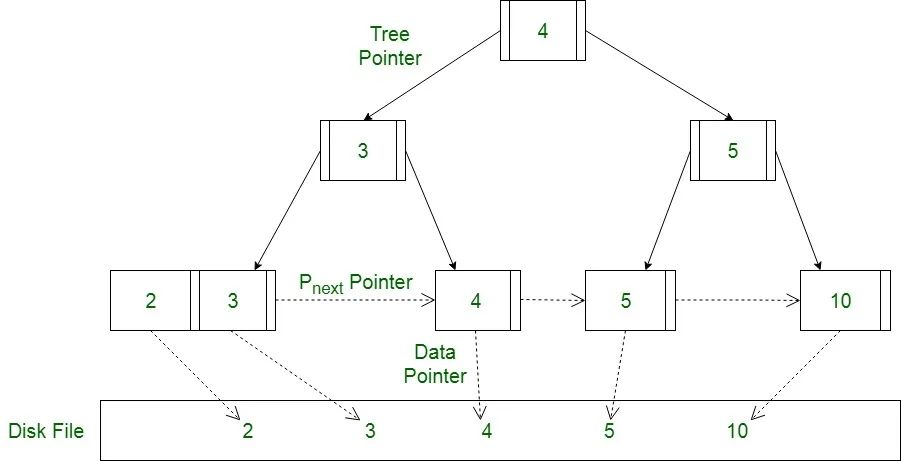
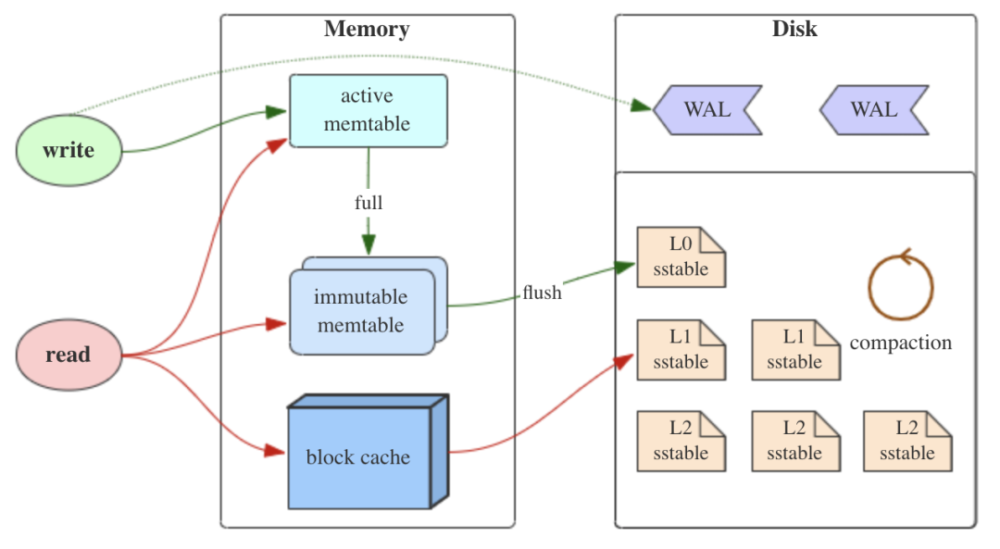
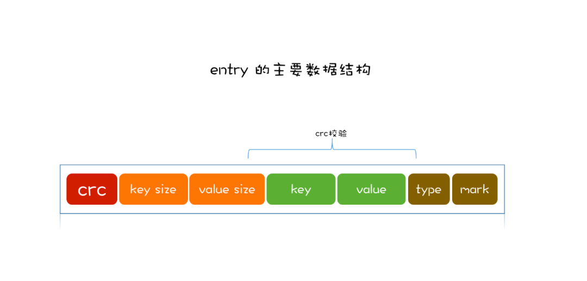
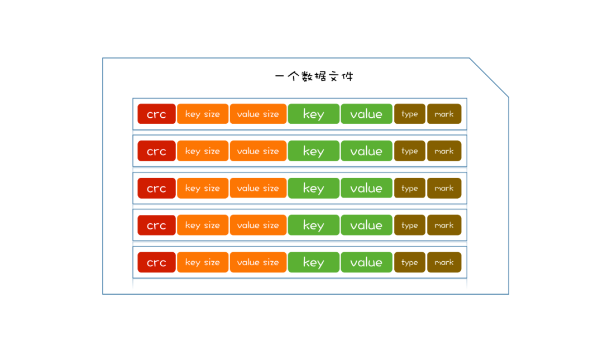
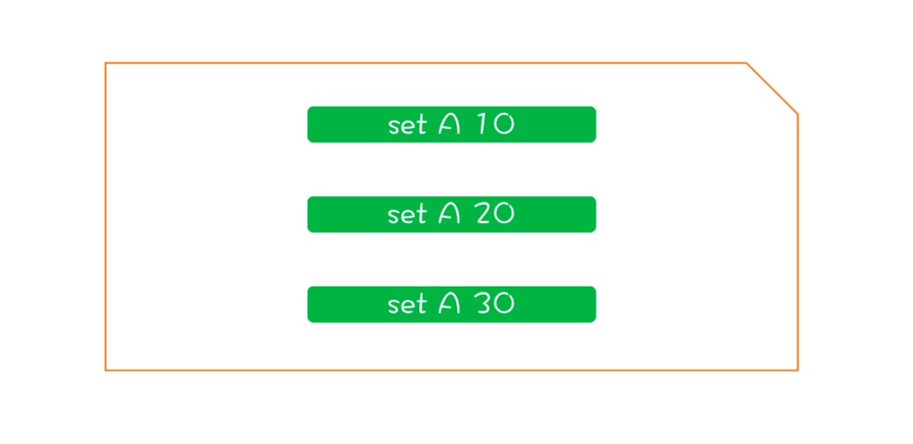
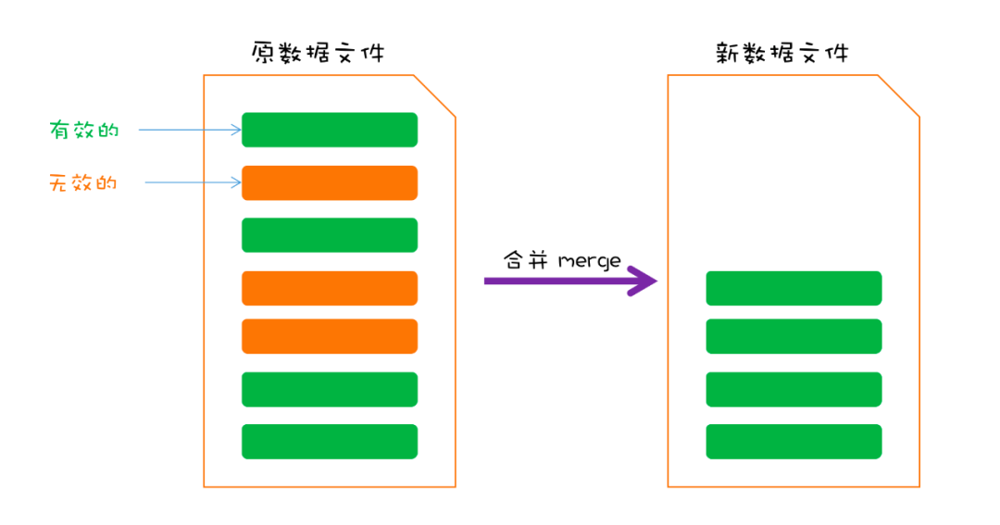
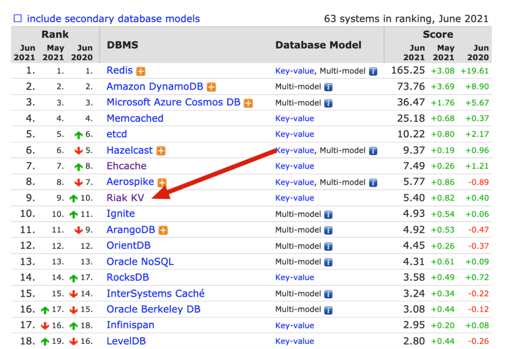

## 1. 简介

minidb 为 rosedb 的 mini 版本，用于理解 bitcask 存储模型以及 rosedb。

minidb 中没有实现 bitcask 模型的多个数据文件机制，为了简化只使用了一个数据文件进行读写，但不妨碍理解 bitcask 模型。

## 2. 存储模型

存储，其核心问题是：如何存放数据以及如何取出数据。

计算机中有内存和磁盘，内存是易失性的，掉电之后数据全部丢失，所以想要在系统崩溃重启后依然正常使用，需要将数据存储在非易失介质中（如磁盘等）。

那么对于一个单机版的 k-v 存储引擎，我们需要设计数据在内存中应该如何存放，在磁盘中应该如何存放。根据优秀前辈的研究和总结，主要将数据存储模型分为两类：==B+ 树== 和 ==LSM 树==。

### 2.1 B+ 树




B+ 树由二叉查找树演化而来，通过增加每层节点的数量，来降低树的高度，适配磁盘的页，尽量减少磁盘 IO 操作。

B+ 树查询性能比较稳定，在写入或更新时，会查找并定位到磁盘中的位置并进行原地操作，注意这里是随机 IO，并且大量的插入或删除还有可能触发页分裂和合并，写入性能一般，因此 B+ 树适合 ==读多写少== 的场景。

### 2.2 LSM 树



LSM Tree (Log Structured Merge Tree, 日志结构合并树) 其实不是一种具体的树类型的数据结构，而是一种数据存储模型，其核心思想基于一个事实：==顺序 IO 远快于随机 IO==。

和 B+ 树不同，在 LSM 中数据的插入、更新、删除都会被记录成一条日志，然后追加写入到磁盘文件当中，这样所有的操作都是顺序 IO，因此 LSM 树适用于 ==写多读少== 的场景。

## 3. minidb

minidb 基于一种更加简单的存储结构，总体上和 LSM 类似。下面通过简单例子看下 minidb 当中数据的 PUT、GET、DELETE 流程。

### 3.1 PUT

我们需要存储一条记录，分别是 key 和 value。首先，为防止数据丢失，我们会将 key 和 value 封装成一条记录（称作 Entry），追加到磁盘文件中。Entry 的大致由 key、value、key size、value size、写入时间组成。



那么磁盘文件的结构非常简单，就是多个 Entry 的集合。



==磁盘更新完了，再来更新内存==， 内存当中可以选择一个简单的数据结构，如哈希表。哈希表的 key 对应存放的是 Entry 在磁盘中的位置，便于查找时进行获取。

至此 minidb 的数据存储的流程结束了，只有两个步骤： 一次磁盘记录的追加，一次内存当中的索引更新。

### 3.2 GET

获取一条数据，首先在内存中的哈希表查找到 key 对应的索引信息，其中包含了的 value 存储在磁盘文件中的位置，然后直接根据这个位置，在磁盘中取出 value 即可。

### 3.3 DEL

删除操作，并不会定位到原记录进行删除，而是首先将删除的操作封装成 Entry，追加到磁盘中，只是需要标识 Entry 的类型是删除。

之后在内存当中的哈希表删除对应的 key 的索引信息，至此删除操作便完成了。

可以看到，无论是插入、查询、删除都只有两个步骤：==一次内存中的索引更新，一次磁盘文件的记录追加==。所以无论数据规模如何，minidb 的写入性能较为稳定。

### 3.4 Merge

最后再来看下一个比较重要的操作，由于磁盘记录一直在追加写入的，导致文件容量会一直增加。并且对于同一个 key，可能会在文件中存在多条 Entry（更新和删除 key 也会追加记录），那么在数据文件中，其实存在冗余的 Entry 数据。

例如，针对 key A，先后设其 value 为 10、20、30，那么磁盘就会存在三条记录：



此时 A 的最新值是 30，那么前两条记录已经是无效的了。

针对上述情形，我们需要定期合并数据文件，清理无效的 Entry 数据，这个过程一般叫做 ==merge==。

Merge 的思路也较为简单，取出原数据文件的所有 Entry，将有效的 Entry 重新写入到一个新建的临时文件中，最后将原数据文件删除，临时文件就是新的数据文件了。



这就是 minidb 的底层数据存储模型，名为 ==bitcask==，rosedb 也是采用这种模型。其本质属于类 LSM 模型，核心思想是利用顺序 IO 来提升写性能，只不过在实现上比 LSM 简单。

## 4. 代码实现

下面看下几个核心步骤的 Code 实现

### 4.1 Open

打开数据库，需要先加载数据文件，取出文件中的 Entry 数据，还原索引状态，关键代码如下：

```go
func Open(dirPath string) (*MiniDB, error) {
   // 如果数据库目录不存在，则新建一个
   if _, err := os.Stat(dirPath); os.IsNotExist(err) {
      if err := os.MkdirAll(dirPath, os.ModePerm); err != nil {
         return nil, err
      }
   }

   // 加载数据文件
   dbFile, err := NewDBFile(dirPath)
   if err != nil {
      return nil, err
   }

   db := &MiniDB{
      dbFile: dbFile,
      indexes: make(map[string]int64),
      dirPath: dirPath,
   }

   // 加载索引
   db.loadIndexesFromFile(dbFile)
   return db, nil
}
```

### 4.2 PUT

先更新磁盘，写入一条记录，再更新内存：

```go
func (db *MiniDB) Put(key []byte, value []byte) (err error) {
  
   offset := db.dbFile.Offset
   // 封装成 Entry
   entry := NewEntry(key, value, PUT)
   // 追加到数据文件当中
   err = db.dbFile.Write(entry)

   // 写到内存
   db.indexes[string(key)] = offset
   return
}
```

### 4.3 GET

从内存中去除索引信息，判断是否存在，不存在直接返回，存在则从硬盘中取出数据。

```go
func (db *MiniDB) Get(key []byte) (val []byte, err error) {
   // 从内存当中取出索引信息
   offset, ok := db.indexes[string(key)]
   // key 不存在
   if !ok {
      return
   }

   // 从磁盘中读取数据
   var e *Entry
   e, err = db.dbFile.Read(offset)
   if err != nil && err != io.EOF {
      return
   }
   if e != nil {
      val = e.Value
   }
   return
}
```

### 4.4 DELETE

DEL 和 PUT 类似，只是 Entry 被标记为了 DEL，然后封装成了 Entry 写入到文件中：

```go
func (db *MiniDB) Del(key []byte) (err error) {
   // 从内存当中取出索引信息
   _, ok := db.indexes[string(key)]
   // key 不存在，忽略
   if !ok {
      return
   }

   // 封装成 Entry 并写入
   e := NewEntry(key, nil, DEL)
   err = db.dbFile.Write(e)
   if err != nil {
      return
   }

   // 删除内存中的 key
   delete(db.indexes, string(key))
   return
}
```

### 4.5 Merge

合并文件操作：

```go
func (db *MiniDB) Merge() error {
   // 读取原数据文件中的 Entry
   for {
      e, err := db.dbFile.Read(offset)
      if err != nil {
         if err == io.EOF {
            break
         }
         return err
      }
      // 内存中的索引状态是最新的，直接对比过滤出有效的 Entry
      if off, ok := db.indexes[string(e.Key)]; ok && off == offset {
         validEntries = append(validEntries, e)
      }
      offset += e.GetSize()
   }

   if len(validEntries) > 0 {
      // 新建临时文件
      mergeDBFile, err := NewMergeDBFile(db.dirPath)
      if err != nil {
         return err
      }
      defer os.Remove(mergeDBFile.File.Name())

      // 重新写入有效的 entry
      for _, entry := range validEntries {
         writeOff := mergeDBFile.Offset
         err := mergeDBFile.Write(entry)
         if err != nil {
            return err
         }

         // 更新索引
         db.indexes[string(entry.Key)] = writeOff
      }

      // 删除旧的数据文件
      os.Remove(db.dbFile.File.Name())
      // 临时文件变更为新的数据文件
      os.Rename(mergeDBFile.File.Name(), db.dirPath+string(os.PathSeparator)+FileName)

      db.dbFile = mergeDBFile
   }
   return nil
}
```

## 5. 小结

除去测试文件，minidb 的==核心代码只有300行==，但包含了 bitcask 存储模型的主要思想，并且也是 rosedb 的底层基础。

虽然 bitcask 简单易懂，但是也存在不少问题，在 rosedb 中也对其进行了优化。

bitcask 最初源于 Riak 项目的底层存储模型，而 Riak 是一个分布式 k-v 存储，在 NoSQL 的排名中也名列前茅：



豆瓣使用的分布式 k-v 存储，其实也是基于的 bitcask 模型，并对其进行了很多优化。但是纯粹基于 bitcask 的 k-v 存储并不多。

## Reference

1. [从零实现一个 k-v 存储引擎](https://mp.weixin.qq.com/s/s8s6VtqwdyjthR6EtuhnUA)
2. [bitcask](https://riak.com/assets/bitcask-intro.pdf)