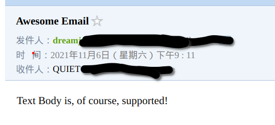

# email

## 简介

程序中经常需要发邮件，比如用户完成一笔交易之后会发送一封通知邮件给用户，用户可以将邮件作为交易的凭证，还有邮件用于通知性的业务，比如通知管理员系统异常等

Golang中可以通过开源库`email`来发送邮件，`email`是一个易用的，健壮的，灵活的Golang库，目标是提供更加人性化的email接口

注意：当前`email`库不支持`STARTTLS`认证的邮箱（2021/11/06）,如`outlook`，可能后续会增加此特性(作者已经表示准备Merge相关的PR)

若想要在项目中实际使用的话建议使用功能较为完善的[go-gomail](https://github.com/go-gomail)/**[gomail](https://github.com/go-gomail/gomail)**

## 电子邮件

### 协议

在使用`email`库之前，先需要了解几个电子邮件协议：

- **SMTP**[^1]:**简单邮件传输协议**(**S**imple **M**ail **T**ransfer **P**rotocol),它是一组用于从源地址到目的地址传输邮件的规范，通过它来控制邮件的中转方式。SMTP 协议属于 TCP/IP 协议簇，它帮助每台计算机在发送或中转信件时找到下一个目的地。SMTP 服务器就是遵循 SMTP 协议的发送邮件服务器
- **POP3[^2]**:**邮局协议**（**P**ost **O**ffice **P**rotocol）,POP3是其第三个版本，它规定怎样将个人计算机连接到Internet的邮件服务器和下载电子邮件的电子协议。它是因特网电子邮件的第一个离线协议标准,POP3允许用户从服务器上把邮件存储到本地主机（即自己的计算机）上,同时删除保存在邮件服务器上的邮件，而POP3服务器则是遵循POP3协议的接收邮件服务器，用来接收电子邮件的
- **IMAP[^3]**:**交互式邮件存取协议**(**I**nternet **M**ail **A**ccess **P**rotocol),即交互式邮件存取协议，它是跟POP3类似邮件访问标准协议之一。不同的是，开启了IMAP后，您在电子邮件客户端收取的邮件仍然保留在服务器上，同时在客户端上的操作都会反馈到服务器上，如：删除邮件，标记已读等，服务器上的邮件也会做相应的动作。所以无论从浏览器登录邮箱或者客户端软件登录邮箱，看到的邮件以及状态都是一致的

### 系统组成

电子邮件系统仅有协议是无法单独运作的，电子邮件系统主要有三个组成构件:

- **邮件用户代理**：**MUA**(**M**ail **U**ser **A**gent)，为用户提供一种可对邮件进行编辑、阅读、发送、存储及管理的工具
- **邮件服务器**
- **邮件传输协议**

其中的邮件服务器和邮件传输协议并称为**MTA**(**M**ail **T**ransfer **A**gent,邮件传输代理)，邮件服务器至少需要两种协议：用于发送邮件(SMTP)和接收邮件(POP3/IMAP)

### 发送流程

假设`Alice@163.com`给`Bob@sina.com`发送一封电子邮件，电子邮件不是直接发送到Bob的电脑上的，流程如下：

- Alice在邮箱客户端(MUA)编写并发送邮件,此时邮件被发送到163的邮箱服务器(MTA)
- 163的邮箱服务器将邮件发送值sina的邮箱服务器(MTA)
- sina的邮箱服务器(MTA)会将邮件发送到邮件投递代理(MDA,**M**ail **D**elivery **A**gent)中,邮件会存储在服务器上
- Bob通过邮件客户端(MUA)从MDA中获取邮件

```flow
st=>start: Alice@163.com
op1=>operation: MUA(163)
op2=>operation: MTA(163)
op3=>operation: MTA(sina)
op4=>operation: MDA(sina)
op5=>operation: MUA(sina)
e=>end: Bob@sina.com
st(right)->op1(right)->op2(right)->op3(right)->op4(right)->op5(right)->e
```

## 快速开始

这里以Gmail为例(需要暂时关闭安全访问，记得测试后开启)：

```go
// go-daily-lib-note/email/quick-start/main.go
package main

import (
	"log"
	"net/smtp"

	"github.com/jordan-wright/email"
)

func main() {
	e := email.NewEmail()
	e.From = "sender@gmail.com"
	e.To = []string{"receiver@qq.com"}
	e.Subject = "Awesome Email"
	e.Text = []byte("Text Body is, of course, supported!")
	err := e.Send("smtp.gmail.com:587", smtp.PlainAuth("", "sender@gmail.com", "password", "smtp.gmail.com"))
	if err != nil {
		log.Fatal("send email failed ", err)
	}
}

```

登录收件邮箱，可以看到刚刚发送的邮件：



由于Gmail是支持`PlainAuth`的，可以使用明文的`user/pass`验证；但是若邮箱服务不支持此验证方式将会报错：

```sh
504 5.7.4 Unrecognized authentication type
```

可以使用`telnet`连接邮件服务器，查看其支持的验证方式(以outlook为例) ：

```sh
telnet smtp-mail.outlook.com 25
Trying 52.98.40.66...
Connected to smtp-mail.outlook.com.
Escape character is '^]'.
220 HKAPR*****.outlook.office365.com Microsoft ESMTP MAIL Service ready at Sat, 6 Nov 2021 12:42:51 +0000
helo
250 HKAPR*****.outlook.office365.com Hello [183.12.236.224]
ehlo
250-HKAPR04CA0010.outlook.office365.com Hello [183.12.236.224]
250-SIZE 157286400
250-PIPELINING
250-DSN
250-ENHANCEDSTATUSCODES
250-STARTTLS
250-8BITMIME
250-BINARYMIME
250-CHUNKING
250 SMTPUTF8
```

可以看到，此处outlook是不支持`PlainAuth`的

## 抄送

发送邮件有时需要抄送(CC, Carbon Copy)和秘密抄送(BCC, Blind Carbon Copy)

修改上面的例子，加上抄送和秘密抄送人：

```go
// go-daily-lib-note/email/quick-start/main.go
// ...
e.Cc = []string{"test1@126.com", "test2@126.com"}
e.Bcc = []string{"secret@126.com"}
// ...
```

## HTML格式

邮件正文可以使用HTML格式，修改上例：

```go
// go-daily-lib-note/email/quick-start/main.go
// ...
e.HTML = []byte(`
<h1>Awesome Email</h1>
<p>Text Body is, of course, supported!</p>
`)
// ...
```

## 附件

使用`AttachFile`方法可以添加附件,修改上例：

```go
// go-daily-lib-note/email/quick-start/main.go
// ...
file, err := os.OpenFile("text.txt", os.O_CREATE|os.O_WRONLY, 0666)
	defer file.Close()
	if err != nil {
		log.Fatal("create file error ")
	}
	file.WriteString("This is a mail attachment")

	e.AttachFile("text.txt")
// ...
```

## 连接池

每次调用`Send`方法时都会与SMTP服务器建立连接，如果发送频繁的话会有性能问题，`email`提供了连接池，可以服用连接

```go
// 
package main

import (
	"fmt"
	"log"
	"net/smtp"
	"os"
	"strconv"
	"sync"
	"time"

	"github.com/jordan-wright/email"
)

func main() {
	ch := make(chan *email.Email, 10)
	pool, err := email.NewPool("smtp.gmail.com:587", 4, smtp.PlainAuth("", "xxx@gmail.com", "pass", "smtp.gmail.com"))
	if err != nil {
		log.Fatal("create pool failed:", err)
	}
	var wg sync.WaitGroup
	wg.Add(4)
	for i := 0; i < 4; i++ {
		go func() {
			defer wg.Done()
			for e := range ch {
				err := pool.Send(e, 10*time.Second)
				if err != nil {
					fmt.Fprintf(os.Stderr, "email: %v sent error:%v\n", e, err)
				}
			}
		}()
	}

	for i := 0; i < 10; i++ {
		e := email.NewEmail()
		e.From = "dreamjzwork@outlook.com"
		e.To = []string{"xxx@qq.com"}
		e.Cc = []string{"xxx@qq.com"}
		e.Bcc = []string{"xxx@gmail.com"}
		e.Subject = "Awesome Email:" + strconv.Itoa(i+1)
		e.Text = []byte("Text Body is, of course, supported!")
		e.HTML = []byte(`
<h1>Awesome Email</h1>
<p>Text Body is, of course, supported!</p>
`)
		ch <- e
	}
	close(ch)
	wg.Wait()
}

```

上例中创建4个goroutine发送一共10封邮件，为了等待邮件都完成或者失败，使用了`Sync.WaitGroup`

## 参考

1. [Go 每日一库之 email](https://darjun.github.io/2020/02/16/godailylib/email/) darjun blog

2. [jordan-wright](https://github.com/jordan-wright)/**[email](https://github.com/jordan-wright/email)** github repo

3. [电子邮件](https://zh.wikipedia.org/wiki/%E7%94%B5%E5%AD%90%E9%82%AE%E4%BB%B6) 维基百科

4. [电子邮件](https://www.liaoxuefeng.com/wiki/1016959663602400/1017790556023936) liaoxuefeng 

5. [什么是POP3、SMTP和IMAP?](http://help.163.com/09/1223/14/5R7P6CJ600753VB8.html?servCode=6010376) 163email help

6. [How to send email using Outlook's SMTP servers?](https://stackoverflow.com/questions/57783841/how-to-send-email-using-outlooks-smtp-servers) stackoverflow


[^1]:**[简单邮件传输协议](https://zh.wikipedia.org/wiki/%E7%AE%80%E5%8D%95%E9%82%AE%E4%BB%B6%E4%BC%A0%E8%BE%93%E5%8D%8F%E8%AE%AE)**（英语：**S**imple **M**ail **T**ransfer **P**rotocol，缩写：**SMTP**）是一个在[互联网](https://zh.wikipedia.org/wiki/網際網路)上传输[电子邮件](https://zh.wikipedia.org/wiki/電子郵件)的标准 
[^2]:**[邮局协议](https://zh.wikipedia.org/wiki/%E9%83%B5%E5%B1%80%E5%8D%94%E5%AE%9A)**（英语：**P**ost **O**ffice **P**rotocol，缩写：**POP**）是[TCP/IP](https://zh.wikipedia.org/wiki/TCP/IP)协议族中的一员，由1996年5月发行之 [RFC 1939](https://tools.ietf.org/html/rfc1939) 首次定义。此协议主要用于支持使用[客户端](https://zh.wikipedia.org/wiki/客户端)远程管理在[服务器](https://zh.wikipedia.org/wiki/服务器)上的[电子邮件](https://zh.wikipedia.org/wiki/电子邮件)。最新版本为**POP3**，全名“Post Office Protocol - Version 3”，而提供了[SSL](https://zh.wikipedia.org/wiki/SSL)加密的POP3协议被称为**POP3S**
[^3]:**[因特网信息访问协议](https://zh.wikipedia.org/wiki/%E5%9B%A0%E7%89%B9%E7%BD%91%E4%BF%A1%E6%81%AF%E8%AE%BF%E9%97%AE%E5%8D%8F%E8%AE%AE)**（英语：**I**nternet **M**essage **A**ccess **P**rotocol，缩写：**IMAP**；以前称作**交互邮件访问协议**）是一个应用层协议，用来从本地邮件客户端（如[Microsoft](https://zh.wikipedia.org/wiki/Microsoft) [Outlook](https://zh.wikipedia.org/wiki/Outlook)、[Outlook Express](https://zh.wikipedia.org/wiki/Outlook_Express)、[Foxmail](https://zh.wikipedia.org/wiki/Foxmail)、[Mozilla Thunderbird](https://zh.wikipedia.org/wiki/Mozilla_Thunderbird)）访问远程服务器上的邮件

