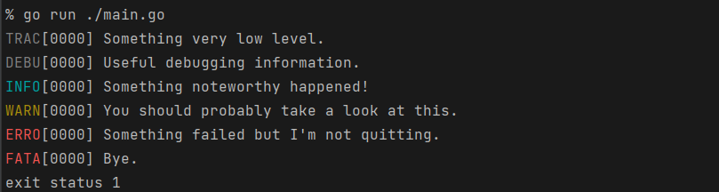
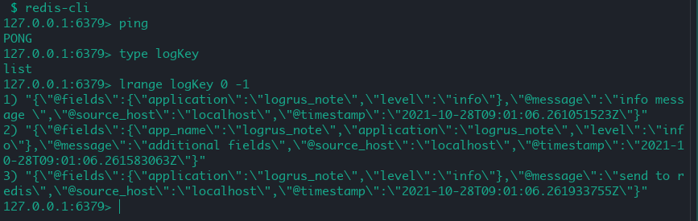

# Golang daily lib -- logrus

## Introduction 简介

golang标准库`log`仅提供了三组接口，功能过于简单。本次将介绍一个开源log库--`logrus`,[logrus](https://github.com/sirupsen/logrus)完全兼容标准`log`库，支持文本，JSON两种日志输出格式。有很多知名的开源项目如docker就使用了此库

## Quick Start 快速开始

在 go module 中导入：

```
go get -u github.com/sirupsen/logrus latest
```

```go
// logrus/quick-start/main.go
package main

import (
	"github.com/sirupsen/logrus"
)

func main() {
	logrus.SetLevel(logrus.TraceLevel)

	log.Trace("Something very low level.")
log.Debug("Useful debugging information.")
log.Info("Something noteworthy happened!")
log.Warn("You should probably take a look at this.")
log.Error("Something failed but I'm not quitting.")
// Calls os.Exit(1) after logging
log.Fatal("Bye.")
// Calls panic() after logging
log.Panic("I'm bailing.")
}
         
```



`logrus`的使用比较简单，与`log`相比其支持更多的日志级别：

- `Panic`:记录日志之后调用`panic`
- `Fatal`:致命错误，出现错误时程序无法运转。输出日志后程序退出
- `Error`:错误日志，需要查看错误原因
- `Warn`:警告信息，提醒开发人员
- `Info`:关键操作，核心流程的日志
- `Debug`:一般程序中输出的调试信息
- `Trace`:最低级别的日志

上述的日志级别由上至下依次降低，`Trace`最低，`Panic`最高。`logrus.SetLevel`可以设置输入的日志级别，低于此日志级别不会输出，默认的级别为`Info`

## 定制

### 输出文件名

调用`logrus.SetReporCaller(true)`，将会在日志中添加文件名和函数名

```go
// report-caller/main.go
package main

import "github.com/sirupsen/logrus"

func main() {
	logrus.SetReportCaller(true)

	logrus.Info("Something noteworthy happened!")
}

```

```sh
$ go run ./main.go                                                       
INFO[0000]/home/username/go-daily-lib-note/logrus/report-caller/main.go:8 main.main() Something noteworthy happened!    
```

### 添加字段

有时需要在输出中添加字段，可以通过`logrus.WithField`和`logrus.WithFields`实现，`logrus.WithFields`接收一个`logrus.Fields`类型的参数，底层实际为`map[string]interface{}`

```go
// logrus/logrus.go
// Fields type, used to pass to `WithFields`.
type Fields map[string]interface{}
```

```go
// with-feild/main.go
package main

import "github.com/sirupsen/logrus"

func main() {
	logrus.WithFields(logrus.Fields{
		"id":   1,
		"name": "kesa",
	}).Info("Info message")
}

```

```sh
$ go run ./main.go
INFO[0000] Info message                                  id=1 name=kesa
```

如果需要在一个函数中所有日志都需要添加某些字段，可以使用`WithFields`的返回值。例如在Web请求处理函数中，日志中需要加上`user_id`和`ip`:

```go
// with-feild/main.go
package main

import "github.com/sirupsen/logrus"

func main() {
	// ...
	loggerInFunction()
}

func loggerInFunction() {
	requestLogger := logrus.WithFields(logrus.Fields{
		"user_id": 11001,
		"ip":      "192.168.2.231",
	})

	requestLogger.Info("info msg")
	requestLogger.Error("error msg")
}

```

```sh
INFO[0000] info msg                                      ip=192.168.2.231 user_id=11001
ERRO[0000] error msg                                     ip=192.168.2.231 user_id=11001
```

`WithField`返回一个`logrus.Entry`类型的值，将保存用户设置的`logrus.Fields`保存下来，调用`Entry`的方法输出日志时，设置的`Fields`也会被输出

```go
// logrus/entry.go
type Entry struct {
	Logger *Logger

	// Contains all the fields set by the user.
	Data Fields

	// Time at which the log entry was created
	Time time.Time

	// Level the log entry was logged at: Trace, Debug, Info, Warn, Error, Fatal or Panic
	// This field will be set on entry firing and the value will be equal to the one in Logger struct field.
	Level Level

	// Calling method, with package name
	Caller *runtime.Frame

	// Message passed to Trace, Debug, Info, Warn, Error, Fatal or Panic
	Message string

	// When formatter is called in entry.log(), a Buffer may be set to entry
	Buffer *bytes.Buffer

	// Contains the context set by the user. Useful for hook processing etc.
	Context context.Context

	// err may contain a field formatting error
	err string
}
```

### 输出重定向

日志默认输出到`io.Stderr`,可以调用`logrus.SetOutput`传入一个`io.Writer`参数。后续调用相关方法写入到`io.Writer`中。和`log`类似，我们传入一个`io.MultiWriter`同时将日志写入文本文件，标准输出和`bytes.Buffer`中

```go
package main

import (
	"bytes"
	"fmt"
	"github.com/sirupsen/logrus"
	"io"
	"log"
	"os"
)

func main() {
	writer1 := &bytes.Buffer{}
	writer2 := os.Stdout
	writer3, err := os.OpenFile("./output_redirection.log", os.O_WRONLY|os.O_CREATE, 0666)
	if err != nil {
		log.Fatal("create file failed :", err)
	}

	logrus.SetOutput(io.MultiWriter(writer3, writer2, writer1))
	logrus.Info("Info message")
	fmt.Println("BUF:", writer1.String())
}

```

```sh
$ go run ./main.go 
time="2021-10-28T14:17:06+08:00" level=info msg="Info message"
BUF: time="2021-10-28T14:17:06+08:00" level=info msg="Info message"
```

注意到此处的日志格式为 plain text,而[quick start](#Quick Start 快速开始)中的日志为带颜色的格式;`logrus`日志输出时会检测输出是否为TTY(Teletypewriter,linux终端),如果是则会输出带颜色的格式(`quick-start`中输出到linux的标准输出，所以是彩色格式)

上例中使用了多个输出：标准输出，`bytes.Buffer`，文件,故输出格式为plain text

也可以强制使用带颜色的格式，`logrus.SetFormatter`指定格式：

```go
logrus.SetFormatter(&logrus.TextFormatter{
		ForceColors: true,
})
```

### 自定义

**考虑到易用性，库一般会使用默认值创建一个对象，包外层的函数一般是操作这个默认对象**

例如`log`中的`std`,`flag`中的`CommandLine`,这个技巧在很多库中都有应用，`logrus`也是如此：

```go
// logrus/exported.go
var (
	// std is the name of the standard logger in stdlib `log`
	std = New()
)
func StandardLogger() *Logger {
	return std
}

// SetOutput sets the standard logger output.
func SetOutput(out io.Writer) {
	std.SetOutput(out)
}

// SetFormatter sets the standard logger formatter.
func SetFormatter(formatter Formatter) {
	std.SetFormatter(formatter)
}

// SetReportCaller sets whether the standard logger will include the calling
// method as a field.
func SetReportCaller(include bool) {
	std.SetReportCaller(include)
}

// SetLevel sets the standard logger level.
func SetLevel(level Level) {
	std.SetLevel(level)
}
```

我们也可创建自定义的`logrus.Logger`对象：

```go
myLogger := logrus.New()
```

### 日志格式

#### JSON

`logrus`支持两种日志格式，文本和JSON，默认为文本格式，可以通过`logrus.SetFormatter`设置：

```go
// set-formatter.go
package main

import "github.com/sirupsen/logrus"

func main() {
	logrus.SetFormatter(&logrus.JSONFormatter{})

	logrus.Info("Info message")
}
```

```sh
% go run ./main.go 
{"level":"info","msg":"Info message","time":"2021-10-28T15:08:48+08:00"}
```

#### 自定义格式

实现`logrus.Formatter`可以实现自定义的格式：

```go
// logrus/formatter.go
type Formatter interface {
  Format(*Entry) ([]byte, error)
}
```

设置钩子(Hook)

可以为`logrus`设置钩子，每条日志输出前都会执行钩子的特定方法。所以可以添加输出字段、根据级别将日志输出到不同的目的地。`logrus`也内置了一个`syslog`的钩子，将日志输出`syslog`中。这里我们实现一个钩子，在输出的日志中增加一个`app=logrus_note`字段

首先实现`logrus.Hook`接口

```go
// A hook to be fired when logging on the logging levels returned from
// `Levels()` on your implementation of the interface. Note that this is not
// fired in a goroutine or a channel with workers, you should handle such
// functionality yourself if your call is non-blocking and you don't wish for
// the logging calls for levels returned from `Levels()` to block.
type Hook interface {
	Levels() []Level
	Fire(*Entry) error
}
```

`Levels`方法返回感兴趣的日志级别，输出其他日志不会触发钩子，`Fire`是日志输出前调用的钩子方法

```go
package main

import (
	"fmt"
	"github.com/sirupsen/logrus"
)

type AppHook struct {
	AppName string
}

func (ah *AppHook) Levels() []logrus.Level {
	return []logrus.Level{logrus.InfoLevel}
}

func (ah *AppHook) Fire(entry *logrus.Entry) error {
	fmt.Println("Fire !")
	entry.Data["app"] = ah.AppName
	return nil
}

func main() {
	myHook := &AppHook{AppName: "logrus_note"}
	logrus.AddHook(myHook)

	logrus.Info("info message")
	logrus.Warn("waring message")
}

```

```sh
% go run ./main.go
Fire !
INFO[0000] info message                                  app=logrus_note
WARN[0000] waring message                               
```

也可以导入第三方的hook，将日志发送到`redis/mongodb`等存储中:

- [mgorus](https://github.com/weekface/mgorus): 将日志发送到 mongodb
- [logrus-redis-hook](https://github.com/rogierlommers/logrus-redis-hook): 将日志发送到 redis
- [logrus-amqp](https://github.com/vladoatanasov/logrus_amqp): 将日志发送到 ActiveMQ

以logrus-redis-hool为例：

```go
package main

import (
	logredis "github.com/rogierlommers/logrus-redis-hook"
	"github.com/sirupsen/logrus"
	"io/ioutil"
)

func init() {
	hookConfig := logredis.HookConfig{
		Host:     "localhost",
		Key:      "logKey",
		Format:   "v0",
		App:      "logrus_note",
		Hostname: "localhost",
		TTL:      3600,
		Port:     6379,
	}

	hook, err := logredis.NewHook(hookConfig)
	if err == nil {
		logrus.AddHook(hook)
	} else {
		logrus.Errorf("logredis error :%q", err)
	}
}

func main() {
	logrus.Info("info message ")

	logrus.WithField("app_name", "logrus_note").Info("additional fields")

	// do not sent log to default writer
	logrus.SetOutput(ioutil.Discard)

	logrus.Info("send to redis")
}

```

```sh
 go run ./main.go
INFO[0000] info message                                 
INFO[0000] additional fields                             app_name=logrus_note
```



#### 第三方格式

`logrus`可以引入第三方格式支持，以[nested-logrus-formatter](https://github.com/antonfisher/nested-logrus-formatter)

```go
// 3rd-formatter/main.go
package main

import (
	nested "github.com/antonfisher/nested-logrus-formatter"
	"github.com/sirupsen/logrus"
)

func main() {
	logrus.SetFormatter(&nested.Formatter{
		HideKeys:    true,
	})

	logrus.Info("Info msg")
}

```

```
% go run ./main.go
Oct 28 15:22:43.102 [INFO] Info msg
```

`nested`格式提供了多个字段控制行为：

```go
// Formatter - logrus formatter, implements logrus.Formatter
type Formatter struct {
	// FieldsOrder - default: fields sorted alphabetically
	FieldsOrder []string

	// TimestampFormat - default: time.StampMilli = "Jan _2 15:04:05.000"
	TimestampFormat string

	// HideKeys - show [fieldValue] instead of [fieldKey:fieldValue]
	HideKeys bool

	// NoColors - disable colors
	NoColors bool

	// NoFieldsColors - apply colors only to the level, default is level + fields
	NoFieldsColors bool

	// NoFieldsSpace - no space between fields
	NoFieldsSpace bool

	// ShowFullLevel - show a full level [WARNING] instead of [WARN]
	ShowFullLevel bool

	// NoUppercaseLevel - no upper case for level value
	NoUppercaseLevel bool

	// TrimMessages - trim whitespaces on messages
	TrimMessages bool

	// CallerFirst - print caller info first
	CallerFirst bool

	// CustomCallerFormatter - set custom formatter for caller info
	CustomCallerFormatter func(*runtime.Frame) string
}
```

上例中`HidKeys:true`隐藏日志中字段的Key，仅展示value（logrus默认输出Key-Value形式）

## Conclusion 总结

本文介绍了`logrus`的基本用法，其拥有较高的扩展性，可以引入三方格式和Hoo

来增强功能，也较受欢迎

## Reference 参考

1. [logrus](https://github.com/sirupsen/logrus) github-repo
2. [Hooks](https://github.com/sirupsen/logrus/wiki/Hooks) logrus hook 
3. [logrus](https://darjun.github.io/2020/02/07/godailylib/logrus/) darjun blog
4. [TTY](https://www.cnblogs.com/sparkdev/p/11460821.html) sparkdev blog

