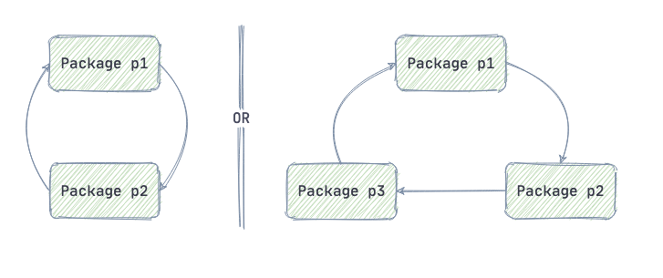
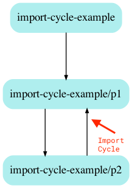

 # How To Deal With Import Cycles In Golang 

## Problem

在学习 gin 构建 Web app 时，遇到了循环依赖的问题，import 循环如下：

```
core -> router -> api -> service -> dao -> models -> core
```

在`core`中定义了`Model`结构体（用于`gorm`基本字段），之后在配置`gin`路由及 API 逻辑时调用到 dao 层由引入了`core`中的`Model`,导致了循环依赖

Google 查找相关资料，[jogendra](https://jogendra.dev/import-cycles-in-golang-and-how-to-deal-with-them)的博客[Import Cycles in Golang: How To Deal With Them](https://jogendra.dev/import-cycles-in-golang-and-how-to-deal-with-them)针对循环依赖进行了详细的讲解，这里作为笔记记录下来

As a Golang developer, you probably have encountered import cycles. Golang do not allow import cycles. Go throws a compile-time error if it detects the import cycle in code. In this post, let's understand how the import cycle occurs and how you can deal with them.

## Import cycles

Let's say we have two packages, `p1` and `p2`. When package `p1` depends on package `p2` and package `p2` depends on package `p1`, it creates a cycle of dependency. Or it can be more complicated than this e.g. package `p2` does not directly depend on package `p1` but `p2` depends on package `p3` which depends on `p1`, again it is cycle.



Let's understand it through some example code.

*package 1*:

```go
package p1

import (
	"fmt"
	"import-cycle-example/p2"
)

type PP1 struct {}

func New() *PP1 {
	return &PP1{}
}

func (p *PP1) HelloFromP1(){
	fmt.Println("Hello from p1")
}

func (p *PP1) HelloFromP2Side(){
	pp2 := p2.New()
	pp2.HelloFromP2()
}
```

*package 2*:

```go
package p2

import (
	"fmt"
	"import-cycle-example/p1"
)

type PP2 struct{}

func New() *PP2 {
	return &PP2{}
}

func (p *PP2) HelloFromP2() {
	fmt.Println("Hello from p2")
}

func (p *PP2) HelloFromP1Side() {
	pp1 := p1.New()
	pp1.HelloFromP1()
}
```

On building, compiler returns the error:

```
package import-cycle-example/p1
        imports import-cycle-example/p2
        imports import-cycle-example/p1: import cycle not allowed
```

## Import Cycles Are Bad Design

Go is highly focused on faster compile time rather than speed of execution (even willing to sacrifice some run-time performance for faster build). The Go compiler doesn't spend a lot of time trying to generate the most efficient possible machine code, it cares more about compiling lots of code quickly.

Allowing cyclic/circular dependencies would **significantly increase compile times** since the entire circle of dependencies would need to get recompiled every           time one of the dependencies changed. It also increases the link-time cost and makes it hard to test/reuse things independently(more difficult to unit test because they cannot be tested in isolation from one another). Cyclic dependencies can result in infinite recursions sometimes.

Cyclic dependencies may also cause memory leaks since each object holds on to the other, their reference counts will never reach zero and hence will never become candidates for collection and cleanup.

[Robe Pike, replying to proposal for allowing import cycles in Golang](https://github.com/golang/go/issues/30247#issuecomment-463940936), said that, this is one area where up-font simplicity is worthwhile. Import cycles can be convenient but their cost can be catastrophic. They should continue to be disallowed.

## Debugging Import Cycles 

 The worst thing about the import cycle error is, Golang doesn’t tell you source file or part of the code which is causing the error. So it becomes tough to figure out when the codebase is large. You would be wondering around different files/packages to check where actually the issue is. Why golang do not  show the cause that causing the error? Because there is not a singe culprit source file in the cycle.

But it does show the packages which are causing the issue. So you can look into those packages and fix the problem.

To visualize the dependencies in your project, you can use [godepgraph](https://github.com/kisielk/godepgraph), a Go dependency graph visualization tool. It can be installed by running:

```
go get github.com/kisielk/godepgraph
```

注意： 这个工具不支持 Go Module,而且作者好久没更新了

It display graph in  [Graphviz](http://graphviz.org/) dot format. If you have the graphviz tools installed, you can render it by piping the output to dot:

```sh
godepgraph -s import-cycle-example | dot -Tpng -o godepgraph.png
```



Apart from it, you can use `go list` to get some insights (run `go help list` for additional information).

```
go list -f '{\{join .DepsErrors "\n"\}}' <import-path>
```

You can provide import path or can be left empty for current directory.

## Dealing with Import Cycles

When you encounter the import cycle error, take a step back, and think about the project organization. The obvious and most common way to deal with the import cycle is implementation through interface. But sometimes you don't need it. Sometimes you may have accidentally split your package into several. Check if packages that are creating import cycle are tightly coupled and they need each other to work, they probably should be merged into one package. In Golang, a package is a compilation unit. If two files must always be compiled together, they must be in the same package.

### The Interface Way :

- Package `p1` to use functions/variables from package `p2` by importing package `p2`
- Package `p2` to call functions/variables from package `p1` without having to import package `p1`. All it needs to be passed package `p1` instances which implement an interface defined in `p2`, those instances will be views as package `p2` object.

That's how package `p2` ignores the existence of package `p1` and import cycle is broken.

After applying steps above, package `p2` code :

```go
package p2

import (
	"fmt"
)

type Pi interface {
	HelloFromP1()
}

type PP2 struct{
	PP1 Pi
}

func New(pp1 Pi) *PP2 {
	return &PP2{
		PP1: pp1,
	}
}

func (p *PP2) HelloFromP2(){
	fmt.Println("Hello from P2")
}

func (p *PP2) HelloFromP1Side() {
	p.PP1.HelloFromP1()
}
```

package `p1`:

```go
package p1

import (
	"fmt"
	"import-cycle-example/p2"
)

type PP1 struct {}

func New() *PP1 {
	return &PP1{}
}

func (p *PP1) HelloFromP1(){
	fmt.Println("Hello from p1")
}

func (p *PP1) HelloFromP2Side(){
	pp2 := p2.New(p)
	pp2.HelloFromP2()
}
```

`main.go`:

```go
package main

import (
	"import-cycle-example/p1"
	"import-cycle-example/p2"
)

func main () {
	pp1 := &p1.PP1{}
	pp1.HelloFromP1()
	pp1.HelloFromP2Side()
	pp2 := &p2.PP2{
		PP1: pp1,
	}
	pp2.HelloFromP2()
	pp2.HelloFromP1Side()
}
```

**Other way ** of using the interface to break cycle can be extracting code into separate 3rd package that act as bridge between two packages. But many times it increases code repetition. You can go for this approach keeping your code structure in mind.

> **“Three Way”** Import Chain: Package p1 -> Package m1 & Package p2 -> Package m1

### The Ugly Way 

Interestingly, you can avoid importing package by making use of `go:linkname`. `go:linkname` is compiler directive (used as `//go:linkname localname [importpath.name]`). This special directive does not apply to the Go code that follows it. Instead, the `//go:linkname` directive instructs the compiler to use `importpath.name` as the object file symbol name for the variable or function declared as `localname` in the source code. 

There are many Go standard package rely on runtime private calls using `go:linkname`. You can also solve import cycle in your code sometime with it but you should avoid using it as it is still a hack and not recommended by the Golang team.

**Point to note** here is Golang standard package **do not** use `go:linkname` to avoid import cycle, rather they use it to avoid exporting APIs that should not be public.

## Bottom Lines 

The import cycle is definitely a pain when the codebase is large. Try to build the application in layers. The higher-level layer should import lower layers but lower layers should not import higher layer (it create cycle). Keeping this in mind and sometimes merging tightly coupled packages into one is a good solution than solving through interfaces. But for more generic cases, interface implementation is a good way to break the import cycles.

## Solution 

通过上文的讲解，循环依赖属于结构设计问题，应该从包结构设计入手来解决，例如：

- 将包进行分层，保证由高到低的引用顺序，防止出现循环
- 将高度耦合的包合并成一个

使用 interface 来处理是不太建议的

那么开头遇到的问题的原因是：

`models`（低层）包引用了`core`（高层）包从而导致的依赖循环，并且`core`（用于项目初始化）中包含了数据库模型，这就和`models`（用于数据模型）角色重合

解决：

将`core`中`Model`移动值`models`包中，此时的依赖顺序为：

```
core -> router -> api -> service -> dao -> models
```

打破了循环，这样就不会在出现依赖循环的问题了

## Reference

1.  [Import Cycles in Golang: How To Deal With Them](https://jogendra.dev/import-cycles-in-golang-and-how-to-deal-with-them) **Jogendra**

