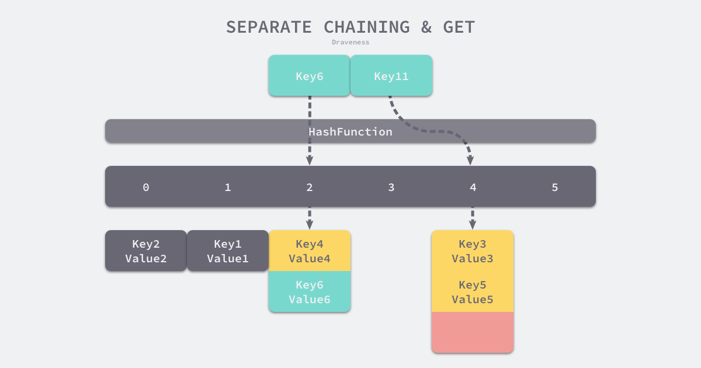
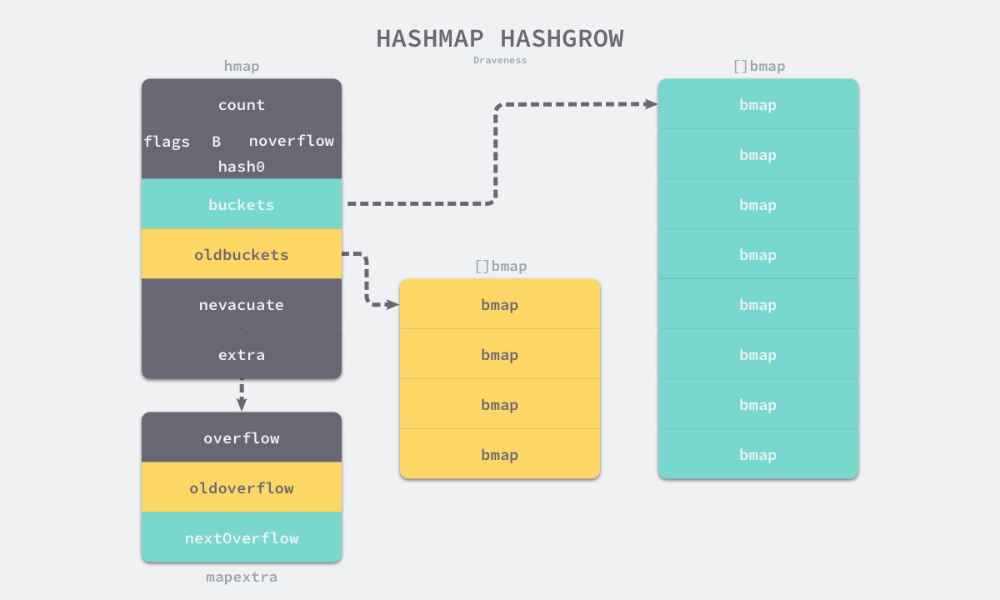
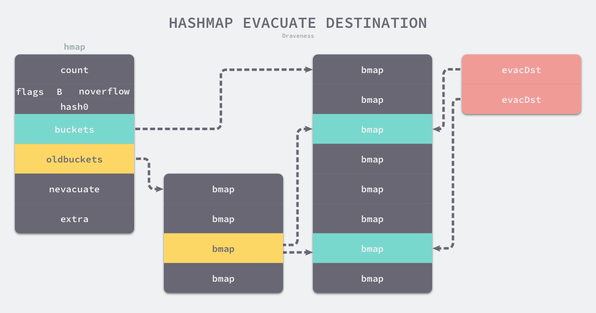
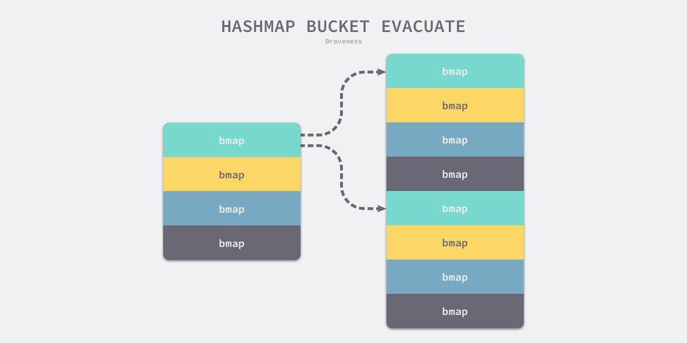

## 3.3.1 设计原理

哈希表是计算机科学中的最重要数据结构之一，不仅因其 *O(1)* 的读写性能优秀，还因为它提供了键值之间的映射。

要想实现一个性能优异的哈希表，需要注意两个关键点 -- **哈希函数**和**哈希冲突**的解决方法。

### 哈希函数

实现哈希表的关键点在于哈希函数的选择，哈希函数的选择在很大程度上能够决定哈希表的读写性能。在理想的情况下哈希函数能够将不同键映射到不容的索引上，这要求哈希函数的**输出范围大于输入范围**，但是由于键的数量远远大于映射的范围，所以在实际使用中，理想的效果是无法实现的。


<center><b>图 3-7 完美哈希函数</b></center>

比较实际的方式是让哈希函数的结果尽可能的均匀分布，然后通过工程上的手段解决哈希冲突的问题。哈希函数映射的结果需要尽可能**均匀**，结果不均匀的哈希函数会带来更多的哈希冲突以及更差的读写性能。


<center><b>图 3-8 不均匀哈希函数</b></center>

若使用结果分布较为均匀的哈希函数，那么哈希表的增删改查的时间复杂度为 *O(1)*；但是若哈希函数的结果分布不均匀，那么所有操作的时间复杂度可能会达到 *O(n)*，由此看来，采用好的哈希函数是至关重要的。

### 解决哈希冲突

通常情况下，哈希函数输入的范围一定会远远大于输出的范围，所以使用哈希表一定会遇到哈希冲突，即使使用了完美哈希函数。常见的解决哈希冲突的方法有**开放寻址法**和**拉链法**。

#### 开放寻址法

开放寻址法的核心思想是**依次探测和比较数组中的元素以判断目标键值对是否存在于哈希表中**，使用开放寻址法实现的哈希表，底层的数据结构为**数组**，因为数组长度有限，那么写入 `(key, value)`时会从如下索引开始遍历：

```go
index = hash("key") % array.len
```

当我们向当前哈希表写入新的数据时，若发生冲突，则会将键值对写入下一个索引不为空的位置：


<center><b>图 3-9 开放地址法写入数据</b></center>

当 Key3 与已经存入哈希表的两个键值对 Key1 和 Key2 发生冲突时，Key3 会被写入 Key2 后面的空闲位置。当需要读取 Key3 对应的值时就会先获取键的哈希值并取模，首先会找到 Key1，发现和 Key3 不等之后继续寻找之后的元素，直到内存为空或找到目标元素。


<center><b>图 3-10 开放地址法写入数据</b></center>

当需要查找某个键对应的值时，会从索引的位置开始线性探测数组，找到目标键值对或空内存则结束查找。

开放寻址法中对性能影响最大的是**装载因子**，其为数组**元素数量**和**数组大小**的**比值**。随着装载因子的增加，线性探测的平均用时就会逐渐增加，这回影响哈希表的读写性能。当装载率超过 70% 之后，性能会急剧下降，一旦大到 100%，查找和插入的时间复杂度将会是 *O(n)*，所以实现哈希表时需要关注装载因子的变化。

#### 拉链法

拉链法一般使用数组加链表的形式：


<center><b>图 3-11 拉链法写入数据</b></center>

例如将键值对 `(Key6, Value6)` **写入**，`Key6`  会通过如下方式获取桶索引：

```go
index = hash("Key6") % array.len
```

在选择了 2 号桶之后开始遍历桶中的链表，此时会有两种情况：

1. 找到相同的 Key： 更新 Value
2. 没有找到相同的 Key： 在链表末尾追加新的 K-V

**读取**的流程类似：



<center><b>图 3-12 拉链法读取数据</b></center>

若寻找 `Key11` ，当其命中 4 号桶时，遍历桶中的链表没有找到期望的键则表示哈希表中没有对应的键值。

计算哈希、定位桶和遍历链表是哈希表读写操作的主要开销，使用**拉链法**实现的哈希表的**装载因子**计算如下：

​														$装在因子 = 元素数量 \div 桶数量$

装载因子性能越大，读写性能越差，所以当装载因子较大时需要进行哈希扩容以保证性能不会出现严重的下降。

## 3.3.2 数据结构

Go 语言运行时使用多个数组结构表示哈希表，其中 [`runtime.hmap`](https://draveness.me/golang/tree/runtime.hmap) 为最核心的结构体：

```go
type hmap struct {
	count     int
	flags     uint8
	B         uint8
	noverflow uint16
	hash0     uint32

	buckets    unsafe.Pointer
	oldbuckets unsafe.Pointer
	nevacuate  uintptr

	extra *mapextra
}

type mapextra struct {
	overflow    *[]*bmap
	oldoverflow *[]*bmap
	nextOverflow *bmap
}
```

1. `count` : 键值对的数量；
2. `B`: $2^B = len(buckets)$ ，表示哈希表持有的 `bucket` 数量；
3. `hash0`： 哈希的种子，能为哈希函数的结果引入随机性，这个值在创建哈希表时确定，并在调用哈希函数时作为参数传入；
4. `buckets`：指向一个 `[]bmap` 数组；
5. `oldbuckets`: 扩容时，存放之前的 `buckets`；
6. `extra`: 溢出桶结构；
7. `noverflow`：溢出桶中 `bmap` 大致数量；
8. `nevacuate`：分流次数，翻倍扩容时分流操作计数的字段；
9. `flags`：状态标识，例如：写入中，等量扩容等；


<center><b>图 3-13 哈希表的数据结构</b></center>

哈希表 [`runtime.hmap`](https://draveness.me/golang/tree/runtime.hmap) 的桶是 [`runtime.bmap`](https://draveness.me/golang/tree/runtime.bmap)。每个 [`runtime.bmap`](https://draveness.me/golang/tree/runtime.bmap) 能存储 8 个键值对，单个桶已经装满时就会使用 `extra.nextOverflow` 指向的桶来存储溢出的数据。

上述的两种桶在内存中是连续的，称为**正常桶**（图中黄色部分）和**溢出桶**（图中绿色部分）。

桶的结构体 [`runtime.bmap`](https://draveness.me/golang/tree/runtime.bmap) 在 Go 语言源代码中定义只包含简单的 `tophash` 字段，`tophash`  存储了键哈希值的高 8 位，通过比较不同键的哈希值高 8 位可以减少访问键值对次数以提高性能：

```go
type bmap struct {
    tophash [bucketCnt]uint8
}
```

在运行期间，[`runtime.bmap`](https://draveness.me/golang/tree/runtime.bmap) 结构体实际不止包含 `tophash` 字段，因为哈希表中可能存储不同类型的键值对，其占据的空间大小需要在编译期间进行推导；[`runtime.bmap`](https://draveness.me/golang/tree/runtime.bmap) 中其他的字段在运行时也是通过计算内存地址的方式访问的，所以其定义中不包含这些字段。可以根据编译期间的 [`cmd/compile/internal/gc.bmap`](https://draveness.me/golang/tree/cmd/compile/internal/gc.bmap) 推导出其结构：

```go
type bmap struct {
    topbits  [8]uint8
    keys     [8]keytype
    elems   [8]valuetype
    pad      uintptr
    overflow uintptr
}
```

1. `topbits`：存储 Key 的哈希值高 8 位，长度为 8 的数组；
2. `keys`：存储具体的 Key，长度为 8 的数组；
3. `elems`：存储具体的 Value，长度为 8 的数组；
4. `overflow`：指向 `hmap.extra.overflow` 溢出桶中的 `bmap` ；
5. `pad`：用于对其内存；

## 3.3.3 初始化

Go 语言的初始化有两种方式：通过**字面量**和**运行时**。

### 字面量

```go
hashMap := map[string]string{
	"A": "a",
	"B": "b",
	"C": "c",
}
```

初始化时需要声明 K-V 的类型，字面量初始化方式将会通过 [`cmd/compile/internal/gc.maplit`](https://draveness.me/golang/tree/cmd/compile/internal/gc.maplit) 函数进行：

```go
func maplit(n *Node, m *Node, init *Nodes) {
	a := nod(OMAKE, nil, nil)
	a.Esc = n.Esc
	a.List.Set2(typenod(n.Type), nodintconst(int64(n.List.Len())))
	litas(m, a, init)

	entries := n.List.Slice()
	if len(entries) > 25 {
		...
		return
	}

	// Build list of var[c] = expr.
	// Use temporaries so that mapassign1 can have addressable key, elem.
	...
}
```

当哈希表中的元素数量**少于或等于** 25 个时，编译器会将字面量初始化的结构体转化成以下代码，将所有键值对一次加入到哈希表中：

```go
hashTbale := make(map[string]int, 3)
hashTbale["A"] = "a"
hashTbale["B"] = "b"
hashTbale["C"] = "c"
```

若元素数量超过 25 个，编译器会创建两个数组分别存储键和值，这些键值会通过如下所示的 for 循环加入哈希表：

```go
hash := make(map[string]int, 26)
vstatk := []string{"1", "2", "3", ... ， "26"}
vstatv := []int{1, 2, 3, ... , 26}
for i := 0; i < len(vstak); i++ {
    hash[vstatk[i]] = vstatv[i]
}
```

此处的切片还会被编译器继续展开。由此可见**字面量**初始化的两种方式都会使用 `make` 创建新的哈希表并使用 `[]` 语法添加元素。

### 运行时

当创建的哈希表被分配到栈上并且容量小于 `BUCKETSIZE = 8` 时，Go 语言在编译阶段使用如下方式快速初始化哈希表，也是对小容量哈希表的优化：

```go
var h *hmap
var hv hmap
var bv bmap
h := &hv
b := &bv
h.buckets = b
h.hash0 = fashtrand0()
```

除了上述特定优化之外，只要使用了 `make` 创建哈希表，Go 编译器都将会在[类型检查](https://draveness.me/golang/docs/part1-prerequisite/ch02-compile/golang-typecheck/)期间将其转换成 [`runtime.makemap`](https://draveness.me/golang/tree/runtime.makemap)，使用**字面量**只是语言提供的辅助工具，最后调用的都是 [`runtime.makemap`](https://draveness.me/golang/tree/runtime.makemap):

```go
func makemap(t *maptype, hint int, h *hmap) *hmap {
	mem, overflow := math.MulUintptr(uintptr(hint), t.bucket.size)
	if overflow || mem > maxAlloc {
		hint = 0
	}

	if h == nil {
		h = new(hmap)
	}
	h.hash0 = fastrand()

	B := uint8(0)
	for overLoadFactor(hint, B) {
		B++
	}
	h.B = B

	if h.B != 0 {
		var nextOverflow *bmap
		h.buckets, nextOverflow = makeBucketArray(t, h.B, nil)
		if nextOverflow != nil {
			h.extra = new(mapextra)
			h.extra.nextOverflow = nextOverflow
		}
	}
	return h
}
```

函数流程如下：

1. 计算哈希表占用的内存是否溢出或者超过能分配的最大值；
2. 调用 [`runtime.fastrand`](https://draveness.me/golang/tree/runtime.fastrand) 获取一个随机的哈希种子；
3. 根据传入的 `hint` 计算需要的最小桶数量，例如：初始容量为 16，那么 B 的值为满足不等式 $16 \leq  2^B \times 6.5$ 的最小整数，即 2；
4. 使用 [`runtime.makeBucketArray`](https://draveness.me/golang/tree/runtime.makeBucketArray) 创建用于保存桶的数组；

[`runtime.makeBucketArray`](https://draveness.me/golang/tree/runtime.makeBucketArray) 会根据传入的 `B` 计算出需要创建的桶数量并在内存中分配一片连续的空间用于存储数据：

```go
func makeBucketArray(t *maptype, b uint8, dirtyalloc unsafe.Pointer) (buckets unsafe.Pointer, nextOverflow *bmap) {
	base := bucketShift(b)
	nbuckets := base
	if b >= 4 {
		nbuckets += bucketShift(b - 4)
		sz := t.bucket.size * nbuckets
		up := roundupsize(sz)
		if up != sz {
			nbuckets = up / t.bucket.size
		}
	}

	buckets = newarray(t.bucket, int(nbuckets))
	if base != nbuckets {
		nextOverflow = (*bmap)(add(buckets, base*uintptr(t.bucketsize)))
		last := (*bmap)(add(buckets, (nbuckets-1)*uintptr(t.bucketsize)))
		last.setoverflow(t, (*bmap)(buckets))
	}
	return buckets, nextOverflow
}
```

- 当桶的数量小于 2^4^ 时，由于数据较少、使用溢出桶的可能性较低，会省略创建的过程以减少额外开销；
- 当桶的数量多余 2^4^ 时，会额外创建 2^B-4^ 个溢出桶；

有上述代码可知，==正常桶和溢出桶在内存中存储空间是连续的==，只是被 [`runtime.hmap`](https://draveness.me/golang/tree/runtime.hmap) 中的不同字段引用，当溢出桶数量较多时会通过 [`runtime.newobject`](https://draveness.me/golang/tree/runtime.newobject) 创建新的溢出桶。

## 3.3.4 读写操作

哈希表的访问一般通过**下标**或**遍历**进行的：

```go
val = hash[key]
for k, v := range hash {
    // ...
}
```

两种方式都能够获取哈希表数据，但是使用的函数和底层原理完全不同。前者需要直到 Key 并且一次只能获取单个键对应的值，后者可以遍历哈希表中的全部键值对，访问数据无需预先知道 Key。

数据结构的写一般指的是**增加**、**删除**和**修改**，增加和修改都是使用索引和赋值语句，而删除字典中的数据需要使用关键字 `delete`：

```go
hash[key] = value
hash[key] = newValue
delete(hash, key)
```

### 访问

在编译的[类型检查](https://draveness.me/golang/docs/part1-prerequisite/ch02-compile/golang-typecheck/)期间，`hash[key]`以及类似的操作都会被转换成哈希 `OINDEXMAP` 操作，[中间代码生成](https://draveness.me/golang/docs/part1-prerequisite/ch02-compile/golang-ir-ssa/)阶段会在 [`cmd/compile/internal/gc.walkexpr`](https://draveness.me/golang/tree/cmd/compile/internal/gc.walkexpr) 中将 `OINDEXMAP` 操作转换成如下代码：

```go
v     := hash[key] // => v     := *mapaccess1(maptype, hash, &key)
v, ok := hash[key] // => v, ok := mapaccess2(maptype, hash, &key)
```

赋值语句左侧接受参数的个数会决定使用的运行时方法：

- 若接受一个参数，会使用 [`runtime.mapaccess1`](https://draveness.me/golang/tree/runtime.mapaccess1)，该函数仅会返回一个指向目标值的指针；
- 若接受两个参数，会使用 [`runtime.mapaccess2`](https://draveness.me/golang/tree/runtime.mapaccess2)，除了返回目标值之外，还会返回一个用于表示当前键对应的值是否存在的 `bool` 值；

```go
func mapaccess1(t *maptype, h *hmap, key unsafe.Pointer) unsafe.Pointer {
	alg := t.key.alg
	hash := alg.hash(key, uintptr(h.hash0))
	m := bucketMask(h.B)
	b := (*bmap)(add(h.buckets, (hash&m)*uintptr(t.bucketsize)))
	top := tophash(hash)
bucketloop:
	for ; b != nil; b = b.overflow(t) {
		for i := uintptr(0); i < bucketCnt; i++ {
			if b.tophash[i] != top {
				if b.tophash[i] == emptyRest {
					break bucketloop
				}
				continue
			}
			k := add(unsafe.Pointer(b), dataOffset+i*uintptr(t.keysize))
			if alg.equal(key, k) {
				v := add(unsafe.Pointer(b), dataOffset+bucketCnt*uintptr(t.keysize)+i*uintptr(t.valuesize))
				return v
			}
		}
	}
	return unsafe.Pointer(&zeroVal[0])
}
```

流程如下：

1. 使用 `hash0` 和哈希函数计算哈希值；
2. 通过掩码计算桶序号，例如：B 为 2，掩码就为 11，即取哈希值的低 B 位，其值即为桶序号；
3. 获取哈希值的高 8 位；
4. 在 `bucketloop` 循环中，会一次遍历正常桶和溢出桶中的数据，先比较哈希值的高 8 位和桶中的 `tophash`，之后比较传入的 Key 和桶中存储的 Key。使用高 8 位加速访问，低 B 位选择桶序号，这种设计可以减少同一个桶中有大量相等 `tophash` 的概率影响性能的情况发生。
   


<center><b>图 3-14 读取哈希表中的数据</b></center>

另一个函数 [`runtime.mapaccess2`](https://draveness.me/golang/tree/runtime.mapaccess2) 只是在 [`runtime.mapaccess1`](https://draveness.me/golang/tree/runtime.mapaccess1) 的基础上多返回了一个标识键值对是否存在的 `bool` 值：

```go
func mapaccess2(t *maptype, h *hmap, key unsafe.Pointer) (unsafe.Pointer, bool) {
	...
bucketloop:
	for ; b != nil; b = b.overflow(t) {
		for i := uintptr(0); i < bucketCnt; i++ {
			if b.tophash[i] != top {
				if b.tophash[i] == emptyRest {
					break bucketloop
				}
				continue
			}
			k := add(unsafe.Pointer(b), dataOffset+i*uintptr(t.keysize))
			if alg.equal(key, k) {
				v := add(unsafe.Pointer(b), dataOffset+bucketCnt*uintptr(t.keysize)+i*uintptr(t.valuesize))
				return v, true
			}
		}
	}
	return unsafe.Pointer(&zeroVal[0]), false
}
```

使用 `v, ok := map[key]` 访问哈希表元素可以更加准确知道 `v == nil` 时，`v` 是哈希表中的元素还是元素不存在。

### 写入

当形如 `hash[k]` 的表达式出现在赋值符号左侧时，该表达式会在编译期间转换成 [`runtime.mapassign`](https://draveness.me/golang/tree/runtime.mapassign) 函数调用，该函数和 [`runtime.mapaccess1`](https://draveness.me/golang/tree/runtime.mapaccess1) 类似，首先根据 Key 获取**哈希值**和对应的**桶**。

```go
func mapassign(t *maptype, h *hmap, key unsafe.Pointer) unsafe.Pointer {
	alg := t.key.alg
	hash := alg.hash(key, uintptr(h.hash0))

	h.flags ^= hashWriting

again:
	bucket := hash & bucketMask(h.B)
	b := (*bmap)(unsafe.Pointer(uintptr(h.buckets) + bucket*uintptr(t.bucketsize)))
	top := tophash(hash)
```

然后通过遍历比较桶中存储的 `tophash` 和 Key 的哈希值高 8 位，若找到了则返回目标位置的地址。其中 `inserti` 表示目标元素在桶中的索引，`insertk` 和 `val` 分别表示键值对的地址，获得目标地址后通过算数计算寻址获得键值对 `k` 和 `val`。

```go
var inserti *uint8
	var insertk unsafe.Pointer
	var val unsafe.Pointer
bucketloop:
	for {
		for i := uintptr(0); i < bucketCnt; i++ {
			if b.tophash[i] != top {
				if isEmpty(b.tophash[i]) && inserti == nil {
					inserti = &b.tophash[i]
					insertk = add(unsafe.Pointer(b), dataOffset+i*uintptr(t.keysize))
					val = add(unsafe.Pointer(b), dataOffset+bucketCnt*uintptr(t.keysize)+i*uintptr(t.valuesize))
				}
				if b.tophash[i] == emptyRest {
					break bucketloop
				}
				continue
			}
			k := add(unsafe.Pointer(b), dataOffset+i*uintptr(t.keysize))
			if !alg.equal(key, k) {
				continue
			}
			val = add(unsafe.Pointer(b), dataOffset+bucketCnt*uintptr(t.keysize)+i*uintptr(t.valuesize))
			goto done
		}
		ovf := b.overflow(t)
		if ovf == nil {
			break
		}
		b = ovf
	}
```

上述的 for 循环会依次遍历正常桶和溢出桶中的数据，判断 `tophash` 和 `key`，遍历结束后从循环中跳出。


<center><b>图 3-15 遍历溢出桶</b></center>

若当前桶已经满了，哈希会调用 [`runtime.hmap.newoverflow`](https://draveness.me/golang/tree/runtime.hmap.newoverflow) 创建新桶或使用 [`runtime.hmap`](https://draveness.me/golang/tree/runtime.hmap) 预先在 `noverflow` 中创建好的桶保存数据，新创建的桶不仅会被追加到已有桶的末尾还会增加哈希表的 `noverflow` 计数器。

```go
	if inserti == nil {
		newb := h.newoverflow(t, b)
		inserti = &newb.tophash[0]
		insertk = add(unsafe.Pointer(newb), dataOffset)
		val = add(insertk, bucketCnt*uintptr(t.keysize))
	}

	typedmemmove(t.key, insertk, key)
	*inserti = top
	h.count++

done:
	return val
}
```

若当前值在哈希表中不存在，哈希表会为新的键值对规划存储的内存地址，通过 [`runtime.typedmemmove`](https://draveness.me/golang/tree/runtime.typedmemmove) 将键移动到对应的内存空间中并返回对应值的 `val`。如果当前键值对在哈希表中存在，那么会直接返回目标区域的内存地址，[`runtime.mapassign`](https://draveness.me/golang/tree/runtime.mapassign) 函数不会将值拷贝到桶中，而是返回内存地址，真正的赋值操作是在编译期间：

```
00018 (+5) CALL runtime.mapassign_fast64(SB)
00020 (5) MOVQ 24(SP), DI               ;; DI = &value
00026 (5) LEAQ go.string."88"(SB), AX   ;; AX = &"88"
00027 (5) MOVQ AX, (DI)                 ;; *DI = AX
```

其中 `24(SP)`是函数返回的地址，通过 `LEAQ` 指令将字符串的地址存储到寄存器 `AX` 中，`MOVQ` 将字符串 `“88”` 存储到目标地址完成本次哈希表的写入。

### 扩容

在写入的过程中，随着哈希表中元素的增加，其性能会逐渐降低，所以需要更多的桶和内存空间来保证哈希的读写性能：

```go
func mapassign(t *maptype, h *hmap, key unsafe.Pointer) unsafe.Pointer {
	...
	if !h.growing() && (overLoadFactor(h.count+1, h.B) || tooManyOverflowBuckets(h.noverflow, h.B)) {
		hashGrow(t, h)
		goto again
	}
	...
}
```

[`runtime.mapassign`](https://draveness.me/golang/tree/runtime.mapassign) 函数会在以下两种情况发生时触发哈希扩容：

1. 装载因子超过 6.5；

2. 溢出桶的数量过多，分为两种情况：

   - $B < 16$ ，$溢出桶的数量 \geq 2^B$；
   - $B \geq 16$，$溢出桶的数量 \geq 2^{15}$；

    

Go 语言哈希表的扩容不是一个原子过程，所以 [`runtime.mapassign`](https://draveness.me/golang/tree/runtime.mapassign) 还需要判断当前哈希是否已经处于扩容状态，避免二次扩容。

根据触发条件不同，扩容方式分为两种：

1. 装载因子超过 6.5 ，进行**翻倍扩容**；
2. 溢出桶过多，进行**等量扩容**；

**等量扩容**是一种特殊情况下的扩容，当我们持续向哈希表中插入数据并将它们全部删除时，若哈希表中的数据量没有超过阈值，就会不断积累溢出桶造成缓慢的==内存泄露==。等量扩容创建新的桶保存数据，而垃圾回收会清理老的溢出桶并释放内存。

扩容的入口是 [`runtime.hashGrow`](https://draveness.me/golang/tree/runtime.hashGrow)：

```go
func hashGrow(t *maptype, h *hmap) {
	bigger := uint8(1)
	if !overLoadFactor(h.count+1, h.B) {
		bigger = 0
		h.flags |= sameSizeGrow
	}
	oldbuckets := h.buckets
	newbuckets, nextOverflow := makeBucketArray(t, h.B+bigger, nil)

	h.B += bigger
	h.flags = flags
	h.oldbuckets = oldbuckets
	h.buckets = newbuckets
	h.nevacuate = 0
	h.noverflow = 0

	h.extra.oldoverflow = h.extra.overflow
	h.extra.overflow = nil
	h.extra.nextOverflow = nextOverflow
}
```


哈希表在扩容的过程中，会通过 [`runtime.makeBucketArray`](https://draveness.me/golang/tree/runtime.makeBucketArray) 创建一组新桶和预创建的溢出桶，随后将原有的桶数组设置到 `oldbuckets` 上并将新的空桶设置到 `buckets` 上，溢出桶使用了相同的逻辑；扩容后的哈希表如下：



<center><b>图 3-15 哈希表的扩容</b></center>

[`runtime.hashGrow`](https://draveness.me/golang/tree/runtime.hashGrow) 函数只是创建了新桶，并没有对数据进行拷贝和转移。哈希表的数据迁移过程是在 [`runtime.evacuate`](https://draveness.me/golang/tree/runtime.evacuate) 中完成的，会对传入桶中的元素进行再分配。

```go
func evacuate(t *maptype, h *hmap, oldbucket uintptr) {
	b := (*bmap)(add(h.oldbuckets, oldbucket*uintptr(t.bucketsize)))
	newbit := h.noldbuckets()
	if !evacuated(b) {
		var xy [2]evacDst
		x := &xy[0]
		x.b = (*bmap)(add(h.buckets, oldbucket*uintptr(t.bucketsize)))
		x.k = add(unsafe.Pointer(x.b), dataOffset)
		x.v = add(x.k, bucketCnt*uintptr(t.keysize))

		y := &xy[1]
		y.b = (*bmap)(add(h.buckets, (oldbucket+newbit)*uintptr(t.bucketsize)))
		y.k = add(unsafe.Pointer(y.b), dataOffset)
		y.v = add(y.k, bucketCnt*uintptr(t.keysize))
```

[`runtime.evacuate`](https://draveness.me/golang/tree/runtime.evacuate) 会将一个旧桶中的数据分流到两个新桶，其创建了两个 [`runtime.evacDst`](https://draveness.me/golang/tree/runtime.evacDst) 结构体分别指向了一个新桶。



<center><b>图 3-16 哈希表扩容目的</b></center>

若为**等量扩容**，新旧桶之间是一对一的关系，所以两个 [`runtime.evacDst`](https://draveness.me/golang/tree/runtime.evacDst) 只会初始化一个。若为**翻倍扩容**，每个旧桶的元素会被分流到两个新桶中，分流逻辑如下：

```go
		for ; b != nil; b = b.overflow(t) {
			k := add(unsafe.Pointer(b), dataOffset)
			v := add(k, bucketCnt*uintptr(t.keysize))
			for i := 0; i < bucketCnt; i, k, v = i+1, add(k, uintptr(t.keysize)), add(v, uintptr(t.valuesize)) {
				top := b.tophash[i]
				k2 := k
				var useY uint8
				hash := t.key.alg.hash(k2, uintptr(h.hash0))
				if hash&newbit != 0 {
					useY = 1
				}
				b.tophash[i] = evacuatedX + useY
				dst := &xy[useY]

				if dst.i == bucketCnt {
					dst.b = h.newoverflow(t, dst.b)
					dst.i = 0
					dst.k = add(unsafe.Pointer(dst.b), dataOffset)
					dst.v = add(dst.k, bucketCnt*uintptr(t.keysize))
				}
				dst.b.tophash[dst.i&(bucketCnt-1)] = top
				typedmemmove(t.key, dst.k, k)
				typedmemmove(t.elem, dst.v, v)
				dst.i++
				dst.k = add(dst.k, uintptr(t.keysize))
				dst.v = add(dst.v, uintptr(t.valuesize))
			}
		}
		...
}
```

假设两个 Key 的哈希值低 4 位别为 `1011` 和 `1111`，原来有 4 个桶，那么掩码为 `11`；翻倍扩容之后为 8 个桶，掩码为 `111` 。那么原来的两组数据在 3  号桶中，现在分流到 3 号 和 7  号中。

​    

<center><b>图 3-17 哈希表数据分流</b></center>

## Reference

## Reference

1. [Go 语言设计与实现](https://draveness.me/golang) 
1. [由浅到深，入门Go语言Map实现原理](https://segmentfault.com/a/1190000039101378)
1. [map 的实现原理](https://golang.design/go-questions/map/principal/#什么是-map)
1. [map 扩容过程](https://golang.design/go-questions/map/extend/) 

