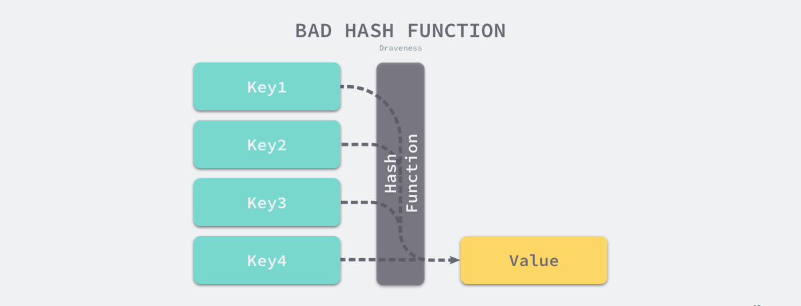

## 3.3.1 设计原理

哈希表是计算机科学中的最重要数据结构之一，不仅因其 *O(1)* 的读写性能优秀，还因为它提供了键值之间的映射。

要想实现一个性能优异的哈希表，需要注意两个关键点 -- **哈希函数**和**哈希冲突**的解决方法。

### 哈希函数

实现哈希表的关键点在于哈希函数的选择，哈希函数的选择在很大程度上能够决定哈希表的读写性能。在理想的情况下哈希函数能够将不同键映射到不容的索引上，这要求哈希函数的**输出范围大于输入范围**，但是由于键的数量远远大于映射的范围，所以在实际使用中，理想的效果是无法实现的。


<center><b>图 3-7 完美哈希函数</b></center>

比较实际的方式是让哈希函数的结果尽可能的均匀分布，然后通过工程上的手段解决哈希冲突的问题。哈希函数映射的结果需要尽可能**均匀**，结果不均匀的哈希函数会带来更多的哈希冲突以及更差的读写性能。



<center><b>图 3-8 不均匀哈希函数</b></center>

若使用结果分布较为均匀的哈希函数，那么哈希表的增删改查的时间复杂度为 *O(1)*；但是若哈希函数的结果分布不均匀，那么所有操作的时间复杂度可能会达到 *O(n)*，由此看来，采用好的哈希函数是至关重要的。

### 解决哈希冲突

通常情况下，哈希函数输入的范围一定会远远大于输出的范围，所以使用哈希表一定会遇到哈希冲突，即使使用了完美哈希函数。常见的解决哈希冲突的方法有**开放寻址法**和**拉链法**。

#### 开放寻址法

开放寻址法的核心思想是**依次探测和比较数组中的元素以判断目标键值对是否存在于哈希表中**，使用开放寻址法实现的哈希表，底层的数据结构为**数组**，因为数组长度有限，那么写入 `(key, value)`时会从如下索引开始遍历：

```go
index = hash("key") % array.len
```

当我们向当前哈希表写入新的数据时，若发生冲突，则会将键值对写入下一个索引不为空的位置：


<center><b>图 3-9 开放地址法写入数据</b></center>

当 Key3 与已经存入哈希表的两个键值对 Key1 和 Key2 发生冲突时，Key3 会被写入 Key2 后面的空闲位置。当需要读取 Key3 对应的值时就会先获取键的哈希值并取模，首先会找到 Key1，发现和 Key3 不等之后继续寻找之后的元素，直到内存为空或找到目标元素。


<center><b>图 3-10 开放地址法写入数据</b></center>

当需要查找某个键对应的值时，会从索引的位置开始线性探测数组，找到目标键值对或空内存则结束查找。

开放寻址法中对性能影响最大的是**装载因子**，其为数组元素数量和数组大小的比值。随着装载因子的增加，线性探测的平均用时就会逐渐增加，这回影响哈希表的读写性能。当装载率超过 70% 之后，性能会急剧下降，一旦大到 100%，查找和插入的时间复杂度将会是 *O(n)*，所以实现哈希表时需要关注装载因子的变化。

#### 拉链法


## Reference

1. [Go 语言设计与实现](https://draveness.me/golang) 