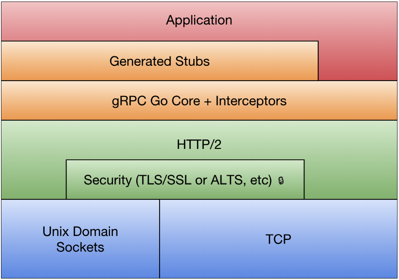

## 4.4 gRPC 入门

gRPC 是 Google 基于 protocol buffers 开发的跨语言的开源 RPC 框架，基于 HTTP/2 协议设计，可以在一个 HTTP/2 链接上提供多个服务。

### 4.4.1  gRPC 技术栈



<center>图 4-1 gRPC 技术栈</center>

最底层为 TCP 或 Unix Socket 协议，之上是 HTTP/2  协议的实现，然后在 HTTP/2 协议之上构建针对 Golang 的 gRPC 核心库。应用程序通过 gRPC 插件生产的 Stub 代码和 gRPC 核心库通信，也可以直接和 gRPC 核心库通信

### 4.4.2 gRPC 入门

若从 protobuf 的角度看， gRPC 不过是针对 service 接口生成代码的生成器。下面学习 gRPC 的基本用法。

创建 `hello.proto`, 定义 `Greeter` 服务(这里按照官网的教程改写了，感觉这里的版本有点老)：

```protobuf
syntax = "proto3";

package hello;

option go_package = "dreamjz/hello";

message HelloRequest {
  string name = 1;
}

message HelloReply {
  string message = 1;
}

service Greeter {
  rpc SayHello(HelloRequest) returns (HelloReply) {}
}
```

生成代码：

```sh
$ protoc --go_out=. --go_opt=paths=source_relative \
	--go-grpc_out=. --go-grpc=paths=source_relative hello.proto
```

创建 `server`:

```go
type server struct {
	pb.UnimplementedGreeterServer
}

func (s *server) SayHello(ctx context.Context, in *pb.HelloRequest) (*pb.HelloReply, error) {
	log.Printf("Received: %s", in.GetName())
	return &pb.HelloReply{Message: fmt.Sprintf("Hello %s", in.GetName())}, nil
}

func main() {
	flag.Parse()

	listen, err := net.Listen("tcp", fmt.Sprintf("localhost:%d", *port))
	if err != nil {
		log.Fatalf("Failed to listen at: %d", *port)
	}

	s := grpc.NewServer()
	pb.RegisterGreeterServer(s, &server{})
	log.Printf("Server listening at: %v", listen.Addr())
	if err := s.Serve(listen); err != nil {
		log.Fatalf("Failed to serve: %v", err)
	}

}
```

`client`:

```go
func sayHello(client pb.GreeterClient, name *pb.HelloRequest) {
	ctx, cancel := context.WithTimeout(context.Background(), 10*time.Second)
	defer cancel()
	message, err := client.SayHello(ctx, name)
	if err != nil {
		log.Fatalf("%v.SayHello(_) = _, %v", client, err)
	}
	log.Println(message)
}

func main() {
	flag.Parse()

	conn, err := grpc.Dial(*serverAddr, grpc.WithTransportCredentials(insecure.NewCredentials()))
	if err != nil {
		log.Printf("Failed to connect %v: %v", *serverAddr, err)
	}
	defer conn.Close()
	client := pb.NewGreeterClient(conn)

	sayHello(client, &pb.HelloRequest{Name: *name})
}
```

gRPC 通过 `context.Context` 参数为每个方法提供了上下文支持。使用`context.WithTimeout` 为 RPC 添加超时时长，若调用超时则释放所有的资源；`defer cancel()` 则是在调用成功后保证能够释放所有占用的资源。

gRPC 和标准库中的 RPC 有一个区别，gRPC 生成的接口不支持异步调用。但是由于可以在多个 goroutine 之间安全共享 gRPC 底层的 HTTP/2 连接，因此可以通过在另一个 goroutine 阻塞调用的方式模拟异步调用。

### 4.4.3 gRPC 流

此处可参考官网完整示例 [Basic Tutorial](https://grpc.io/docs/languages/go/basics/) 

### 4.4.4 发布订阅模式

下面将基于 gRPC Stream 构建一个简单的发布订阅系统。发布订阅是一个常见的设计模式，开源社区中由很多的实现，这里看下 docker 中的实现 （docker 开源项目已改名为 moby，参见[对于 Docker 改名 Moby ，大家怎么看？](https://www.zhihu.com/question/58805021) ,[#32691](https://github.com/moby/moby/pull/32691) ）

[moby](https://github.com/moby/moby)/[pkg](https://github.com/moby/moby/tree/master/pkg)/[pubsub](https://github.com/moby/moby/tree/master/pkg/pubsub)/**publisher.go** :

```go
```


## 	Reference

1. [gRPC 入门](https://chai2010.cn/advanced-go-programming-book/ch4-rpc/ch4-04-grpc.html) Go 语言高级编程
2. [Basic Tutorial](https://grpc.io/docs/languages/go/basics/) gRPC docs
