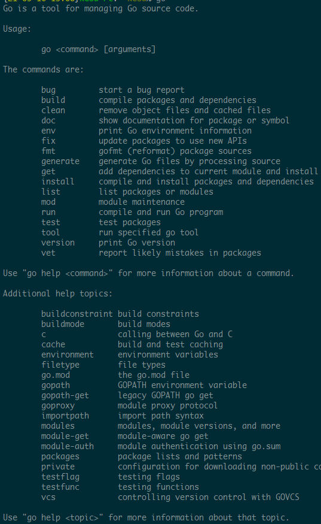

# 1.3 Go 命令

## 1.3.1  Go 命令

Golang有一套完整的命令行工具:



<center>图1.3 Go命令</center>

## 1.3.3  go build

go build命令用于编译代码.在包的编译过程中,若有必要则会同时编译与之相关联的包

* 若为普通包,go build不会生成任何文件.若想要在pkg下生成包文件,需执行go install
* 若为main包,执行go build会在当前目录下生成一个可执行文件.可使用`go build -o [path/fileName]`在指定位置生成文件,若想要在\$GOPATH/bin下生成则需执行go install
* 若只想编译一个文件,可使用`go build fileName`,go build默认编译当前文件夹下所有的go文件
* go build会忽略目录下以“\_”或“.”开头的go文件
* 若源码针对不同的操作系统需要不同的处理,可以根据操作系统后缀来命名文件
  例如有一个读取数组的程序,对于不同的操作系统有如下文件:
  - array_linux.go
  
  - array_darwin.go
  
  - array_windows.go
  
  - array_freebsd.go 
  
    go build 可选择性的编译以操作系统结尾的文件

常用参数说明:

* -o      指定输出的文件路径和文件名 例如 : go build -o a/b/c
* -i      安装响应的包 相当于 go build + go install
* -a      更新全部已经是最新的包
* -n      将需执行的编译命令打印出来,但是不执行
* -p n    指定可并行执行的编译数目,默认为CPU数
* -race   开启编译的时候自动检测数据竞争情况,仅支持64位系统
* -v      打印出正在编译的包名
* -work   打印编译时临时文件夹名称,且不删除临时文件夹
* -x      打印执行的命令,类似于 -n 但是会执行

## 1.3.4  go clean

go clean用于移除当前源码包和关联源码包中编译生成的文件,这些文件包括:

```
_obj/            旧的object目录，由Makefiles遗留
_test/           旧的test目录，由Makefiles遗留
_testmain.go     旧的gotest文件，由Makefiles遗留
test.out         旧的test记录，由Makefiles遗留
build.out        旧的test记录，由Makefiles遗留
*.[568ao]        object文件，由Makefiles遗留
DIR(.exe)        由go build产生
DIR.test(.exe)   由go test -c产生
MAINFILE(.exe)   由go build MAINFILE.go产生
*.so             由 SWIG 产生
```

一般使用go clean清除编译文件,之后向GiHub提交源码

常用参数介绍:

* -i 清除关联的安装的包和可执行文件(通过go install生成的文件)
* -n 打印执行的命令,但不执行
* -r 循环清楚在import中导入的包
* -x 打印命令并执行

## 1.3.5  go fmt

go fmt命令实际调用了gofmt工具,其功能是格式化go源码

使用go fmt需要带参数 -w 否则格式化结构不会写入文件;go fmt -w -l [path]可格式化整个项目

gofmt常用参数介绍:

* -l 显示需要格式化的文件
* -w 将格式化后的内容写入到文件中
* -r 添加重写规则(形如:“a[b:len(a)] -> a[b:]”),方便做批量替换
* -s 简化文件中的代码
* -d 显示格式化前后的区别,且不写入文件
* -e 打印所有语法错误到标准输出,若不只用 -e 则默认打印前10个

## 1.3.6  go get

go get用于获取远程代码包,其命令实际执行了两个步骤:

1. 下载源码包
2. 执行 go install 

下载源码包go会根据不同的域名调用不同的源码工具,对应关系如下:

```
BitBucket (Mercurial Git)
GitHub (Git)
Google Code Project Hosting (Git, Mercurial, Subversion)
Launchpad (Bazaar)
```

欲使go get正常工作,需要安装合适的源码管理工具

常用参数介绍:

* -d   仅下载不安装
* -fix 获取源码之后先执行fix
* -t   同时下载测试所需要的包
* -u   强制更新包及其依赖包
* -v   显示执行命令

## 1.3.7  go install

go install实际上执行了两个步骤:

1. 生成结果文件(.a或可执行文件)
2. 将编译结果移动到\$GOPATH/bin或\$GOPATH/pkg中

参数支持go build的编译参数

## 1.3.8  go test

go test执行时会读取源码目录下名为\*\_test.og的文件,生成并运行测试用的可执行文件

常用参数介绍:

* -bench regexp 执行相应的benchmarks
* -cover        测试覆盖率
* -run regexp   仅运行regexp匹配的函数
* -v            显示测试执行的命令

## 1.3.9  go tool

go tool下有很多命令,下面介绍fix和vet

* go tool fix .               修复老版本代码到新版本
* go tool vet directory|files 分析当前目录的代码是否都是正确代码

## 1.3.10 go generate

这个命令是从Go1.4开始才设计的，用于在编译前自动化生成某类代码。`go generate`和`go build`是完全不一样的命令，通过分析源码中特殊的注释，然后执行相应的命令。这些命令都是很明确的，没有任何的依赖在里面。而且大家在用这个之前心里面一定要有一个理念，这个`go generate`是给你用的，不是给使用你这个包的人用的，是方便你来生成一些代码的。

这里我们来举一个简单的例子，例如我们经常会使用`yacc`来生成代码，那么我们常用这样的命令：

	go tool yacc -o gopher.go -p parser gopher.y

-o 指定了输出的文件名， -p指定了package的名称，这是一个单独的命令，如果我们想让`go generate`来触发这个命令，那么就可以在当前目录的任意一个`xxx.go`文件里面的任意位置增加一行如下的注释：

	//go:generate go tool yacc -o gopher.go -p parser gopher.y

这里我们注意了，`//go:generate`是没有任何空格的，这其实就是一个固定的格式，在扫描源码文件的时候就是根据这个来判断的。

所以我们可以通过如下的命令来生成，编译，测试。如果`gopher.y`文件有修改，那么就重新执行`go generate`重新生成文件就好。

	$ go generate
	$ go build
	$ go test

## 1.3.11 godoc

godoc用于查看包文档,例如:

* builtin包，那么执行`godoc builtin`
* http包，那么执行`godoc net/http`
* 查看某一个包里面的函数，那么执行`godoc fmt Printf`
* 查看相应的代码，执行`godoc -src fmt Printf`

## 1.3.12 Others

go还提供了一些其他命令:

```
go version 查看go当前的版本
go env 查看当前go的环境变量
go list 列出当前全部安装的package
go run 编译并运行Go程序
```

