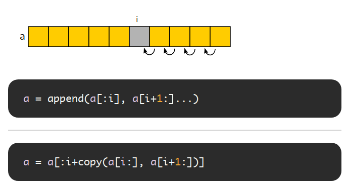

## 1. 切片操作及性能

Go 官方的 [SliceTricks](https://github.com/golang/go/wiki/SliceTricks) 介绍了常见的操作技巧，[Go Slice Tricks Cheat Sheet](https://ueokande.github.io/go-slice-tricks/) 将操作以图片形式呈现。

### AppendVector

#### Copy

使用  `append([]T(nil), a...)` 或 `apppend(a[:0:0], a...)`  要比  `copy(b, a)` 慢一些，

但是前者在拷贝之后的 append 操作要比后者更加高效。

###  Cut

### Delete

### Delete without preserving order

### Cut (GC)

### Delete (GC)

### Delete without preserving order (GC)

### Expand

## Reference

1. 
2. [golang slice, slicing a slice with slice abc](https://stackoverflow.com/questions/27938177/golang-slice-slicing-a-slice-with-sliceabc)

