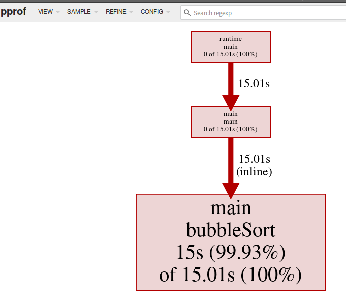

Benchmark 可以度量某个函数的性能，前提是知道性能的瓶颈。对于未知程序，则需要 `pprof` 工具来进行分析，[pprof](https://github.com/google/pprof) 分为两个部分：

- `runtime/pprof` 包；
- `pprof` 性能分析工具；

## 1. 性能分析类型

记录性能数据会对程序的性能产生影响，建议一次只记录一类数据。

### 1.1 CPU

CPU 性能分析 (CPU Profiling) ，启动分析时，运行时 (runtime) 将每隔 10ms 中断一次，记录此时正在运行的协程 (goroutines) 的堆栈信息。

程序运行结束后，可以分析记录的数据找到 Hottest Code Paths。

>Compiler hot paths are code execution paths in the compiler in which most of the execution time is spent, and which are potentially executed very often.
>– [What’s the meaning of “hot codepath”](https://english.stackexchange.com/questions/402436/whats-the-meaning-of-hot-codepath-or-hot-code-path)

### 1.2 内存

内存性能分析 (Memory Profiling) 记录堆内存分配时的堆栈信息，忽略栈内存分配信息。

启用内存分析时，默认每 1000 次采样 1 次，频率可以进行调整。

### 1.3 阻塞

阻塞性能分析 (Block Profiling) 为 Golang 特有，用于记录一个协程等待一个共享资源花费的时间，在判断程序的并发瓶颈很有用。

阻塞场景包括：

- 在没有缓冲区的信道上发送和接收数据；
- 从空的信道上接收数据，或发送数据到满的信道上；
- 尝试获取一个已经被其他协程锁住的排他锁；

一般当 CPU 和 内存瓶颈解决之后，才会考虑这一类的分析。

### 1.4 锁

锁性能分析 (mutex profiling) 和阻塞分析类似，但更专注于因为锁竞争导致的等待或延时。

## 2. CPU 性能分析

### 2.1 生成 profile

```go
package main

import (
	"log"
	"math/rand"
	"os"
	"runtime/pprof"
	"time"
)

func generateRandIntSlice(n int) []int {
	rand.Seed(time.Now().UnixNano())
	nums := make([]int, 0, n)
	for i := 0; i < n; i++ {
		nums = append(nums, rand.Intn(10000))
	}
	return nums
}

func bubbleSort(nums []int) {
	length := len(nums)
	for i := 0; i < length-1; i++ {
		for j := 0; j < length-1-i; j++ {
			if nums[j] > nums[j+1] {
				nums[j], nums[j+1] = nums[j+1], nums[j]
			}
		}
	}
}

func main() {
	f, err := os.OpenFile("./cpu.pprof", os.O_CREATE|os.O_RDWR, 0644)
	if err != nil {
		log.Fatalln("Create profile error:", err)
	}
	defer func() {
		err := f.Close()
		if err != nil {
			log.Fatalln("Close file error:", err)
		}
	}()

	if err = pprof.StartCPUProfile(f); err != nil {
		log.Fatalln("Start cpu profile error:", err)
	}
	defer pprof.StopCPUProfile()

	n := 10
	for i := 0; i < 5; i++ {
		nums := generateRandIntSlice(n)
		bubbleSort(nums)
		n *= 10
	}
}
```

- `pprof.StartCPUProfile(w io.Writer) error` ：开始 CPU 性能分析并将结果写入 `Writer` 中。可以写到标准输出 `os.Stdout`，然后重定向文件 `go run ./bubble_sort.go > cpu.pprof`，但是会将程序和分析结果糅杂在一起，建议直接写入到文件中。

### 2.2 分析 profile

使用 `go tool pprof` 分析数据，在浏览器查看：

```sh
$ go tool pprof -hhtp=:9999 cpu.pprof
```



使用命令行模式查看：

 ```sh
 $ go tool pprof cpu.pprof
 File: bubble_sort
 Type: cpu
 Time: Apr 13, 2022 at 10:31am (CST)
 Duration: 15.13s, Total samples = 15.01s (99.18%)
 Entering interactive mode (type "help" for commands, "o" for options)
 (pprof) top
 Showing nodes accounting for 15s, 99.93% of 15.01s total
 Dropped 1 node (cum <= 0.08s)
       flat  flat%   sum%        cum   cum%
        15s 99.93% 99.93%     15.01s   100%  main.bubbleSort (inline)
          0     0% 99.93%     15.01s   100%  main.main
          0     0% 99.93%     15.01s   100%  runtime.main
 ```

## 3. 内存性能分析

```go
package main

import (
	"flag"
	"fmt"
	"github.com/pkg/profile"
	"log"
	"math/rand"
	"net/http"
	_ "net/http/pprof"
	"os"
	"runtime/pprof"
	"sync"
	"time"
	"unsafe"
)

const (
	letters = "abcdefghijklmnopqrstuvwxyzABCDEFGHIJKLMNOPQRSTUVWXYZ"
	N       = 1000
)

var (
	profileType = flag.Int("prfType", 0, "profile type: 0 - runtime/pprof, 1 - net/http/pprof, 2 - github.com/pkg/profile")
)

func randomString(n int) string {
	rand.Seed(time.Now().UnixNano())
	b := make([]byte, n)
	for i := range b {
		b[i] = letters[rand.Intn(len(letters))]
	}
	return *(*string)(unsafe.Pointer(&b))
}

func concatString(n int) string {
	s := ""
	for i := 0; i < n; i++ {
		s += randomString(n)
	}
	return s
}

func main() {
	flag.Parse()
	switch *profileType {
	case 0 :
		profileWithRuntime()
	case 1:
		profileWithHttp()
	case 2:
		profileWithPkgProfile()
	}
}

func profileWithRuntime() {
	concatString(N)

	f, err := os.OpenFile("./mem.pprof", os.O_CREATE|os.O_RDWR, 0644)
	if err != nil {
		log.Fatalln("create profile error:", err)
	}
	defer func() {
		if err := f.Close(); err != nil {
			log.Fatalln("close file error:", err)
		}
	}()

	if err := pprof.WriteHeapProfile(f); err != nil {
		log.Fatalln("write profile error:", err)
	}
}

func profileWithHttp() {
	concatString(N)
	go func() {
		fmt.Println("Listening :6060")
		log.Fatalln(http.ListenAndServe(":6060", nil))
	}()
	var wg sync.WaitGroup
	// Block main goroutine
	wg.Add(1)
	wg.Wait()
}

func profileWithPkgProfile() {
	defer profile.Start(profile.MemProfile, profile.MemProfileRate(1)).Stop()
	concatString(N)
}

```

上述程序生成长度为 N 的随机字符串并拼接，使用 `runtime/pprof.WriteHeapProfile` 记录内存信息。

### 3.1 runtime/pprof

`profileWithRuntime` 使用 `runtime/pprof.WriteHeapProfile` 写入内存分析信息。

进行分析：

```sh
$ go run ./randstr.go -prfType 0
$ go tool pprof ./mem.pprof
File: randstr
Type: inuse_space
Time: Apr 13, 2022 at 3:16pm (CST)
Entering interactive mode (type "help" for commands, "o" for options)
(pprof) top
Showing nodes accounting for 1.12MB, 100% of 1.12MB total
      flat  flat%   sum%        cum   cum%
    1.12MB   100%   100%     1.12MB   100%  main.concatString
         0     0%   100%     1.12MB   100%  main.main
         0     0%   100%     1.12MB   100%  main.profileWithRuntime
         0     0%   100%     1.12MB   100%  runtime.main
```

### 3.2 net/http/pprof

`profileWithHttp` 使用 `net/http/pprof` 进行分析，使用时需要引入 `_ "net/http/pprof"`  以执行其 `init()` 函数。若程序中没有启动 HTTP 服务，则需要启动一个服务来访问分析数据。

```sh
$ go run ./randstr.go -prfType 1
$ go tool pprof http://localhost:6060/debug/pprof/allocs
File: randstr
Type: alloc_space
Time: Apr 13, 2022 at 3:23pm (CST)
Entering interactive mode (type "help" for commands, "o" for options)
(pprof) top
Showing nodes accounting for 463.39MB, 99.57% of 465.39MB total
Dropped 1 node (cum <= 2.33MB)
      flat  flat%   sum%        cum   cum%
  463.39MB 99.57% 99.57%   465.39MB   100%  main.concatString
         0     0% 99.57%   465.39MB   100%  main.main
         0     0% 99.57%   465.39MB   100%  main.profileWithHttp
         0     0% 99.57%   465.39MB   100%  runtime.main
```

访问 `/debug/pprof` 可查看所有类型性能分析的结果。

### 3.3 github.com/pkg/profile

 `profileWithPkgProfile`  引入三方库进行分析，只需一行代码即可。

```sh
$ go get -u github.com/pkg/profile@v1.6.0
$ go run ./randstr.go -prfType 2
2022/04/13 15:27:12 profile: memory profiling enabled (rate 1), /tmp/profile907236960/mem.pprof
2022/04/13 15:27:12 profile: memory profiling disabled, /tmp/profile907236960/mem.pprof
$ go tool pprof /tmp/profile907236960/mem.pprof
File: randstr
Type: inuse_space
Time: Apr 13, 2022 at 3:27pm (CST)
Entering interactive mode (type "help" for commands, "o" for options)
(pprof) top
Showing nodes accounting for 994.12kB, 99.37% of 1000.39kB total
Dropped 43 nodes (cum <= 5kB)
Showing top 10 nodes out of 14
      flat  flat%   sum%        cum   cum%
     976kB 97.56% 97.56%      977kB 97.66%  main.concatString
   10.12kB  1.01% 98.57%    10.12kB  1.01%  runtime.malg
       8kB   0.8% 99.37%       16kB  1.60%  runtime.allocm
         0     0% 99.37%   977.73kB 97.74%  main.main
         0     0% 99.37%   977.73kB 97.74%  main.profileWithPkgProfile
         0     0% 99.37%   977.73kB 97.74%  runtime.main
         0     0% 99.37%       14kB  1.40%  runtime.mcall
         0     0% 99.37%     6.38kB  0.64%  runtime.mstart
         0     0% 99.37%       16kB  1.60%  runtime.newm
         0     0% 99.37%       14kB  1.40%  runtime.park_m
```

### 4. Benchmark 生成 profile

进行 benchmark 测试时可以生成 profile 文件：

- `-cpuprofile FILE`  ；
- `-memprofile FILE` ；
- `-memprofilerate N`   ，将记录速率改为原来的 $\frac {1} {N}$；
- `-blockprofile FILE` ；

新增测试用例：

```go
func BenchmarkConcatString(b *testing.B) {
	for n := 0; n < b.N; n++ {
		concatString(1000)
	}
}
```

进行测试并生成内存分析：

```sh
$ go test -bench '.' -memprofile 'mem.pprof' . 
"ZEkckWKbjR"
goos: linux
goarch: amd64
pkg: pprof-example/randstr
cpu: Intel(R) Core(TM) i7-4710HQ CPU @ 2.50GHz
BenchmarkConcatString-8                4         320310131 ns/op
PASS
ok      pprof-example/randstr   2.355s
$ go tool pprof ./mem.pprof 
File: randstr.test
Type: alloc_space
Time: Apr 13, 2022 at 3:37pm (CST)
Entering interactive mode (type "help" for commands, "o" for options)
(pprof) top
Showing nodes accounting for 3824.67MB, 99.77% of 3833.68MB total
Dropped 1 node (cum <= 19.17MB)
      flat  flat%   sum%        cum   cum%
 3824.67MB 99.77% 99.77%  3833.68MB   100%  pprof-example/randstr.concatString
         0     0% 99.77%  3833.68MB   100%  pprof-example/randstr.BenchmarkConcatString
         0     0% 99.77%  3351.76MB 87.43%  testing.(*B).launch
         0     0% 99.77%   481.92MB 12.57%  testing.(*B).run1.func1
         0     0% 99.77%  3833.68MB   100%  testing.(*B).runN
```

## Reference

1.  [Go 语言高性能编程](https://geektutu.com/post/high-performance-go.html)
2. [defer file close on overridden variable](https://stackoverflow.com/questions/66198742/defer-file-close-on-overridden-variable)
3. [runtime/pprof doc](https://pkg.go.dev/runtime/pprof)
4. [net/http/pprof doc]()