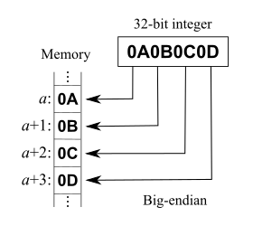
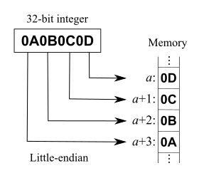

## 1. 字节顺序

**字节顺序** (Endianness)，又称**端序**或**尾序**，在计算机科学中，指电脑内存或数字通信链路中组成多字节的字的字节排列顺序。

字节顺序可分为**大端序**、**小端序**和**混合序**。以 32 位 integer 0x0A0B0C0D 为例：

- 大端序：高位字节存储在的低内存地址处，地位字节存储在高内存地址处。
  
- 小端序：低位字节存储在高内存地址处，高位字节存储在低内存地址处。
  
- 

// TODO: 

## Reference

1. [字节序](https://zh.wikipedia.org/wiki/%E5%AD%97%E8%8A%82%E5%BA%8F)