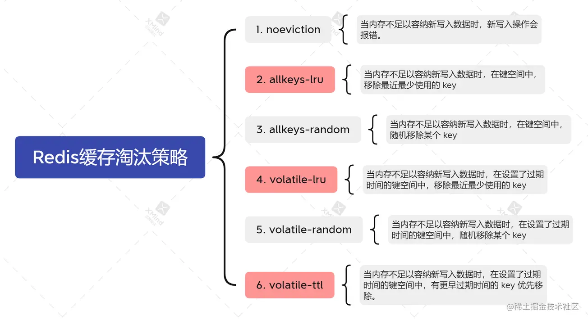

## 1. 数据结构及使用场景

- String 字符串
  Key 都为字符串类型，Set key val 使用的是字符串；
- Hash 哈希
  键值对结构；
- List 列表（双向链表）
  存储多个有序的字符串；
- Set 集合
  集合中不允许有重复元素，元素是无序的。可以进行相关的集合计算（交并补等）；
- Zset （Sorted Set，有序集合）
  采用跳表实现，相较于 Set  多了 Score 从，元素可按照 Score 进行排列；

## 2. 持久化方式

1. RDB ：快照形式将内存中的数据保存到一个 dump 文件中，定时保存；
   当 Redis 需要持久化时，会 fork 一个子进程，子进程将数据写入磁盘上的临时 RDB 文件中。当子进程写完后，将原来的 RDB 替换掉。
2. AOF： 把所有的修改命令存到一个文件中；
   使用 AOF 做持久化，每一个写命令都将追加到 `appendonly.aof` 文件中。AOF 的默认策略是每秒中同步一次。
   缺点：AOF 文件体积大于 RDB，且相对较慢；

Redis **默认**使用 RDB 快照。

## 3. 数据过期 和 缓存淘汰 策略

### 数据过期

- **定时过期：**每个设置过期时间的key都需要创建一个定时器，到过期时间就会立即清除。该策略可以立即清除过期的数据，对内存很友好；但是会占用大量的CPU资源去处理过期的数据，从而影响缓存的响应时间和吞吐量。

- **惰性过期：**只有当访问一个key时，才会判断该key是否已过期，过期则清除。该策略可以最大化地节省CPU资源，却对内存非常不友好。极端情况可能出现大量的过期key没有再次被访问，从而不会被清除，占用大量内存。

- **定期过期：**每隔一定的时间，会扫描一定数量的数据库的expires字典中一定数量的key，并清除其中已过期的key。该策略是前两者的一个折中方案。通过调整定时扫描的时间间隔和每次扫描的限定耗时，可以在不同情况下使得CPU和内存资源达到最优的平衡效果。(expires字典会保存所有设置了过期时间的key的过期时间数据，其中key是指向键空间中的某个键的指针，value是该键的毫秒精度的UNIX时间戳表示的过期时间。键空间是指该Redis集群中保存的所有键。)

Redis同时使用了惰性过期和定期过期两种过期策略。但是Redis定期删除是随机抽取机制，不可能扫描删除掉所有的过期Key。因此需要内存淘汰机制。

### 缓存淘汰

## 4. 单线程 Redis 为什么快

- 纯内存操作
- 单线程操作，避免频繁的上下文切换
- 高效的数据结构
- 采用非阻塞 I/O 多路复用机制

## 5. 如何解决缓存雪崩

- 使用 Redis 高可用架构：使用 Redis 集群保证 Redis 服务不会挂掉
- 缓存时间不一致，给缓存失效时间加上一个随机值，避免集体失效
- 限流降级 策略

## 6. 如何解决缓存穿透

- 接口层做校验
- 存 NULL 值，缓存击穿加锁
- 布隆过滤器拦截：将所有可能的 Key 先映射到布隆过滤器中，查询时先判断是否存在布隆过滤器中，存在继续执行，不存在则返回；布隆过滤器中元素存在可能误判，元素不存在则一定不存在；

## 7. 主从 哨兵 集群

- 主从模式
  基于主从复制特性，主节点负责使用者的 IO 操作，从节点进行数据备份，并提供读操作；实现读写分离。
  主节点宕机，其他从节点不会竞争称为主节点，会丧失写能力；
- 哨兵模式
  相较于主从，多了竞选机制，从从节点中竞选出主节点；
- 集群模式
  集群是提供在多个 Redis 节点间共享数据的程序集，中Redis集群分为主节点和从节点。主节点用于处理槽,而从节点用于复制某个主节点，并在被复制的主节点下线时，代替下线的主节点继续处理命令请求。

    