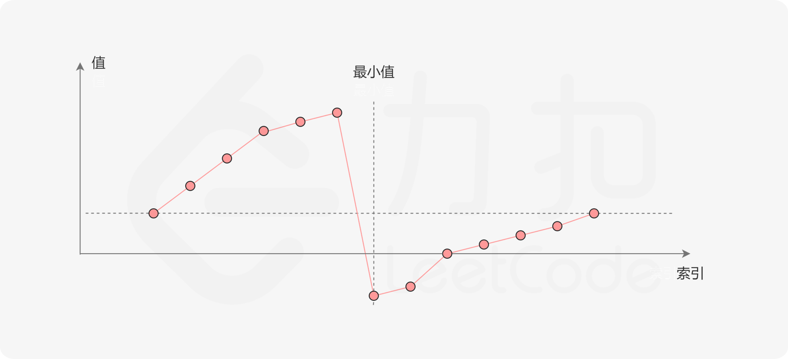

## 1. 题目描述

已知一个长度为 n 的数组，预先按照升序排列，经由 1 到 n 次旋转之后，得到输入数组。

数组 `a[0], a[1], ..., a[n-1]` 旋转一次之后为 `a[n-1], a[0], ..., a[n-2]` 。

给一个元素值互不相同的数组 `nums`, 原来是一个升序排列的数组，并经过了若干次旋转，找出其中的最小元素。

必须设计一个时间复杂度为 *O(logn)* 的算法解决此问题。

```
示例 1：
输入：nums = [3,4,5,1,2]
输出：1
解释：原数组为 [1,2,3,4,5] ，旋转 3 次得到输入数组。

示例 2：
输入：nums = [4,5,6,7,0,1,2]
输出：0
解释：原数组为 [0,1,2,4,5,6,7] ，旋转 4 次得到输入数组。

示例 3：
输入：nums = [11,13,15,17]
输出：11
解释：原数组为 [11,13,15,17] ，旋转 4 次得到输入数组。
```

## 2. 题解

### 2.1 直接搜索

因为原数组是有序的，在旋转之后，旋转部分和未旋转部分均为有序的，所以只要寻找两者的边界即可。

 ```go
 func findMin(nums []int) int {
     // 直接搜索
     for i := 0; i < len(nums) - 1; i++ {
         if (nums[i] > nums[i+1]) {
             return nums[i+1]
         }
     }
     return nums[0]
 }
 ```

当输入数组未进行旋转时，此时将遍历整个数组，时间复杂度为 *O(N)*。

### 2.2 二分查找

题目要求使用 *O(logn)* 的算法，首先想到的就是二分查找。此时需要分析数组中元素之间的关系。

在不含重复元素的升序数组在旋转之后，可以得到一个可视化折线图：



设数组中的最后一个元素 $x$ :  在最小值右侧的元素，值一定严格小于 $x$ ；最小值左侧的元素，一定严格大于 $x_0$。可以根据这种性质通过二分法找出最小值。

在二分查找步骤中，设左边界为 $low$，右边界为 $high$，区间的中点为 $pivot$，最小值在该区间内。将中轴元素 $nums_{pivot}$ 和 右边界元素 $nums_{high}$ 进行比较，会有三种情况：

- $nums_{pivot} < nums_{high}$ ，说明 $nums_{pivot}$ 在最小值的右侧，忽略右侧部分，更新查找区间
- $nums_{pivot} > nums_{high}$ ，说明 $nums_{pivot}$ 在最小值的左侧，忽略左侧部分，更新查找区间
- 因为数组不存在重复元素，并且只要当前区间长度不为 1，就不会出现 $nums_{pivot} = nums_{high}$ 的情况，所以只要区间长度为 1 时，就找到了最小值的位置

```go
func findMin(nums []int) int {
    // binary search
    low, high := 0, len(nums) - 1
    for low < high {
        pivot := (low + high) / 2
        if nums[pivot] < nums[high] {
            high = pivot
        } else {
            low = pivot + 1
        }
    }
    return nums[low]
}
```

**复杂度分析**

- 时间复杂度：时间复杂度 *O(logn)* ，n 为数组长度，二分查找的过程中每次忽略一半的区间。
- 空间复杂度：*O(1)*

## Reference

1. [153](https://leetcode-cn.com/problems/find-minimum-in-rotated-sorted-array/)
2. [leetcode 题解](https://leetcode-cn.com/problems/find-minimum-in-rotated-sorted-array/solution/xun-zhao-xuan-zhuan-pai-xu-shu-zu-zhong-5irwp/)
