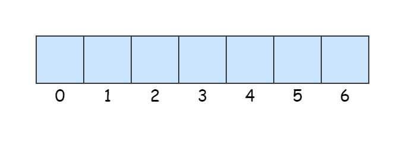
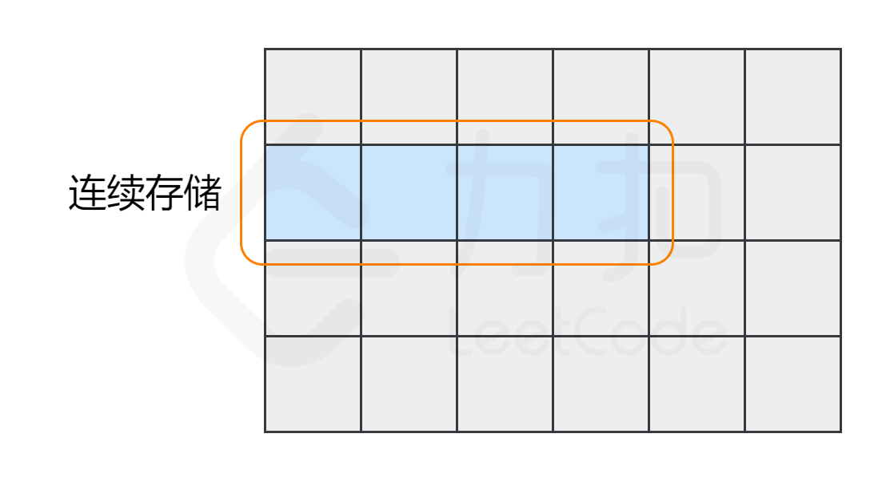
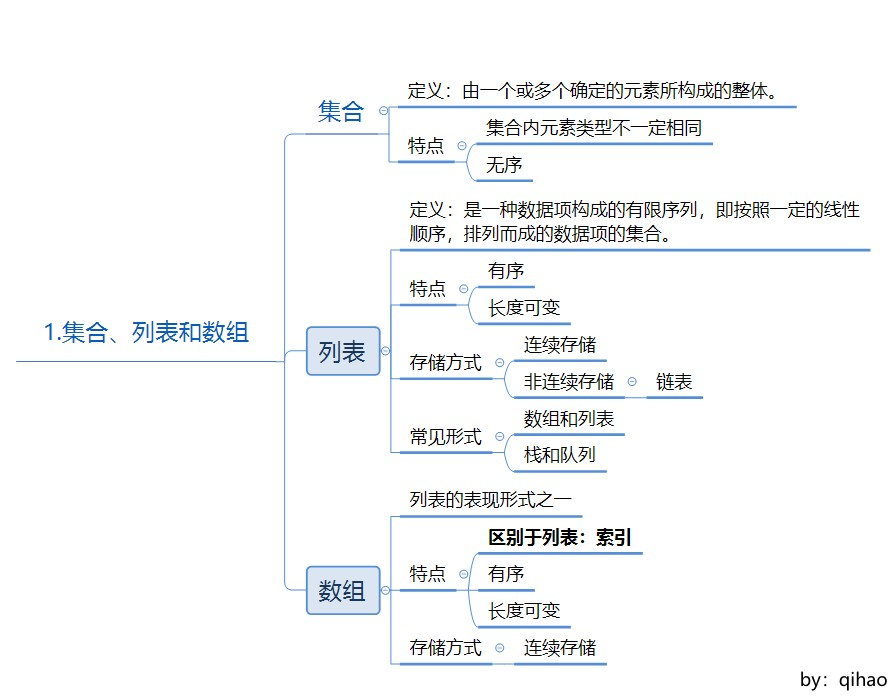
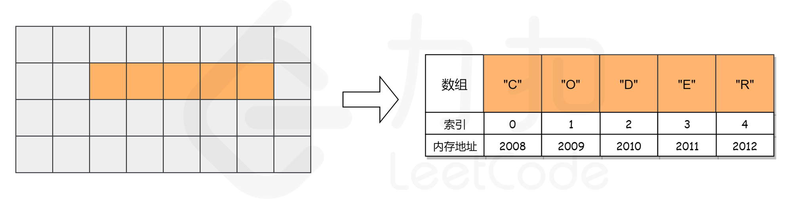
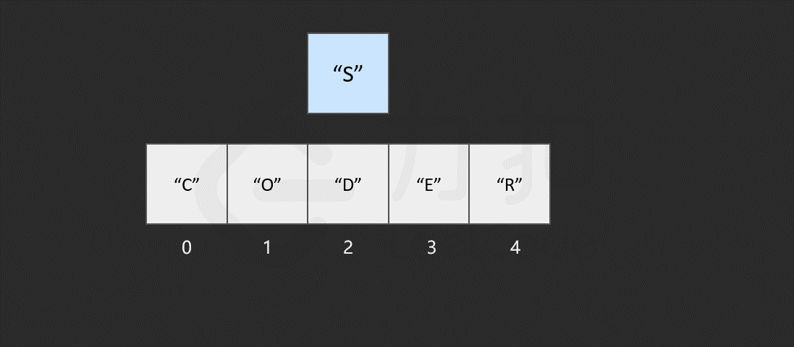
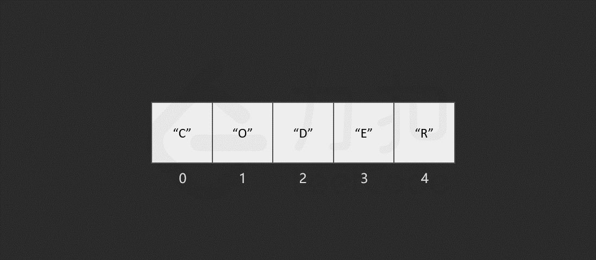
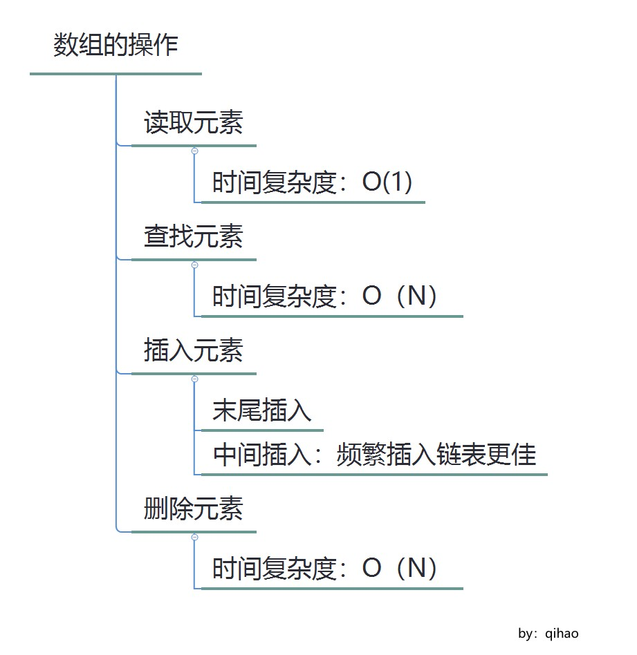
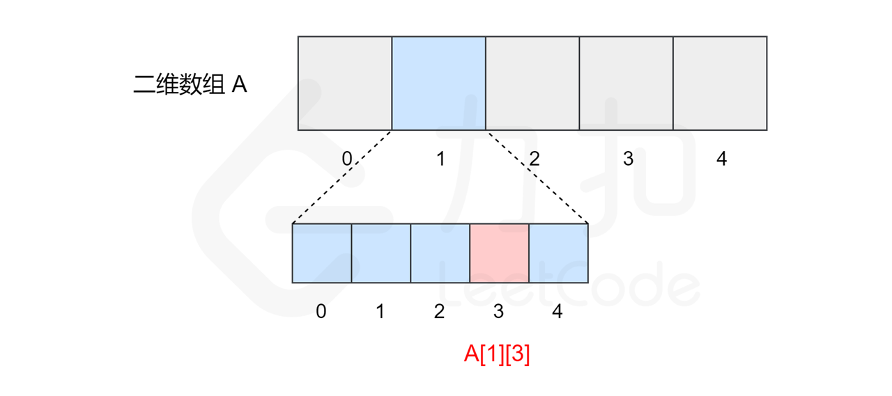
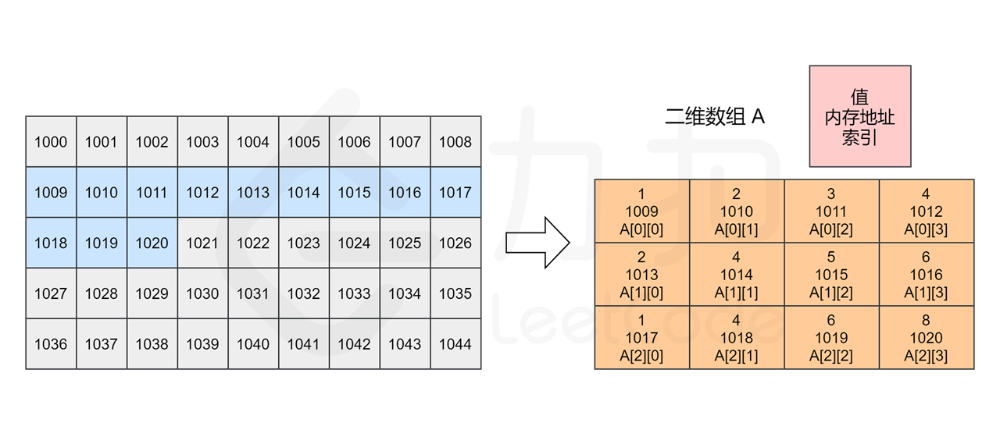
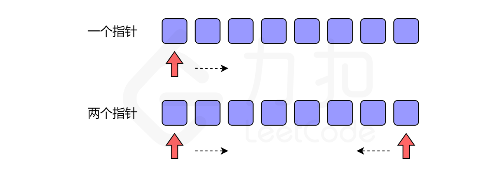

## 1. 集合、列表和数组

### 1.1 集合

定义：由一个或多个确定的元素所构成的整体

特性：

- 集合中的元素类型不一定相同
- 集合中的元素没有顺序

这样的集合并不直接存在于编程语言中，实际编程语言中的很多数据结构是在集合的基础上添加一些规则形成的。

### 1.2 列表

列表（线性表）定义：是一种数据项构成的有限序列，即按照一定的线性顺序，排列而成的数据项的集合。

列表的概念是在集合的特征上形成的，它具有顺序，且长度可变。在编程语言中，列表常见的表现形式有数组和链表，还有两种特殊类型的列表栈和队列。

### 1.3 数组

数组是列表的实现方式之一，其具有列表的特征，同时具有自己的特征。

特点：

- 数组使用名为`索引`的数字来标识每项数据在数组中的位置，可以根据索引快速访问数组元素
- 数组中的元素在内存中是连续存储的，且每个元素占用相同大小的内存。

数组和列表的区别：

- 索引： 列表没有索引，是其与数组最大的区别
- 存储方式：列表元素在内存中不一定是连续的（如：链表），数组元素在内存中是连续的

### 1.4 小结



## 2. 数组的操作

### 2.1 读取元素

读取数组元素，是通过访问索引的方式来读取的。

对于数组，计算机会在内存中为其申请一段**连续**的空间，并会记下索引`0`处的内存地址。



例如想要访问索引为`2`的元素时，计算过程如下：

- 找到该数组的索引`0` 的内存地址：`2008`
- 内存地址加上索引值，作为目标元素的地址，即`2008 + 2 = 2010`,  此内存地址存储的元素为`D`

计算内存的过程很快，一旦知道了内存地址可立即访问到该元素，因此其时间复杂度为常数级，为*O(1)*。

### 2.2 查找元素

查找元素时，只需从数组开头逐步向后查找即可。

最坏情况下，目标元素不在数组中，需要查找`n`次，`n`为数组长度，故查找时间复杂度为*O(N)*。

### 2.3 插入元素

若插入元素在数组末尾则仅需一步。


若插入其他位置，则需要为插入元素**腾出**空间后再进行插入。



频繁的插入操作会耗费大量的时间，可以采用链表的结构来解决此问题。

### 2.4 删除元素

与插入类似，删除某个元素之后，后续的元素需要填补空缺的位置。



最坏情况下，删除第一个元素，操作步数为 `1 + (n-1) = n`, `1` 为删除操作，`n-1` 为移动元素操作。 删除操作为线性时间复杂度，*O(N)*, *N* 为数组长度。

### 2.5 小结



## 3. 二维数组

二维数组是数组元素为数组的数组，其本质上仍是一个一维数组。



例如：二维数组 `A = [[1, 2, 3, 4],[2, 4, 5, 6],[1, 4, 6, 8]]`, 计算机同样会在内存中申请一段 **连续** 空间，并记录第一行数组的索引位置，即 `A[0][0]` 的内存地址。



## 4. 字符串

字符串是由零个或多个字符组成的有限序列，一般记为 s=a~1~a~2~...a~n~ d, 在编程语言中表示文本的数据类型。

字符串的基本操作对象通常是**字符串整体或者子串**，例如: 将 `I like leetcode` 翻转之后的 `edocteel ekil I` 通常是没有意义的，一般希望输出的是`Leetcode like I`。

### 4.1 比较函数

在 golang 中字符串可以使用运算符直接比较，也可以使用`strings.Compare(a, b string) int ` 进行比较

```go
	// built-in operator
	of := "%s %s %s : %v\n"
	s1, s2 := "abc", "def"
	fmt.Printf(of,s1,"==",s2,s1==s2)
	fmt.Printf(of,s1,"<=",s2,s1<=s2)
	fmt.Printf(of,s1,">=",s2,s1>=s2)
	fmt.Printf(of,s1,"<",s2,s1<s2)
	fmt.Printf(of,s1,">",s2,s1>s2)
	// strings.Compare
	fmt.Printf("%s compare to %s : %v",s1,s2, strings.Compare(s1,s2))
```

```
abc == def : false
abc <= def : true
abc >= def : false
abc < def : true
abc > def : false
abc compare to def : -1
```

对于`strings.Compare`:

```go
// Compare returns an integer comparing two strings lexicographically.
// The result will be 0 if a==b, -1 if a < b, and +1 if a > b.
//
// Compare is included only for symmetry with package bytes.
// It is usually clearer and always faster to use the built-in
// string comparison operators ==, <, >, and so on.
func Compare(a, b string) int {
	// NOTE(rsc): This function does NOT call the runtime cmpstring function,
	// because we do not want to provide any performance justification for
	// using strings.Compare. Basically no one should use strings.Compare.
	// As the comment above says, it is here only for symmetry with package bytes.
	// If performance is important, the compiler should be changed to recognize
	// the pattern so that all code doing three-way comparisons, not just code
	// using strings.Compare, can benefit.
	if a == b {
		return 0
	}
	if a < b {
		return -1
	}
	return +1
}
```

`strings.Compare`函数只是为了和`bytes`包对称，使用内建的操作符性能要更好，并且函数本身也是用了内建操作符进行计算，故不建议使用此函数进行字符串比较。

### 4.2 拼接函数

某些语言(如 C++) 中字符串是可变的，可以像改变数组元素那样修改字符串。

在字符串不可变的语言中，想要修改字符串则需要创建新的字符串。

## 5. 双指针技巧

通常迭代数组仅需一个指针即可，但有时需要使用两个指针进行迭代。



示例：反转数组

```go
func reverseString(s string) string {
	b := []byte(s)
	left, right := 0, len(b)-1
	for left < right {
		b[left], b[right] = b[right], b[left]
		left++
		right--
	}
	return string(b)
}
```

左右两边的指针向中间移动，交换彼此的值，直到两者相遇。


## Reference

1. [字符串和数组](https://leetcode-cn.com/leetbook/read/array-and-string/xkhi75/)
1. [Golang 字符串拼接方式比较](https://segmentfault.com/a/1190000040275250)
