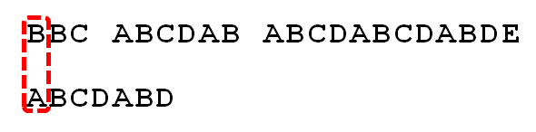

## 1. 集合、列表和数组

### 1.1 集合

定义：由一个或多个确定的元素所构成的整体

特性：

- 集合中的元素类型不一定相同
- 集合中的元素没有顺序

这样的集合并不直接存在于编程语言中，实际编程语言中的很多数据结构是在集合的基础上添加一些规则形成的。

### 1.2 列表

列表（线性表）定义：是一种数据项构成的有限序列，即按照一定的线性顺序，排列而成的数据项的集合。

列表的概念是在集合的特征上形成的，它具有顺序，且长度可变。在编程语言中，列表常见的表现形式有数组和链表，还有两种特殊类型的列表栈和队列。

### 1.3 数组

数组是列表的实现方式之一，其具有列表的特征，同时具有自己的特征。

特点：

- 数组使用名为`索引`的数字来标识每项数据在数组中的位置，可以根据索引快速访问数组元素
- 数组中的元素在内存中是连续存储的，且每个元素占用相同大小的内存。

数组和列表的区别：

- 索引： 列表没有索引，是其与数组最大的区别
- 存储方式：列表元素在内存中不一定是连续的（如：链表），数组元素在内存中是连续的

### 1.4 小结


## 2. 数组的操作

### 2.1 读取元素

读取数组元素，是通过访问索引的方式来读取的。

对于数组，计算机会在内存中为其申请一段**连续**的空间，并会记下索引`0`处的内存地址。


例如想要访问索引为`2`的元素时，计算过程如下：

- 找到该数组的索引`0` 的内存地址：`2008`
- 内存地址加上索引值，作为目标元素的地址，即`2008 + 2 = 2010`,  此内存地址存储的元素为`D`

计算内存的过程很快，一旦知道了内存地址可立即访问到该元素，因此其时间复杂度为常数级，为*O(1)*。

### 2.2 查找元素

查找元素时，只需从数组开头逐步向后查找即可。

最坏情况下，目标元素不在数组中，需要查找`n`次，`n`为数组长度，故查找时间复杂度为*O(N)*。

### 2.3 插入元素

若插入元素在数组末尾则仅需一步。


若插入其他位置，则需要为插入元素**腾出**空间后再进行插入。


频繁的插入操作会耗费大量的时间，可以采用链表的结构来解决此问题。

### 2.4 删除元素

与插入类似，删除某个元素之后，后续的元素需要填补空缺的位置。


最坏情况下，删除第一个元素，操作步数为 `1 + (n-1) = n`, `1` 为删除操作，`n-1` 为移动元素操作。 删除操作为线性时间复杂度，*O(N)*, *N* 为数组长度。

### 2.5 小结


## 3. 二维数组

二维数组是数组元素为数组的数组，其本质上仍是一个一维数组。


例如：二维数组 `A = [[1, 2, 3, 4],[2, 4, 5, 6],[1, 4, 6, 8]]`, 计算机同样会在内存中申请一段 **连续** 空间，并记录第一行数组的索引位置，即 `A[0][0]` 的内存地址。


## 4. 字符串

字符串是由零个或多个字符组成的有限序列，一般记为 s=a~1~a~2~...a~n~ d, 在编程语言中表示文本的数据类型。

字符串的基本操作对象通常是**字符串整体或者子串**，例如: 将 `I like leetcode` 翻转之后的 `edocteel ekil I` 通常是没有意义的，一般希望输出的是`Leetcode like I`。

### 4.1 比较函数

在 golang 中字符串可以使用运算符直接比较，也可以使用`strings.Compare(a, b string) int ` 进行比较

```go
	// built-in operator
	of := "%s %s %s : %v\n"
	s1, s2 := "abc", "def"
	fmt.Printf(of,s1,"==",s2,s1==s2)
	fmt.Printf(of,s1,"<=",s2,s1<=s2)
	fmt.Printf(of,s1,">=",s2,s1>=s2)
	fmt.Printf(of,s1,"<",s2,s1<s2)
	fmt.Printf(of,s1,">",s2,s1>s2)
	// strings.Compare
	fmt.Printf("%s compare to %s : %v",s1,s2, strings.Compare(s1,s2))
```

```
abc == def : false
abc <= def : true
abc >= def : false
abc < def : true
abc > def : false
abc compare to def : -1
```

对于`strings.Compare`:

```go
// Compare returns an integer comparing two strings lexicographically.
// The result will be 0 if a==b, -1 if a < b, and +1 if a > b.
//
// Compare is included only for symmetry with package bytes.
// It is usually clearer and always faster to use the built-in
// string comparison operators ==, <, >, and so on.
func Compare(a, b string) int {
	// NOTE(rsc): This function does NOT call the runtime cmpstring function,
	// because we do not want to provide any performance justification for
	// using strings.Compare. Basically no one should use strings.Compare.
	// As the comment above says, it is here only for symmetry with package bytes.
	// If performance is important, the compiler should be changed to recognize
	// the pattern so that all code doing three-way comparisons, not just code
	// using strings.Compare, can benefit.
	if a == b {
		return 0
	}
	if a < b {
		return -1
	}
	return +1
}
```

`strings.Compare`函数只是为了和`bytes`包对称，使用内建的操作符性能要更好，并且函数本身也是用了内建操作符进行计算，故不建议使用此函数进行字符串比较。

### 4.2 拼接函数

某些语言(如 C++) 中字符串是可变的，可以像改变数组元素那样修改字符串。

在字符串不可变的语言中，想要修改字符串则需要创建新的字符串。

### 4.3 字符串匹配算法 KMP

字符串模式匹配：给定两个串 S=S~1~S~2~...S~n~ 和 T=T~1~ ... T~m~ 在主串 S 中寻找子串 T 的过程称为模式匹配，T 为模式。 

Knuth-Morris-Pratt (KMP) 算法是一种改进的字符串匹配算法，其核心是利用匹配失败后的信息，尽量减少模式串与主串的匹配次数以大到快速匹配的目的。时间复杂度为 *O(m + n)*。

#### 4.3.1 KMP 算法的流程

1. 
   首先，字符串 “BBC ABCDAB ABCDABCDABDE” 的第一个字符和搜索此 “ABCDABD” 的第一个比较。因为 B 与 A 不匹配，所以搜索词后移一位。

2. 
   B 与 A 不匹配，搜索词再次后移

3. 
   直到字符串有一个字符与搜索此的第一个字符相同为止。

4. 
   接着比较字符串和搜索此的下一个字符，还是相同。

5. 
   直到字符串中有一个字符和搜索词对应的字符不同为止。

6. 
   此时最自然的反应是将搜索此整个后移一位，从头开始比较（这就是暴力匹配 BF 的思想)。但是这样效率很差，因为要将搜索位置移动到已经比较过的位置，重比一遍。

7. 
   一个基本事实是，当空格和 D 不匹配时，其实已经直到前面六个字符为 “ABCDAB”。KMP 算法的思想是，利用这个已知的信息，不将搜索位置移动到比较过的位置，继续后移，从而提高效率。

8. 
   如何做到这一点？KMP 针对搜索词，计算出一张 “部分匹配表” (Partial Match Table)。

9. 
   已知空格与 D 不匹配时，前面六个字符 “ABCDAB” 是匹配的。查表可知，最后一个匹配字符 B 对应的“部分匹配值”为2， 因此按照下列公式算出向后移动的位数：

   ```
   移动位数 = 已匹配的字符数 - 对应的部分匹配值
   ```

   因为 6 - 2 等于 4，所以将搜索词向后移动 4 位。

10. 
    因为空格和 C 不匹配，搜索词继续后移。这时，已匹配的字符数为 2 (AB)，对应的部分匹配值为 0。所以移动位数为 2 = 2 - 0，向后移动两位。

11. 
    因为空格与 A 不匹配，继续后移一位。

12. 
    逐位比较，直到发现 C 和 D 不匹配，于是移动位数 = 6 - 2，继续将搜索词向后移动 4 位。

13. 
    逐位比较，直到搜索词的最后一位，发现完全匹配，于是搜索完成。若需要继续搜索（找出全部匹配)，移动位数 = 7 - 0，在将搜索词向后移动 7 位，再次进行搜索。

#### 4.3.2 部分匹配表


在介绍“部分匹配表”如何产生之前，先了解两个概念：

- 前缀：除最后一个字符之外，一个字符串全部头部组合
- 后缀：除第一个字符之外，一个字符串全部尾部组合


“部分匹配值” 就是“前缀”和“后缀”的最长的共有元素的长度。以“ABCDABD”为例：

- “A”的前缀和后缀都为空集，共有元素长度为 0
- “AB”的前缀为 [A], 后缀为 [B]，共有元素长度为 0
- “ABC” 的前缀为 [A, AB]，后缀为 [BC, C]，共有元素长度为 0
- “ABCD” 的前缀为 [A, AB, ABC]，后缀为 [BCD, CD, D]，共有元素长度为 0
- “ABCDA” 的前缀为 [A, AB, ABC, ABCD]，后缀为 [BCDA, CDA, DA, A]，共有元素 A，长度为 1
- “ABCDAB” 的前缀为 [A, AB, ABC, ABCD, ABCDA]，后缀为 [BCDAB, CDAB, DAB, AB, B]，共有元素为 AB，长度为 2
- "ABCDABD"的前缀为[A, AB, ABC, ABCD, ABCDA, ABCDAB]，后缀为[BCDABD, CDABD, DABD, ABD, BD, D]，共有元素的长度为0


部分匹配的本质是，有时候，字符串的头部和尾部会重复。比如，“ABCDAB” 之中有两个“AB”，那么它的部分匹配值就是 2（“AB”的长度）。搜索词移动时，第一个“AB”向后移动 4 位（已匹配字符数- 部分匹配值)，就可以来到第二个“AB”的位置。

#### 4.3.3 程序实现

接下来使用代码实现字符串模式匹配

首先是 **BF 暴力匹配**的实现：

```go
// tips/kmp/kmp.go	
func BF(s, t string) int {
	n, m := len(s), len(t)
	i, j := 0, 0
	for i < n && j < m {
		if s[i] == t[j] {
			i++
			j++
		} else {
			i = i - j + 1
			j = 0
		}
	}
	if j == m {
		return i - j
	}
	return -1
}
```

- 若当前字符匹配成功则 `i++, j++` 继续匹配下一个字符
- 若不同，则 i 回到本次匹配的起始位置的下一个 `i-j+1` ，j 回到起始位置 0，开始新一轮的匹配
- 当 j 到达模式 T 的尾部时表示匹配成功，返回 S 中的下标 `i-j`
- 没有匹配成功则返回 -1

接下来是 **KMP 算法** 的实现：


由上述的 KMP 流程中可以看到“部分匹配表”的生成，部分匹配值是**以当前搜索词结尾**的子串的**最大公共前后缀**的长度。

在 KMP 算法中，使用一个 `next` 数组来保存模式串中下一个开始匹配的字符的下标，其规则是**除当前字符之外**的子串的最大公共前后缀的长度。以上图为例，对应的 `next` 数组为：

| 搜索词     | A    | B    | C    | D    | A    | B    | D    |
| ---------- | ---- | ---- | ---- | ---- | ---- | ---- | ---- |
| 部分匹配值 | -1   | 0    | 0    | 0    | 0    | 1    | 2    |

- 约定 `next[0]` 设为 -1
- 同时可以看出此表相当于上表向右移动一格

这个人工分析出来的表，需要将其转换成计算机能够处理的方式。

首先计算模式串指针 j 在匹配失败（失配）时，需要移动的位数，之前有提到的移动公式 `已匹配的字符数 - 部分匹配值`，已匹配字符数为 `j-1`，而部分匹配表对应值为 `pt[j - 1]` ，因为 next 表相当于 Pt 表向右移动一格，则可以得出：

```
next[j] = pt[j-1]
k = (j - 1) - pt[j]
->
k = (j - 1) - next[j-1]
->
k = j - next[j]
```

j 需要移动的位数 k = j - next[j]，那么 j 在模式串移动了 k 位之后，所在的位置即为 j 在失配后回溯的位置：j - k = next[j]。

接下来计算 next[j] 的值，根据 next 数组的构建规则，已知 next[0] 为 -1，next[1] 为 0，所以我们只需要计算 j > 1 时的情形。


1. 当模式串字符 P~k~ = P~j~  时，可以得出 next[j+1] = next[j] + 1 = k + 1
2. 当 P~k~ ≠ P~j~ 时，此时需要找到更短一些的最长公共前后缀，如上图中蓝色部分，那么此时只需比较 P~next[k]~ 和 P~j~ 即可，若仍不相同，则继续按照此规则寻找。

将上面的计算方式写成 Code：

```go
func buildNext(p string) []int {
    n := len(p)
    next := make([]int, n)
    j, k := 0, -1
    next[j] = k
    for j < n-1 {
        if k == -1 || p[j] == p[k] {
            j++
            k++
            next[j] = k // next[j+1]=next[j]+1
        } else {
            k = next[k]
        }
    }
}
```

KMP 算法：

```go
func kmp(s string, p string) int {
    next := buildNext(p)
    i, j := 0, 0
    m, n := len(s), len(p)
    for i < m && j < n {
        if s[i] == s[j] {
            i++
            j++
        } else {
            j = next[j]
        }
    }
    if j == n {
        return i - j
    }
    return -1
}
```

##   5. 双指针技巧

通常迭代数组仅需一个指针即可，但有时需要使用两个指针进行迭代。


示例：反转数组

```go
func reverseString(s string) string {
	b := []byte(s)
	left, right := 0, len(b)-1
	for left < right {
		b[left], b[right] = b[right], b[left]
		left++
		right--
	}
	return string(b)
}
```

左右两边的指针向中间移动，交换彼此的值，直到两者相遇。


## Reference

1. [字符串和数组](https://leetcode-cn.com/leetbook/read/array-and-string/xkhi75/) leetcode
1. [Golang 字符串拼接方式比较](https://segmentfault.com/a/1190000040275250) jankin
1. [字符串匹配的KMP算法](https://www.ruanyifeng.com/blog/2013/05/Knuth%E2%80%93Morris%E2%80%93Pratt_algorithm.html) 阮一峰
1. [KMP 算法详解](https://blog.csdn.net/yyzsir/article/details/89462339) yyzsir
1. [KMP算法](https://zh.wikipedia.org/wiki/KMP%E7%AE%97%E6%B3%95) wikipedia
