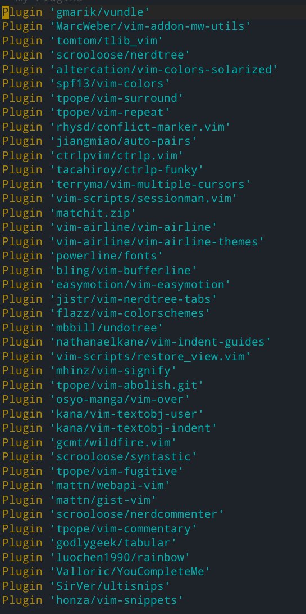
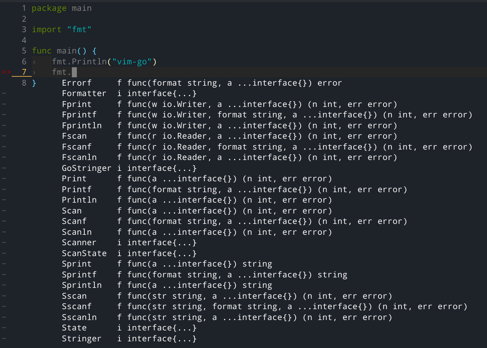

# spf13-vim 安装及配置

spf13-vim及插件安装记录，后续遇到好用的插件也会记录在此

本文安装环境：

- Manjaro
- Linux 5.10 

## 安装 Installation

安装需要 *Git 1.7+, Vim 1.3+*,复制以下命令以安装:

```sh
curl https://j.mp/spf13-vim3 -L > spf13-vim.sh && sh spf13-vim.sh
```

如果是bash兼容的shell可以直接执行脚本：

```sh
sh <(curl https://j.mp/spf13-vim3 -L)
```

## 自定义 Customization

spf13-vim的配置加载顺序如下：

1. `.vimrc.before` - spf13-vim before configuration
2. `.vimrc.before.fork` - fork before configuration
3. `.vimrc.before.local` - before user configuration
4. `.vimrc.bundles` - spf13-vim bundle configuration
5. `.vimrc.bundles.fork` - fork bundle configuration
6. `.vimrc.bundles.local` - local user bundle configuration
7. `.vimrc` - spf13-vim vim configuration
8. `.vimrc.fork` - fork vim configuration
9. `.vimrc.local` - local user configuration

自定配置建议创建相关的`.vim.*.local`文件

## 插件 Plugins

spf13-vim 已经集成了很多的人气插件：



后续会跟新集成插件的用法和说明

### 增加新插件 Adding new plugins

创建`~/.vimrc.bundles.local`用于新增额外插件，按`Bundle plugin_name`的格式写入文件，例如：

```sh
echo Bundle \'spf13/vim-colors\' >> ~/.vimrc.bundles.local
```

安装插件：

```
vim +BundleInstall! +BundleClean +q
```

### 移除（禁用）插件 Removing (disabling) an included plugin

创建`~/.vimrc.local`(若不存在)，以`UnBundle plugin_name`的格式写入，例如：

```
 echo UnBundle \'AutoClose\' >> ~/.vimrc.bundles.local
 echo UnBundle \'scrooloose/syntastic\' >> ~/.vimrc.bundles.local
```

移除插件：

```
vim +BundleClean! +q
```

 ### YCM([YouCompleteMe](https://github.com/Valloric/YouCompleteMe))

YCM是一个vim的代码补全插件，提供多种语言的补全功能

由于新版本的YCM无法使用python2，需要强制vim使用python3

查看vim当前使用的python版本,进入vim:

```
:echo has('python')
:echo has('python3')
```

若`echo has('python')`返回1，则表示vim使用的是python2

在`~/.vimrc.before.local`中添加：

```
set pythondll=
```

再次执行：

```
:echo has('python3')
```

为1则说明当前使用python3

在`~/.vimrc.before.local`,添加如下内容：

```
let g:spf13_bundle_groups=['general', 'programming','youcompleteme']
```

安装插件：

```
vim +BundleInstall! +q
```

使用YCM之前需要自己编译配置,注意使用python3：

```sh
cd ~/.vim/bundle/YouCompleteMe/
python3 ./install.py --all #编译支持所有功能
or
python3 ./install.py --clang-completer #只支持C/C++补全
```

再次进入vim，就可以使用YCM的代码补全了

### [vim-go](https://github.com/fatih/vim-go)

vim-go 为vim添加Go语言支持，向`~/.vimrc.bundles.local`写入：

```
Bundle 'fatih/vim-go'
```

安装：

```sh
vim +BundleInstall +q
```

创建文件`main.go`,会生成模板代码，可以配合YCM的代码补全：



## 配置修改

### 复制粘贴问题

使用默认配置时，鼠标框选会直接进入`VISUAL`模式，不能方便的复制到系统剪切板

解决方案：

在`~/.vimrc.local`中加入：

 ```
 set mouse=v
 ```

这样就不会直接进入可视模式

#### vim的可视模式VISUAL

`vim`有一个可视模式`(Visual Mode)`，在此模式下可以选择区域。可以在普通模式下键入v进入可视模式，键入V进入行可视模式，或者键入`Ctrl+v`进入列可视模式。当选择的时候这些被选择内容已经实时保存到了选择缓冲区中。

#### 选择缓冲区和剪切板

`Linux`中存在两个剪切板，选择缓冲区`（X11 selection buffer）`和剪切板`（clipboard）`。

选择缓冲区是实时的，当使用鼠标或者键盘选择内容的时候内容就已经存在了选择缓冲区。可以使用鼠标中键或键入`Shift+Insert`来粘贴选择缓冲区的内容。但对于有些`GUI`程序，比如`gedit`，只能通过鼠标中键调用选择缓冲区的内容，使用`Shift+Insert`的话，调用的是剪切板的内容。

剪切板和`Windows`的剪切板类似，在选择文字内容后，执行`Ctrl + c`或在菜单里选择‘复制’的话，这时内容才存放到剪切板里。而使用剪切板的内容，则是`Ctrl+v`。 但在有些情况下，比如`gnome-terminal`，不能直接使用`Ctrl+c`，`Ctrl+v`，这时就要用`Shift+Ctrl+c`，`Shift+Ctrl+v`代替。

如果只是在`vim`中使用，使用选择缓冲区的话，可以在可视模式中进行选择或者使用`"*yny`将n行内容复制到选择缓冲区中，使用`"*p`粘贴到vim，或者使用`"+y`将内容复制到系统剪切板，再使用`C-v`进行粘贴。

`vim`中默认使用选择缓冲区寄存器可以在`~/.vimrc`中添加

```bash
set clipboard = unnamed
```

这样，直接使用`y`和`p`就会直接和选择缓冲区进行数据交换了。

---
本文采用[CC BY-NC-ND 4.0](https://creativecommons.org/licenses/by-nc-nd/4.0/)许可

## 参考

1. [spf13-vim](https://github.com/spf13/spf13-vim) github-repo
2. [YouCompleteMe](https://github.com/ycm-core/YouCompleteMe) github-repo
3. [vim-go](https://github.com/fatih/vim-go) github-repo
4. [vim配置ycm，同时支持python和python3了，如何只支持python3](https://www.zhihu.com/question/48089488) 知乎
5. [vim的复制粘贴问题](https://www.jianshu.com/p/a17fc6c2920c) 简书

