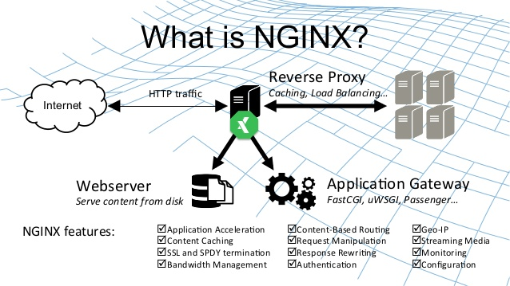
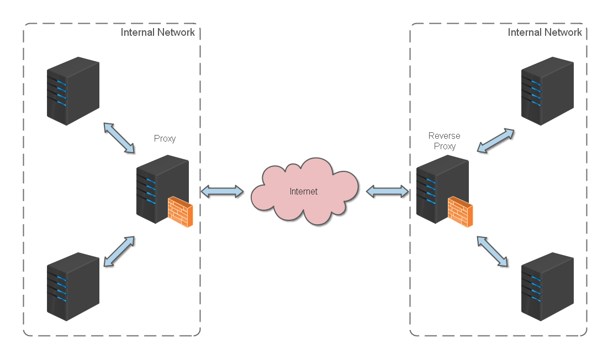
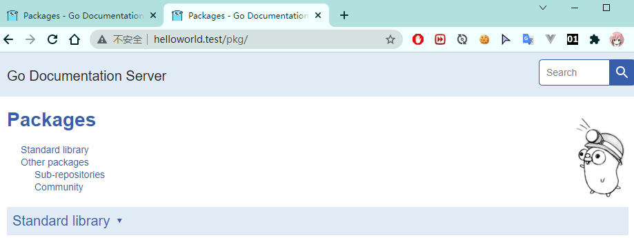
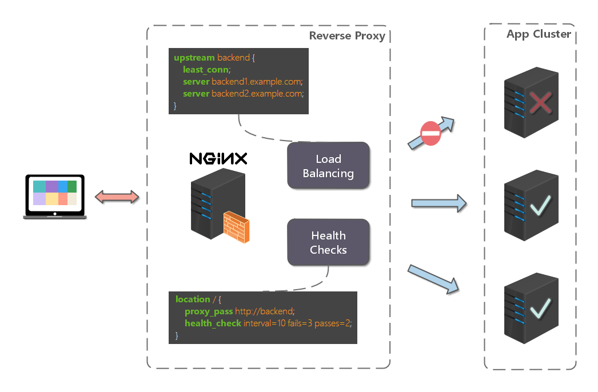

# Nginx 教程

## Introduction 简介

Nginx(engine x)是一款轻量级的web服务器，反向代理服务器及电子邮件(IMAP/POP3)代理服务器



### 反向代理

反向代理(Reverse proxy)方式是指以代理服务器来接受 internet 上的连接请求，然后将请求发给内部网络上的服务器，并将服务器上得到的结果返回给 internet 上请求连接的客户端，此时代理服务器就表现为一个反向代理服务器



## 开始使用

环境：

- Server: Raspian 64-bit
- Client: Windows11

nginx常用命令如下：

```sh
nginx -s stop       快速关闭Nginx，可能不保存相关信息，并迅速终止web服务。
nginx -s quit       平稳关闭Nginx，保存相关信息，有安排的结束web服务。
nginx -s reload     因改变了Nginx相关配置，需要重新加载配置而重载。
nginx -s reopen     重新打开日志文件。
nginx -c filename   为 Nginx 指定一个配置文件，来代替缺省的。
nginx -t            不运行，仅仅测试配置文件。nginx 将检查配置文件的语法的正确性，并尝试打开配置文件中所引用到的文件。
nginx -v            显示 nginx 的版本。
nginx -V            显示 nginx 的版本，编译器版本和配置参数。
```

可以编写启动脚本,方便快速启动:

```sh
#!/bin/zsh   
CONFIG=$HOME/nginx/nginx.conf
echo "Config path: "$CONFIG" "

#  如果启动前已经启动nginx并记录下pid文件，会kill指定进程
sudo nginx -s stop

# 测试配置文件语法正确性
sudo nginx -t -c $CONFIG

# 显示版本信息
sudo nginx -v

# 按照指定配置去启动nginx
sudo nginx -c $CONFIG
```

### Http 反向代理

nginx配置如下(linux默认配置为`/etc/nginx/nginx.conf`,也可使用`-c`指定配置文件)：

```sh
#运行用户
user username;


#启动进程,通常设置成和cpu的数量相等
worker_processes  1;

#全局错误日志
error_log  /home/username/nginx/logs/error.log;
error_log  /home/username/nginx/logs/notice.log  notice;
error_log  /home/username/nginx/logs/info.log  info;

#PID文件，记录当前启动的nginx的进程ID
pid        /home/username/nginx/logs/pid/nginx.pid;

#工作模式及连接数上限
events {
    worker_connections 1024;    #单个后台worker process进程的最大并发链接数
}

#设定http服务器，利用它的反向代理功能提供负载均衡支持
http {
    #设定mime类型(邮件支持类型),类型由mime.types文件定义
    include       /etc/nginx/mime.types;
    default_type  application/octet-stream;

    #设定日志
	log_format  main  '[$remote_addr] - [$remote_user] [$time_local] "$request" '
                      '$status $body_bytes_sent "$http_referer" '
                      '"$http_user_agent" "$http_x_forwarded_for"';

    access_log    /home/username/nginx/logs/access.log main;
    rewrite_log     on;

    #sendfile 指令指定 nginx 是否调用 sendfile 函数（zero copy 方式）来输出文件，对于普通应用，
    #必须设为 on,如果用来进行下载等应用磁盘IO重负载应用，可设置为 off，以平衡磁盘与网络I/O处理速度，降低系统的uptime.
    sendfile        on;
    #tcp_nopush     on;

    #连接超时时间
    keepalive_timeout  120;
    tcp_nodelay        on;

	#gzip压缩开关
	#gzip  on;

    #设定实际的服务器列表
    upstream zp_server1{
        server 127.0.0.1:8889;
    }

    #HTTP服务器
    server {
        #监听80端口，80端口是知名端口号，用于HTTP协议
        listen       80; 

        #定义使用域名访问
        server_name  helloworld.test;

		#首页
		index index.html

		#指向webapp的目录
		root /home/pi/nginx/content/;

		#编码格式
		charset utf-8;

		#代理配置参数
        proxy_connect_timeout 180;
        proxy_send_timeout 180;
        proxy_read_timeout 180;
        proxy_set_header Host $host;
        proxy_set_header X-Forwarder-For $remote_addr;

        #反向代理的路径（和upstream绑定），location 后面设置映射的路径
        location / {
            proxy_pass http://zp_server1;
        }

        #静态文件，nginx自己处理
        # location ~ ^/(images|javascript|js|css|flash|media|static)/ {
            #root D:\01_Workspace\Project\github\zp\SpringNotes\spring-security\spring-shiro\src\main\webapp\views;
            #过期30天，静态文件不怎么更新，过期可以设大一点，如果频繁更新，则可以设置得小一点。
           # expires 30d;
       # }

        #设定查看Nginx状态的地址
        location /NginxStatus {
            stub_status           on;
            access_log            on;
            auth_basic            "NginxStatus";
            auth_basic_user_file  conf/htpasswd;
        }

        #禁止访问 .htxxx 文件
        location ~ /\.ht {
            deny all;
        }

		#错误处理页面（可选择性配置）
		#error_page   404              /404.html;
		#error_page   500 502 503 504  /50x.html;
        #location = /50x.html {
        #    root   html;
        #}
    }
}
```

在客户端设置(windows)host:

```
192.168.2.111 helloworld.test
```

​	服务端启动godoc：

```sh
godoc -http=127.0.0.1:8889
```



可以看到访问`helloworld.test`   的请求被代理到了`127.0.0.1:8889`,客户端看到的是godoc的页面

### Https 反向代理

一些安全性要求较高的站点会使用HTTPS协议，nginx配置Https和Http有所不同：

- Https 固定端口号为443,Http为80
- SSL需要引入证书，需要在nginx中配置证书和对应的key

其他配置和http类似，`server` 部分有所不同

```sh
#HTTP服务器
  server {
      #监听443端口。443为知名端口号，主要用于HTTPS协议
      listen       443 ssl;

      #定义使用域名访问
      server_name  helloworld.test;

      #ssl证书文件位置(常见证书文件格式为：crt/pem)
      ssl_certificate      cert.pem;
      #ssl证书key位置
      ssl_certificate_key  cert.key;

      #ssl配置参数（选择性配置）
      ssl_session_cache    shared:SSL:1m;
      ssl_session_timeout  5m;
      #数字签名，此处使用MD5
      ssl_ciphers  HIGH:!aNULL:!MD5;
      ssl_prefer_server_ciphers  on;

      location / {
          root   /root;
          index  index.html index.htm;
      }
  }
```

##  负载均衡

大多数情况下生产环境服务会以集群的方式运行，此时需要负载均衡来分流，nginx可以实现简单的负载均衡功能



假设一个场景：

应用部署在三台服务器中：192.168.1.11:80、192.168.1.12:80、192.168.1.13:80 ,网站域名为`www.helloworld.com`，公网IP为`192.168.1.11`,在公网IP所在的服务器上部署nginx，对所有请求做负载均衡处理（下例使用加权轮询策略）

配置如下：

```sh
http {
     #设定mime类型,类型由mime.type文件定义
    include       /etc/nginx/mime.types;
    default_type  application/octet-stream;
    #设定日志格式
    access_log    /var/log/nginx/access.log;

    #设定负载均衡的服务器列表
    upstream load_balance_server {
        #weigth参数表示权值，权值越高被分配到的几率越大
        server 192.168.1.11:80   weight=5;
        server 192.168.1.12:80   weight=1;
        server 192.168.1.13:80   weight=6;
    }

   #HTTP服务器
   server {
        #侦听80端口
        listen       80;

        #定义使用www.xx.com访问
        server_name  www.helloworld.com;

        #对所有请求进行负载均衡请求
        location / {
            root        /root;                 #定义服务器的默认网站根目录位置
            index       index.html index.htm;  #定义首页索引文件的名称
            proxy_pass  http://load_balance_server ;#请求转向load_balance_server 定义的服务器列表

            #以下是一些反向代理的配置(可选择性配置)
            #proxy_redirect off;
            proxy_set_header Host $host;
            proxy_set_header X-Real-IP $remote_addr;
            #后端的Web服务器可以通过X-Forwarded-For获取用户真实IP
            proxy_set_header X-Forwarded-For $remote_addr;
            proxy_connect_timeout 90;          #nginx跟后端服务器连接超时时间(代理连接超时)
            proxy_send_timeout 90;             #后端服务器数据回传时间(代理发送超时)
            proxy_read_timeout 90;             #连接成功后，后端服务器响应时间(代理接收超时)
            proxy_buffer_size 4k;              #设置代理服务器（nginx）保存用户头信息的缓冲区大小
            proxy_buffers 4 32k;               #proxy_buffers缓冲区，网页平均在32k以下的话，这样设置
            proxy_busy_buffers_size 64k;       #高负荷下缓冲大小（proxy_buffers*2）
            proxy_temp_file_write_size 64k;    #设定缓存文件夹大小，大于这个值，将从upstream服务器传

            client_max_body_size 10m;          #允许客户端请求的最大单文件字节数
            client_body_buffer_size 128k;      #缓冲区代理缓冲用户端请求的最大字节数
        }
    }
}
```

### 负载均衡策略

Nginx提供了多种负载均衡策略：

- 轮询，权重均为1：

  ```
  upstream bck_testing_01 {
    # 默认所有服务器权重为 1
    server 192.168.250.220:8080
    server 192.168.250.221:8080
    server 192.168.250.222:8080
  }
  ```

- 加权轮询,可自定义权重：

  ```
  upstream bck_testing_01 {
    server 192.168.250.220:8080   weight=3
    server 192.168.250.221:8080              # default weight=1
    server 192.168.250.222:8080              # default weight=1
  }
  ```

- 最少连接：

  ```
  upstream bck_testing_01 {
    least_conn;
  
    # with default weight for all (weight=1)
    server 192.168.250.220:8080
    server 192.168.250.221:8080
    server 192.168.250.222:8080
  }
  ```

- 加权最少连接：

  ```
  upstream bck_testing_01 {
    least_conn;
  
    server 192.168.250.220:8080   weight=3
    server 192.168.250.221:8080              # default weight=1
    server 192.168.250.222:8080              # default weight=1
  }
  ```

- IP Hash：

  ```
  upstream bck_testing_01 {
  
    ip_hash;
  
    # with default weight for all (weight=1)
    server 192.168.250.220:8080
    server 192.168.250.221:8080
    server 192.168.250.222:8080
  
  }
  ```

- 普通Hash

  ```
  upstream bck_testing_01 {
  
    hash $request_uri;
  
    # with default weight for all (weight=1)
    server 192.168.250.220:8080
    server 192.168.250.221:8080
    server 192.168.250.222:8080
  
  }
  ```

## 多个Webapp配置

当网站内容较多时，往往需要模块独立出来，独立维护，此时就会有多个App

例如：

`helloworld.com`有三个`webapp`,finance,product,admin,通过上下文(context)来进行访问：

- `helloworld.com\product`
- `helloworld.com\finance`
- `helloworld.com\admin`

http默认的端口号为80，在一台服务器上不能以80端口同时启动三个webapp；用户实际访问时也不能加上端口号来调用不同的webapp，此时就需要用到反向代理

配置如下：

```
http {
	#此处省略一些基本配置

	upstream product_server{
		server www.helloworld.com:8081;
	}

	upstream admin_server{
		server www.helloworld.com:8082;
	}

	upstream finance_server{
		server www.helloworld.com:8083;
	}

	server {
		#此处省略一些基本配置
		#默认指向product的server
		location / {
			proxy_pass http://product_server;
		}

		location /product/{
			proxy_pass http://product_server;
		}

		location /admin/ {
			proxy_pass http://admin_server;
		}

		location /finance/ {
			proxy_pass http://finance_server;
		}
	}
}
```

## 静态站点

有时需要配置静态站点（html文件和静态资源）

例如：所有的静态资源放在了`app/dist`下，需要在nginx中配置：

```
worker_processes  1;

events {
	worker_connections  1024;
}

http {
    include       mime.types;
    default_type  application/octet-stream;
    sendfile        on;
    keepalive_timeout  65;

    gzip on;
    gzip_types text/plain application/x-javascript text/css application/xml text/javascript application/javascript image/jpeg image/gif image/png;
    gzip_vary on;

    server {
		listen       80;
		server_name  static.zp.cn;

		location / {
			root /app/dist;
			index index.html;
			#转发任何请求到 index.html
		}
	}
}
```

## 搭建文件服务器

有时团队需要归档一些数据或资料时，那么文件服务器必不可少，可以使用nginx快速搭建简易的文件服务

配置要点：

- 将 autoindex 开启可以显示目录，默认不开启。
- 将 autoindex_exact_size 开启可以显示文件的大小。
- 将 autoindex_localtime 开启可以显示文件的修改时间。
- root 用来设置开放为文件服务的根路径。
- charset 设置为 `charset utf-8,gbk;`，可以避免中文乱码问题（windows 服务器下设置后，依然乱码，本人暂时没有找到解决方法）。

简化配置如下：

```
autoindex on;# 显示目录
autoindex_exact_size on;# 显示文件大小
autoindex_localtime on;# 显示文件时间

server {
    charset      utf-8,gbk; 
    listen       9050 default_server;
    listen       [::]:9050 default_server;
    server_name  _;
    root         /share/fs;
}
```

## 跨域问题

在web开发中，经常采用前后分离模式，各自独立的app互相访问时势必存在跨域问题,一般有两种方式解决：

- CORS
  在后端服务器设置HTTP响应头，将允许访问的域名加入`Access-Control-Allow-Origin`中
- JSONP
  **JSON with Padding**是[JSON](https://zh.wikipedia.org/wiki/JSON)的一种“使用模式”，可以让网页从别的网域获取资料

Nginx采用第一种思路解决跨域问题

例如：[www.helloworld.com](http://www.helloworld.com/) 网站是由一个前端 app ，一个后端 app 组成的。前端端口号为 9000， 后端端口号为 8080，前端和后端如果使用 http 进行交互时，请求会被拒绝，因为存在跨域问题

配置如下：

`enable-cors.conf`

```
# allow origin list
set $ACAO '*';

# set single origin
if ($http_origin ~* (www.helloworld.com)$) {
  set $ACAO $http_origin;
}

if ($cors = "trueget") {
	add_header 'Access-Control-Allow-Origin' "$http_origin";
	add_header 'Access-Control-Allow-Credentials' 'true';
	add_header 'Access-Control-Allow-Methods' 'GET, POST, OPTIONS';
	add_header 'Access-Control-Allow-Headers' 'DNT,X-Mx-ReqToken,Keep-Alive,User-Agent,X-Requested-With,If-Modified-Since,Cache-Control,Content-Type';
}

if ($request_method = 'OPTIONS') {
  set $cors "${cors}options";
}

if ($request_method = 'GET') {
  set $cors "${cors}get";
}

if ($request_method = 'POST') {
  set $cors "${cors}post";
}

```

在`nginx.conf`引入(`include enable-cors.conf`):

```
# ----------------------------------------------------
# 此文件为项目 nginx 配置片段
# 可以直接在 nginx config 中 include（推荐）
# 或者 copy 到现有 nginx 中，自行配置
# www.helloworld.com 域名需配合 dns hosts 进行配置
# 其中，api 开启了 cors，需配合本目录下另一份配置文件
# ----------------------------------------------------
upstream front_server{
  server www.helloworld.com:9000;
}
upstream api_server{
  server www.helloworld.com:8080;
}

server {
  listen       80;
  server_name  www.helloworld.com;

  location ~ ^/api/ {
    include enable-cors.conf;
    proxy_pass http://api_server;
    rewrite "^/api/(.*)$" /$1 break;
  }

  location ~ ^/ {
    proxy_pass http://front_server;
  }
}

```


## 参考

1. [Nginx 极简教程](https://github.com/dunwu/nginx-tutorial) github repo
2. [前端常见跨域解决方案（全）](https://segmentfault.com/a/1190000011145364) segmentfault/安静de沉淀
3. [Nginx 的中文维基](http://tool.oschina.net/apidocs/apidoc?api=nginx-zh)
4. [Nginx 开发从入门到精通](http://tengine.taobao.org/book/index.html)
5. [nginx-admins-handbook](https://github.com/trimstray/nginx-admins-handbook)
6. [nginxconfig.io](https://nginxconfig.io/)   Nginx 配置生成器

