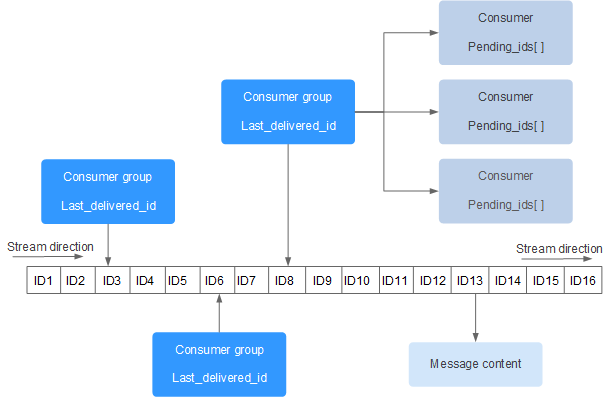

# 3.7 Redis Stream 

Redis Stream 是 Redis 5.0 版本新增加的数据结构。

Redis Stream 主要用于消息队列（MQ，Message Queue），Redis 本身是有一个 Redis 发布订阅 (pub/sub) 来实现消息队列的功能，但它有个缺点就是消息无法持久化，如果出现网络断开、Redis 宕机等，消息就会被丢弃。

简单来说发布订阅 (pub/sub) 可以分发消息，但无法记录历史消息。

而 Redis Stream 提供了消息的持久化和主备复制功能，可以让任何客户端访问任何时刻的数据，并且能记住每一个客户端的访问位置，还能保证消息不丢失。

Redis Stream 的结构如下所示，它有一个消息链表，将所有加入的消息都串起来，每个消息都有一个唯一的 ID 和对应的内容：



每个Stream都有唯一的名称，即为redis的key，在首次使用xadd将会自动创建

上图中：

* Consumer Group: 消费组，使用XGROUP CREATE命令创建，一个消费组有多个消费者
* last_delivered_id ：游标，每个消费组会有个游标last_delivered_id,任意一个消费者都会使游标last_delivered_id往前移动
* pending_ids:消费者(Consumer)的状态变量，作用是维护消费者的未确认的id，pending_ids记录了当前已经被客户端读取的消息，但是还没有ack(acknowledge character:确认字符)

## 常用命令

消息队列相关

| command   | description                        |
| --------- | ---------------------------------- |
| XADD      | 添加消息到末尾                     |
| XTRIM     | 对流进行修剪，限制长度             |
| XDEL      | 删除消息                           |
| XLEN      | 获取流包含的元素数量，即消息长度   |
| XRANGE    | 获取消息列表，自动过滤已删除的消息 |
| XREVRANGE | 反向获取消息列表，ID从大到小排序   |
| XREAD     | 以阻塞或者非阻塞方式获取消息列表   |

消费者组相关

| command            | descrition                       |
| ------------------ | -------------------------------- |
| XGROUP CREATE      | 创建消费者组                     |
| XREADGROUP GROUP   | 读取消费者组的消息               |
| XACK               | 将消息标记为“已处理”             |
| XGROUP SETID       | 为消费者组设置新的最后递送消息ID |
| XGROUP DELCONSUMER | 删除消费者                       |
| XGROUP DESTROY     | 删除消费者组                     |
| XPENDING           | 显示待处理消息的相关信息         |
| XCLAIM             | 转移消息的归属权                 |
| XINFO              | 查看流和消费者组的相关信息       |
| XINFO GROUPS       | 打印消费者组的信息               |
| XINFO STREAM       | 打印流信息                       |

## 示例

XADD 向队列添加消息，若队列不存在，则创建队列

```
XADD key ID field value [field value]
```

* key : 队列名
* ID：消息ID，使用*则由redis生成
* field value：记录

```
127.0.0.1:6379> XADD mystream * name Sara surname OConnor
"1618806739508-0"
127.0.0.1:6379> XADD mystream * field1 value1 field2 value2 field3 value3
"1618806764424-0"
127.0.0.1:6379> XLEN mystream
(integer) 2
127.0.0.1:6379> XRANGE mystream - +
1) 1) "1618806739508-0"
   2) 1) "name"
      2) "Sara"
      3) "surname"
      4) "OConnor"
2) 1) "1618806764424-0"
   2) 1) "field1"
      2) "value1"
      3) "field2"
      4) "value2"
      5) "field3"
      6) "value3"
```

XTRIM 对流进行裁剪，限制长度

```
XTRIM key MAXLEN [~] count
```

* key ：队列名称
* MAXLEN：长度
* count：数量

XDEL 删除消息

```
XDEL key ID [ID...]
```

* key :队列名称
* ID：消息ID

```
127.0.0.1:6379> xrange mystream - +
1) 1) "1618806739508-0"
   2) 1) "name"
      2) "Sara"
      3) "surname"
      4) "OConnor"
2) 1) "1618806764424-0"
   2) 1) "field1"
      2) "value1"
      3) "field2"
      4) "value2"
      5) "field3"
      6) "value3"
3) 1) "1618806986614-0"
   2) 1) "field4"
      2) "value4"
127.0.0.1:6379> xdel mystream 1618806986614-0
(integer) 1
127.0.0.1:6379> xrange mystream - +
1) 1) "1618806739508-0"
   2) 1) "name"
      2) "Sara"
      3) "surname"
      4) "OConnor"
2) 1) "1618806764424-0"
   2) 1) "field1"
      2) "value1"
      3) "field2"
      4) "value2"
      5) "field3"
      6) "value3"
127.0.0.1:6379> 
```

XLEN 获取流长度

```
XLEN key
```

```
127.0.0.1:6379> xrange mystream - +
1) 1) "1618806739508-0"
   2) 1) "name"
      2) "Sara"
      3) "surname"
      4) "OConnor"
2) 1) "1618806764424-0"
   2) 1) "field1"
      2) "value1"
      3) "field2"
      4) "value2"
      5) "field3"
      6) "value3"
127.0.0.1:6379> xlen mystream
(integer) 2

```

XRANGE 获取消息列表，自动过滤已删除的消息

```
XRANGE key start end [COUNT count]
```

* key :队列名
* start ：开始值，-为最小值
* end ：结束值，+为最大值
* count：数量

```
127.0.0.1:6379> xrange mystream - + count 1
1) 1) "1618806739508-0"
   2) 1) "name"
      2) "Sara"
      3) "surname"
      4) "OConnor"

```

XREVRANGE 反向获取消息列表，自动过滤已删除信息

```
XREVRANGE key start end [COUNT count]
```

```
127.0.0.1:6379> xrevrange mystream + -
1) 1) "1618807571967-0"
   2) 1) "f4"
      2) "v4"
2) 1) "1618807569272-0"
   2) 1) "f3"
      2) "v3"
3) 1) "1618807556220-0"
   2) 1) "f1"
      2) "v1"
      3) "f2"
      4) "v2"
4) 1) "1618806764424-0"
   2) 1) "field1"
      2) "value1"
      3) "field2"
      4) "value2"
      5) "field3"
      6) "value3"
5) 1) "1618806739508-0"
   2) 1) "name"
      2) "Sara"
      3) "surname"
      4) "OConnor"
127.0.0.1:6379> 
```

XREAD 以阻塞或非阻塞方式获取消息列表

```
XREAD [COUNT count] [BLOCK milliseconds] STREAMS key [key...] id [id...]
```

* count :数量
* milliseconds：阻塞毫秒数，为设置则为非阻塞模式
* key：队列名
* id：消息ID

```
#从mystream头部读取两条消息
127.0.0.1:6379> xread count 2 streams mystream 0
1) 1) "mystream"
   2) 1) 1) "1618806739508-0"
         2) 1) "name"
            2) "Sara"
            3) "surname"
            4) "OConnor"
      2) 1) "1618806764424-0"
         2) 1) "field1"
            2) "value1"
            3) "field2"
            4) "value2"
            5) "field3"
            6) "value3"
```

XGROUP CREATE创建消费者组

```
XGROUP [CREATE key groupname id-or-$] [SETID key groupname id-or-$] [DESTROY key groupname] [DELCONSUMER key groupname consumername]
```

- **key** ：队列名称，如果不存在就创建
- **groupname** ：组名。
- **$** ： 表示从尾部开始消费，只接受新消息，当前 Stream 消息会全部忽略。

从头开始消费:

```
XGROUP CREATE mystream consumer-group-name 0-0  
```

从尾部开始消费:

```
XGROUP CREATE mystream consumer-group-name $
```


使用 XREADGROUP GROUP 读取消费组中的消息，语法格式：

```
XREADGROUP GROUP group consumer [COUNT count] [BLOCK milliseconds] [NOACK] STREAMS key [key ...] ID [ID ...]
```

- **group** ：消费组名
- **consumer** ：消费者名。
- **count** ： 读取数量。
- **milliseconds** ： 阻塞毫秒数。
- **key** ： 队列名。
- **ID** ： 消息 ID。

```
XREADGROUP GROUP consumer-group-name consumer-name COUNT 1 STREAMS mystream >
```