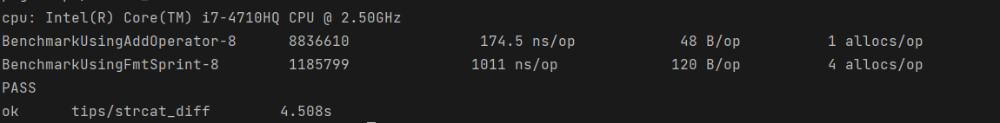

字符串的拼接操作在日常开发中非常的常见，Golang 中可以使用 `+`、`fmt.Sprint`、`bytes.Buffer`、`string.Builder`、`strings.Join`进行拼接。下面将通过性能测试的方式来看下各个拼接方式的区别。

## 1. 定义拼接函数

```go
// tips/strcat_diff/strcat_diff.go

// UsingAddOperator use operator '+'
func UsingAddOperator(strs []string) string {
	var s string
	for _, v := range strs {
		s += v
	}
	return s
}

// UsingFmtSprint use fmt.Sprint function
func UsingFmtSprint(strs []string) string {
	var s string
	s = fmt.Sprint(strs)
	return s
}

// UsingStringsJoin use strings.Join
func UsingStringsJoin(strs []string) string {
	var s string
	s = strings.Join(strs, "")
	return s
}

// UsingBytesBuffer use bytes.Buffer
func UsingBytesBuffer(strs []string) string {
	var buf bytes.Buffer
	for _, v := range strs {
		buf.WriteString(v)
	}
	return buf.String()
}

// UsingStringsBuilder use string.Builder
func UsingStringsBuilder(strs []string) string {
	var sb strings.Builder
	for _, v := range strs {
		sb.WriteString(v)
	}
	return sb.String()
}
```

## 2 测试

### 2.1 测试用例

```go
var (
	strsLong  []string
	strsShort []string
)

func init() {
	str := "Golang 字符串拼接!!"
	for i := 0; i < 200; i++ {
		strsLong = append(strsLong, str)
	}
	for i := 0; i < 2; i++ {
		strsShort = append(strsShort, str)
	}
}
```

- `strsLong`: 用于测试大量字符串连接
- `strsShort`: 用于测试少量字符串连接

### 2.2 测试函数

```go
// tips/strcat_diff/strcat_diff_test.go

func BenchmarkUsingAddOperator(b *testing.B) {
	b.ResetTimer()
	for i := 0; i < b.N; i++ {
		UsingAddOperator(strsLong)
	}
	b.StopTimer()
}

func BenchmarkUsingFmtSprint(b *testing.B) {
	b.ResetTimer()
	for i := 0; i <= b.N; i++ {
		UsingFmtSprint(strsLong)
	}
	b.StopTimer()
}

func BenchmarkUsingStringsJoin(b *testing.B) {
	b.ResetTimer()
	for i := 0; i < b.N; i++ {
		UsingStringsJoin(strsLong)
	}
	b.StopTimer()
}

func BenchmarkUsingBytesBuffer(b *testing.B) {
	b.ResetTimer()
	for i := 0; i < b.N; i++ {
		UsingBytesBuffer(strsLong)
	}
	b.StopTimer()
}

func BenchmarkUsingStringsBuilder(b *testing.B) {
	b.ResetTimer()
	for i := 0; i < b.N; i++ {
		UsingStringsBuilder(strsLong)
	}
	b.StopTimer()
}
```

### 2.4 测试结果

执行`go test -bench . -benchmem`:


结果中每列含义：

- `BenchmarkUsingAddOperator-8`: 前面为测试函数名，数字表示 CPU 核心数 (默认为`GOMAXPROC`)， 可以使用 `-cpu` 接收列表值，例如：`-cpu=2,4` 将使用 2 和 4 核心数进行测试

- `8148`: 执行总次数，即 `b.N`
- `295916 ns/op`: 每次执行的平均耗时
- `516656 B/op`: 每次执行的内存分配
- `199 alloc/op`: 每次执行的内存分配次数

由测试结果可以看出：

- 使用 `+` 进行拼接是耗时最多，内存消耗最大的操作，并且每次操作都会进行内存分配（拼接 200 字符串，额外内存分配次数达到了 199 次）
- 使用 `strings.Join` 耗时最小，内存消耗最下并且每次操作仅分配了一次内存
- `strings.Builder` 和 `bytes.Buffer` 结果类似，但是 `strings.Builder` 比 `bytes.Buffer` 多，但是总体耗时要少些

### 2.5 结果分析

#### 2.5.1 使用 ‘+’

使用 ‘+’ 拼接 `strsLong` 中的 200 个字符串，从测试结果中看每次操作额外内存分配了 199 次，即使用 ‘+’ 每次都会进行内存的分配。

#### 2.5.2 使用 `fmt.Sprint`

使用 `fmt.Sprint` 的内存大于 199 次，比使用 ‘+’ 还要多，下面分别使用 `fmt.Sprint` 对长度为 2 和 1 的字符串切片进行拼接并测试。

切片长度为 2 ，执行 `go test -bench='Fmt|Add' . -benchmem `



切片长度为 1, 执行 `go test -bench='Fmt|Add' . -benchmem `


可以看到 `fmt.Sprint` 始终比 `+` 多三次内存分配，接下来看下多出来的内存分配出现在哪

将 benchmark 结果导出到文件，使用 pprof 工具分析：

```sh
$ go test -bench . -benchmem -benchtime 3s -memprofile mem_profile.out
$ go tool pprof -htpp ":8088" mem_profile.out
```

可以看出其多出了三次内存分配


#### 2.5.3 使用 `strings.Join`

从测试结果中来看，`strings.Join` 耗时和内存占用都比较少，额外内存分配只有 1 此，下面看下其源码：

```go
// Join concatenates the elements of its first argument to create a single string. The separator
// string sep is placed between elements in the resulting string.
func Join(elems []string, sep string) string {
	switch len(elems) {
	case 0:
		return ""
	case 1:
		return elems[0]
	}
    // 分隔符总长度
	n := len(sep) * (len(elems) - 1)
	// 字符串总长度
    for i := 0; i < len(elems); i++ {
		n += len(elems[i])
	}

	var b Builder
	b.Grow(n)
	b.WriteString(elems[0])
	for _, s := range elems[1:] {
		b.WriteString(sep)
		b.WriteString(s)
	}
	return b.String()
}
```

可以看到 `strings.Join` 底层实际使用了 `strings.Builder` 。

#### 2.5.4 使用 `bytes.Buffer` 

```go
// A Buffer is a variable-sized buffer of bytes with Read and Write methods.
// The zero value for Buffer is an empty buffer ready to use.
type Buffer struct {
    buf      []byte // contents are the bytes buf[off : len(buf)]
    off      int    // read at &buf[off], write at &buf[len(buf)]
    lastRead readOp // last read operation, so that Unread* can work correctly.
}
```

`bytes.Buffer` 维护了一个 byte 类型的切片，在一定程度上避免了每次拼接就重新进行内存分配的问题，但是存在一个 `[]byte` 到 `string` 类型转换和内存拷贝问题。

#### 2.5.5 使用 `strings.Builder`

`strings.Builder` 是 Go 1.10 引入的，能够极大程度上提高拼接效率

```go
// A Builder is used to efficiently build a string using Write methods.
// It minimizes memory copying. The zero value is ready to use.
// Do not copy a non-zero Builder.
type Builder struct {
    addr *Builder // of receiver, to detect copies by value
    buf  []byte
}

func (b *Builder) copyCheck() {
    if b.addr == nil {
        // This hack works around a failing of Go's escape analysis
        // that was causing b to escape and be heap allocated.
        // See issue 23382.
        // TODO: once issue 7921 is fixed, this should be reverted to
        // just "b.addr = b".
        b.addr = (*Builder)(noescape(unsafe.Pointer(b)))
    } else if b.addr != b {
        panic("strings: illegal use of non-zero Builder copied by value")
    }
}

// String returns the accumulated string.
func (b *Builder) String() string {
    return *(*string)(unsafe.Pointer(&b.buf))
}


// WriteString appends the contents of s to b's buffer.
// It returns the length of s and a nil error.
func (b *Builder) WriteString(s string) (int, error) {
    b.copyCheck()
    b.buf = append(b.buf, s...)
    return len(s), nil
}

// grow copies the buffer to a new, larger buffer so that there are at least n
// bytes of capacity beyond len(b.buf).
func (b *Builder) grow(n int) {
    buf := make([]byte, len(b.buf), 2*cap(b.buf)+n)
    copy(buf, b.buf)
    b.buf = buf
}
```

这里使用了 `unsafe.Pointer` 的内存指针转换操作，可直接将 `[]byte` 转换为 `string` 类型，同时避免了内存重分配问题。而`copyChek` 方法则用于避免 buf 逃逸到堆内存上。

#### 2.5.6 `strings.Join` 和 `strings.Builder`

自定义的拼接函数和 `strings.Join` 都使用了 `strings.Builder` ，但是性能差异较大。是因为在 `strings.Join` 中使用了内存的预分配，提前计算好了需要分配的空间，避免了多次分配。

```go
    ...
	// 分隔符总长度
	n := len(sep) * (len(elems) - 1)
	// 字符串总长度
    for i := 0; i < len(elems); i++ {
		n += len(elems[i])
	}

	var b Builder
	b.Grow(n)
    ...
```

重写使用 `strings.Builder` 的拼接函数

```go
// UsingStringsBuilder2 use string.Builder
// and calculate the length of final string
func UsingStringsBuilder2(strs []string) string {
	switch len(strs) {
	case 0:
		return ""
	case 1:
		return strs[0]
	}
	var n int
	for _, v := range strs {
		n += len(v)
	}

	var sb strings.Builder
	sb.Grow(n)
	for _, v := range strs {
		sb.WriteString(v)
	}
	return sb.String()
}
```

再次测试,`go test -bench 'Builder|Join' . -benchmem`


可以看到性能有了显著的提升，额外内存分配降到了 1 次。

### 2.6 拼接两个字符串

当只需要拼接两个字符串时，测试下：


可以看到使用 ‘+’ 拼接的性能不错，所以当字符串只有两个时可以直接使用 ‘+’ 进行拼接即可。

### 2.7 小结

当字符串只有两个时，建议使用 ‘+’。

当字符串长度较大时，建议使用 `strings.Builder`。因 `strings.Join` 需要传递参数（对性能有少许影响），不仅仅用于拼接字符串。

因此在进行较大字符串拼接时，五种方式的拼接效率：

strings.Builder ≈ strings.Join > strings.Buffer > “+” > fmt.Sprint

## 3. strings.Builder

下面看下 strings.Builder 的用法和要点。

### 3.1 Write 类方法

和 `bytes.Buffer` 类似，`strings.Builder` 也支持 4 类方法将数据写入 builder 中。

```go
func (b *Builder) Write(p []byte) (int, error)
func (b *Builder) WriteByte(c byte) error
func (b *Builder) WriteRune(r rune) (int, error)
func (b *Builder) WriteString(s string) (int, error)
```

可以根据数据的不同类型（byte slice, byte, rune, string），选择对应的写入方法。

### 3.2 strings.Builder 字符串存储原理

`strings.Builder` 通过内部的  byte slice 来存储数据，当调用上述的写入函数时，数据会被 append 到内部的 slice 上。


### 3.3 高效使用 strings.Builder

当调用写入方法时，数据会被追加到内部的 slice 中，若此时达到了 slice 的容量限制，那么就会创建一个新的 slice，原有的数据会被拷贝至新 slice 中。当 slice 的长度非常大时，这个操作会非常消耗资源和影响性能。

`strings.Builder` 提供了 `Grow()` 函数来预定义 slice 容量：

```go
func (b *Builder) Grow(n int) {
	b.copyCheck()
	if n < 0 {
		panic("strings.Builder.Grow: negative count")
	}
	if cap(b.buf)-len(b.buf) < n {
		b.grow(n)
	}
}

func (b *Builder) grow(n int) {
	buf := make([]byte, len(b.buf), 2*cap(b.buf)+n)
	copy(buf, b.buf)
	b.buf = buf
}
```

由上述代码可以看到，仅当 n 大于内部 slice 能够被写入的字节数时，才会进行扩容。扩容会按照以下公式进行：

```
current_capacity * 2 + n
```

### 3.4 String

`strings.Builder` 提供了 `String()` 函数来返回最终的字符串。为了节省内存分配，其使用了指针技术将内部的 byte slice 转换成了字符串，节省了时间和空间。

```
*(*string)(unsafe.Pointer(&bytes))
```

### 3.5 不要拷贝

`strings.Builder` 不推荐被拷贝，当试图拷贝 `strings.Builder` 并写入数据时，程序会崩溃

```go
var sb1 strings.Builder
sb1.WriteString("ABC")
var sb2 strings.Builder
sb2 = sb1
sb2.WriteString("DEF")
// illegal use of non-zero Builder copied by value
```

`strings.Builder` 内部通过 slice 保存和管理数据，slice 内部通过指针指向实际保存内容的数组


当我们拷贝了 builder 后，内部的 slice 指针也会被拷贝。拷贝后的 slice 会和之前的 slice 指向同一个数组，当对原 builder 或新 builder 进行写入时，会互相影响，所以 builder 是不能被拷贝的。


`strings.Builder` 会在以下函数中检测拷贝操作：

```go
Grow(n int)
Write(p []byte)
WriteRune(r rune)
WriteString(s string)
```

但是对于未写入内容的空 builder 是可以进行拷贝的，并可以使用下列方法：

```go
// Reset()
// Len()
// String()

var b1 strings.Builder
b1.WriteString("ABC")
b2 := b1
fmt.Println(b2.Len())    // 3
fmt.Println(b2.String()) // ABC
b2.Reset()
b2.WriteString("DEF")
fmt.Println(b2.String()) // DEF
```

### 3.6 并发

和 `bytes.Buffer` 一样，`strings.Builder` 不支持并发读或写

例如，同时向 builder 中写入 1000 个字符串

```go
func main() {
	// concurrency
	var sb strings.Builder
	var wait sync.WaitGroup
	for n := 0;n < 1000; n++ {
		wait.Add(1)
		go func() {
			sb.WriteString("1")
			wait.Done()
		}()
	}
	wait.Wait()
	fmt.Println(sb.Len())

	var sb1 strings.Builder
	for n := 0; n < 1000; n++ {
		sb1.WriteString("1")

	}
	fmt.Println(sb1.Len())
}
```

采用并发方式进行写入，最终结果 buf 的长度可能都不同，并且不到 1000。

### 3.7 io.Writer 接口

`strings.Builder` 通过 `Write(p []byte) (n int, err error)` 方法实现了 `io.Writer` 接口，所以有很多可以使用的场景：

- `io.Copy(dst Writer, src Reader) (written int64, err error)`
- `bufio.NewWriter(w io.Writer) *Writer`
- `fmt.Fprint(w io.Writer, a ...interface{}) (n int, err error)`
- `func (r *http.Request) Write(w io.Writer) error`
- 其他使用 io.Writer 的库

## 4. 总结

1. 字符串拼接有五种方式，`+`、`fmt.Sprint`、`strings.Join`、`bytes.Buffer`、`strings.Builder`
2. 五种方式的效率比较：strings.Builder ≈ strings.Join > strings.Buffer > “+” > fmt.Sprint
3. `strings.Builder` 内部使用 byte slice 存储数据，其`String()`方法使用了指针技术将 byte slice 转换成 string 类型，节省了时间与空间
4. 使用 `strings.Builder` 时可以预先调用 `Grow(n)` 函数预先定义长度可以有效减少额外的内存分配次数
5. 不能对非空 `strings.Builder`进行拷贝，拷贝后两个 builder 会指向同一个 byte slice
6. `strings.Builder` 不支持并发

## Reference 

1. [Go语言几种字符串的拼接方式比较](https://segmentfault.com/a/1190000040275250)  jankin
1. [7 notes about strings.builder in Golang](https://medium.com/@thuc/8-notes-about-strings-builder-in-golang-65260daae6e9) Thuc le