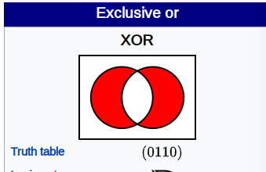

在 Golang 中异或运算只能用于位运算，不能用于布尔类型。因此我们需要自己实现此逻辑。

首先根据异或的定义写出逻辑表达式：

```
X xor Y -> (X || Y) && !(X && Y)
```

简化后可以写成：

```
X xor Y -> X != Y
```

| exp     | T, T | T, F | F, T | F, F |
| ------- | ---- | ---- | ---- | ---- |
| X xor Y | F    | T    | T    | F    |
| X != Y  | F    | T    | T    | F    |

```go
package main

import (
	"fmt"
	"strings"
	"unsafe"
)

func main() {
	// bitwise XOR
	// 0000 ... 0101
	i := 5
	// 0000 ... 0001
	j := 3
	r := i ^ j
	fmt.Printf("%3d: %s\n", i, SprintBits(i))
	fmt.Printf("%3d: %s\n", j, SprintBits(j))
	fmt.Printf("%3d: %s\n", r, SprintBits(r))
	// boolean xor
	fmt.Printf("%5v xor %5v: %v\n", true, true, xor(true, true))
	fmt.Printf("%5v xor %5v: %v\n", true, false, xor(true, false))
	fmt.Printf("%5v xor %5v: %v\n", false, true, xor(false, true))
	fmt.Printf("%5v xor %5v: %v\n", false, false, xor(false, false))
}

func SprintBits(n int) string {
	var sb strings.Builder
	intBitSize := int(unsafe.Sizeof(int(0)) * 8)
	sb.WriteString("[")
	for i := intBitSize - 1; i >= 0; i-- {
		sb.WriteString(fmt.Sprintf("%d", (n>>i)&1))
	}
	sb.WriteString("]")
	return sb.String()
}

func xor(x, y bool) bool {
	return x != y
}
```

```
  5: [0000000000000000000000000000000000000000000000000000000000000101]
  3: [0000000000000000000000000000000000000000000000000000000000000011]
  6: [0000000000000000000000000000000000000000000000000000000000000110]
 true xor  true: false
 true xor false: true
false xor  true: true
false xor false: false
```

>
> wikipedia: **Exclusive or** or **exclusive disjunction** is a [logical operation](https://en.wikipedia.org/wiki/Logical_connective) that is true if and only if its arguments differ (one is true, the other is false)
>
> 

## Reference

1. [Is there no XOR operator for booleans in golang?](https://stackoverflow.com/questions/23025694/is-there-no-xor-operator-for-booleans-in-golang)

